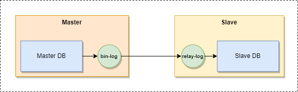
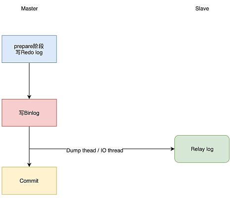
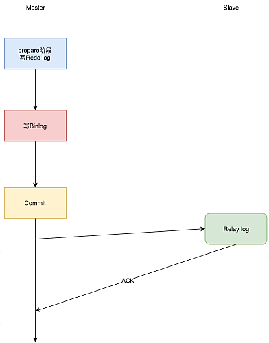
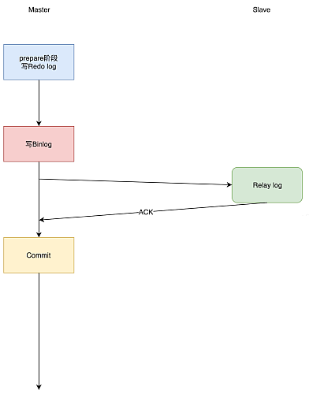

# 基于 Binlog 的主从模式

- [基于 Binlog 的主从模式](#基于-binlog-的主从模式)
  - [1. 前置说明](#1-前置说明)
  - [2. 容器配置](#2-容器配置)
    - [2.1. 创建同步用户](#21-创建同步用户)
    - [2.2. 将 Slave 连接到 Master](#22-将-slave-连接到-master)
      - [2.2.1. Master 节点相关操作](#221-master-节点相关操作)
      - [2.2.2. Slave 节点相关操作](#222-slave-节点相关操作)
    - [2.3. 结果验证](#23-结果验证)
      - [3.3.1. 在 Master 节点上执行](#331-在-master-节点上执行)
        - [3.2.3.2. 在 Slave 上执行](#3232-在-slave-上执行)
  - [3. 同步故障修复](#3-同步故障修复)
    - [3.1. 修复同步落后问题](#31-修复同步落后问题)
    - [3.2. 主从切换问题](#32-主从切换问题)
    - [3.3. 数据冲突问题](#33-数据冲突问题)
      - [3.3.1. 初始化同步前](#331-初始化同步前)
      - [3.3.2. 数据冲突导致同步停止](#332-数据冲突导致同步停止)
        - [3.3.2.1. 未启用 GTID 模式时](#3321-未启用-gtid-模式时)
      - [3.3.2.2. 已开启 GTID 模式时](#3322-已开启-gtid-模式时)
      - [3.3.2.3. 自动化操作](#3323-自动化操作)
  - [4. 半同步复制和增强型半同步复制](#4-半同步复制和增强型半同步复制)
    - [4.1. 异步复制](#41-异步复制)
    - [4.2. 半同步复制](#42-半同步复制)
      - [4.2.1. 启用半同步复制](#421-启用半同步复制)
      - [4.2.2. 启用增强半同步复制](#422-启用增强半同步复制)
      - [4.2.3. (增强) 半同步模式配置项说明](#423-增强-半同步模式配置项说明)
  - [5. 双主模式](#5-双主模式)

Percona 集群配置是基于其单实例配置的, 如何配置单实例请参考: [Percona 单实例](../standalone/README.md)

基于 MySQL Binlog 配置集群模式是 Percona 搭建集群的最简单模式 (也是 MySQL 的原生集群搭建方式), 也是本地实验环境的最常用模式, 因为其配置简单, 且无额外组件引入, 对数据库实例的启动顺序无严格要求, 从节点可以随时脱离集群等

本例中演示了如何搭建"主从"模式集群, 为了易于演练, 本例中的所有操作均是基于 Docker 进行, 其它部署方式 (服务器部署或 K8S 部署) 方式类似



## 1. 前置说明

在 MySQL 中创建用户所能访问主机时, 使用容器的 Hostname 无法生效, 需要使用 `<容器标示>.<网络名>`, 例如要创建一个只允许容器标示 `percona-slave` 访问的用户 `replica` 时, 需要这样设置

```sql
CREATE USER 'replica'@'percona-slave.cluster-ms_percona_network' IDENTIFIED WITH mysql_native_password BY 'replica';
```

`percona-slave` 为容器标识, `cluster-ms_percona_network` 为网络名称, 可以通过 `docker network ls` 命令查询到, 也可以通过进入另一个容器中, 通过 `ping` 命令探查 (例如: `ping percona-slave`)

## 2. 容器配置

主从模式由一个 Master 实例和多个 Slave 实例组成, Slave 通过 Master 的 Binlog 读取数据增量变化, 将变化进行同步, 从而达到"主从复制"的目的

所有所有的 `DDL` (数据定义语句) 和 `DML` (数据操作语句) 必须在 Master 上执行, `DQL` (数据查询语句) 可以在 Master 和 Slave 上, 从而实现"读写分离", 至于 `DCL` (数据控制语句) 则根据需要, 在 Master 和 Slave 上分别执行

### 2.1. 创建同步用户

需要创建一个用户, 可以从 Slave 上访问 Master (本例中为 `replica`), 即:

```sql
CREATE USER 'replica'@'%' IDENTIFIED WITH mysql_native_password BY 'replica';
GRANT SELECT, REPLICATION SLAVE, REPLICATION CLIENT ON *.* TO 'replica'@'%';
```

为其赋予的 `REPLICATION SLAVE` 以及 `REPLICATION CLIENT` 权限说明该用户使用于主从复制

仿照[单实例配置](../standalone/README.md#16-创建健康检查用户), 这里也将初始化 SQL 脚本写入文件 [sql/master_initialize.sql](./sql/master_initialize.sql) 中, 并映射到容器的 `/docker-entrypoint-initdb.d/` 路径下

```yml
volumes:
  - ./sql/master_initialize.sql:/docker-entrypoint-initdb.d/master_initialize.sql:ro
```

> 注意, 无需为从库执行任何初始化 SQL 脚本, 其会从主库同步所有的操作

### 2.2. 将 Slave 连接到 Master

为了让同步做到最优, 本例中启用了 MySQL GTID 作为同步复制依据

```plaintext
GTID = server_uuid:transaction_id
```

GTID 保证了每个在主库上提交的事务在集群中有一个唯一的 ID, 这种方式强化了数据库的主备一致性, 故障恢复以及容错能力

#### 2.2.1. Master 节点相关操作

修改 Master 节点配置文件 ([conf/master.cnf](./conf/master.cnf)), 增加如下部分:

```ini
server-id = 1 # 设置节点 id, 不能重复
log-bin = mysql-bin   # 开启 binlog
binlog_format = ROW   # binlog 格式

gtid_mode = on        # 为 binlog 启动 gtid
enforce_gtid_consistency = on

log_replica_updates = 1 # 从库 binlog 才会记录主库同步的操作日志
skip_replica_start = 1  # 跳过 slave 复制线程

relay-log = relay-bin

sync_binlog = 1000  # 设置同步频率
innodb_flush_log_at_trx_commit = 2  # 设置刷新时机
```

启动 Master 节点, 查看 Binlog 当前进度

```sql
SHOW MASTER STATUS\G

*************************** 1. row ***************************
             File: mysql-bin.000003
         Position: 196
     Binlog_Do_DB:
 Binlog_Ignore_DB:
Executed_Gtid_Set: e5176efe-e2b1-11ed-92d7-0242c0a89002:1-4
```

输出的 `File: mysql-bin.000003` 和 `Position: 196` 即 Master 上 Binlog 的当前位置

如果启用了 GTID, 则无需关注 Master 节点 Binlog 的进度, Slave 节点会通过 Master 节点的 GTID 获知上次同步的位置, 但如果未启用 GTID, 则需要在 Slave 上手动输入开始同步的位置

建议使用 GTID, 否则很容易出现主从节点不一致的情况, 而且区分主从节点上未重复进行的操作难度较高

#### 2.2.2. Slave 节点相关操作

修改 Slave 配置文件 ([cluster-ms/conf/slave.cnf](../docker/cluster-ms/conf/slave.cnf)), 增加如下部分:

```ini
server-id = 2 # 设置节点 id, 不能重复

gtid_mode = on # 为 binlog 启动 gtid
enforce_gtid_consistency = on

read_only = on # 启动只读模式
super_read_only = ON # 对 root 用户启动只读模式


sync_binlog = 1000  # 设置同步频率
innodb_flush_log_at_trx_commit = 2  # 设置刷新时机
```

注意, 一般对于主从集群, Slave 节点不会进行任何写操作, 所以应该开启 `read_only = ON` 这个配置; 如果对 `root` 用户也启用只读, 则进一步添加 `super_read_only = ON` 配置

重启服务, 设置 Slave 节点连接到 Master 节点上, 需要注意, `MASTER_LOG_FILE`, `MASTER_LOG_POS` 两个属性值需要根据上一步返回的结果进行调整

```sql
STOP SLAVE;

CHANGE MASTER TO
    MASTER_HOST='percona_master',
    MASTER_USER='replica',
    MASTER_PASSWORD='replica',
    -- MASTER_LOG_FILE='mysql-bin.000003',
    -- MASTER_LOG_POS=196;
    MASTER_AUTO_POSITION=1;

START SLAVE;
```

在未开启 GTID 时, 需要手动设置 `MASTER_LOG_FILE` 和 `MASTER_LOG_POS` 这两个参数, 告诉 Slave 节点要从 Master 节点 Binlog 的什么位置开始复制

开启了 GTID 后, 只需要设置 `MASTER_AUTO_POSITION=1`, Slave 节点会自行根据 GTID 向 Master 节点询问最后同步的位置

注意, `replica` 这个用户是在 Master 节点通过初始化 SQL 脚本 [sql/master_initialize.sql](./sql/master_initialize.sql) 生成的, 该脚本必须映射到容器的 `/docker-entrypoint-initdb.d` 路径下, 如果无法进行同步, 请检查这一步是否正确

另外, 启动复制后, Master 节点的所有历史操作均会在 Slave 节点上执行一次, 所以 Slave 节点不应进行任何写操作, 防止造成数据冲突

查看设置结果, 若类似如下结果, 则表示 Slave 节点已经和 Master 节点建立关系

```sql
SHOW SLAVE STATUS\G

*************************** 1. row ***************************
               Slave_IO_State: Waiting for source to send event
                  Master_Host: percona_master
                  Master_User: replica
                  Master_Port: 3306
                Connect_Retry: 60
              Master_Log_File: mysql-bin.000003
          Read_Master_Log_Pos: 196
...
```

### 2.3. 结果验证

可以在两个节点上执行一些 SQL 验证一下同步结果

#### 3.3.1. 在 Master 节点上执行

```sql
CREATE DATABASE IF NOT EXISTS `replicate_test`
    CHARACTER SET utf8mb4
    COLLATE utf8mb4_unicode_ci;

USE `replicate_test`;

CREATE TABLE IF NOT EXISTS `test` (
  `id` BIGINT NOT NULL AUTO_INCREMENT,
  `value` VARCHAR(200) NOT NULL,
  PRIMARY KEY (`id`)
) ENGINE = InnoDB CHARSET = utf8mb4;

INSERT INTO `test` (`value`) VALUES ('test-value');
```

##### 3.2.3.2. 在 Slave 上执行

```sql
USE `replicate_test`;

SELECT * FROM `test`;
```

如果可以返回 Master 上插入的结果, 表示主从复制已经成功

## 3. 同步故障修复

主从发生故障, 包括: 1. Slave 节点宕机; 2. Master 节点宕机; 4. 主从数据冲突

### 3.1. 修复同步落后问题

如果 Slave 或 Master 节点宕机, 或者两个节点间网络异常导致同步失败, 造成的问题是 Slave 节点的同步位置和 Master 不一致, 此时需要恢复 Slave 节点的同步位置

大部分情况下, 只需要排除故障, 正确启动 Master 节点和 Slave 节点, Slave 节点即会按照上次同步位置继续同步, 少数情况, Slave 和同步位置出现错乱, 需要重置 Slave 节点的"中继日志 (`relay-log`)"

执行如下语句:

```sql
STOP SLAVE;
RESET SLAVE;
```

此时, Slave 节点的 `relay-log` 会被重建, 但主从关系不会重置, 接下来重新启动从库复制即可

```sql
START SLAVE;

SHOW SLAVE STATUS\G
```

### 3.2. 主从切换问题

如果 Master 宕机且故障不可恢复 (例如磁盘损坏), 此时需要将主从进行切换, 即将 Slave 节点升级为 Master 节点, 并配置新的 Slave 节点

从 Slave 节点中选择一台, 令其彻底脱离从库状态

```sql
STOP SLAVE;
RESET SLAVE ALL;
```

此时该节点不在记录任何从库信息, `SHOW SLAVE STATUS` 命令返回空

```sql
SHOW SLAVE STATUS\G

Empty set, 1 warning (0.01 sec)
```

接下来将原先用于主库的配置设置到这台从库机器上, 并**取消其只读状态**, 参考 [Master 节点操作](#221-master-节点相关操作) 一节

重启该节点, 该节点即以新的 Master 节点上线

将其余从节点通过 `CHANGE MASTER TO` 指令, 将复制源指向新的 Master 节点即可

### 3.3. 数据冲突问题

数据冲突问题一般发生在在 Slave 节点进行了写操作, 导致 Master 节点的部分数据无法正常同步到 Slave (例如主键冲突), 这个问题有几种不同的场景

#### 3.3.1. 初始化同步前

此时 Master 和 Slave 节点都可能具备一些数据 (例如 `mysql.user` 表中), 此时开启同步, Slave 会重现 Master 上的所有操作, 可能导致数据冲突

此时可以重置 Master 上的 Binlog, 避免 Slave 去同步之前的数据

Master 节点进行如下操作:

```sql
RESET MASTER;
```

Slave 节点进行如下操作:

```sql
STOP SLAVE;
RESET SLAVE;
START SLAVE;
```

注意, `RESET MASTER` 会破坏 Master 的 Binlog, 如果集群已经开始工作, 则一定不能执行该命令

#### 3.3.2. 数据冲突导致同步停止

可以在 Slave 节点上查看具体错误信息

```sql
SHOW SLAVE STATUS\G
```

其中的 `Last_Error` 字段显示了是什么问题造成同步终止

最简单的办法是将从库对应的数据删除 (或修改主键), 再开启同步, 即可继续进行

但如果错误比较复杂, 例如要同步的数据缺少对应的关联数据, 且该数据可忽略时, 可跳过同步位置, 即忽略若干要同步的数据, 从下一个不会出错的位置开始同步

##### 3.3.2.1. 未启用 GTID 模式时

可以通过 `SQL_SLAVE_SKIP_COUNTER` 变量控制要跳过的 Binlog 数量, 即:

```sql
STOP SLAVE;

SET SQL_SLAVE_SKIP_COUNTER=2;
START SLAVE;
```

#### 3.3.2.2. 已开启 GTID 模式时

需要先查看 Slave 节点的同步进度, 在 Slave 节点执行如下命令:

```sql
SHOW SLAVE STATUS\G

*************************** 1. row ***************************
        Last_Errno: 1062
        Last_Error: ... Duplicate ... key 'PRIMARY', Error_code: 1062; ...
       Master_UUID: f2b6c829-9c87-11e4-84e8-deadeb54b599
Retrieved_Gtid_Set: 3a16ef7a-75f5-11e4-8960-deadeb54b599:1-283,f2b6c829-9c87-11e4-84e8-deadeb54b599:1-33
 Executed_Gtid_Set: 3a16ef7a-75f5-11e4-8960-deadeb54b599:1-283,f2b6c829-9c87-11e4-84e8-deadeb54b599:1-31
     Auto_Position: 1
```

从上面的信息可知, Slave 节点已经从 Master 节点取到了 `1-33` 的事务列表 (`Retrieved_Gtid_Set` 字段), 并且已执行到了 `31` 这个事务 GTID 位置 (`Executed_Gtid_Set` 字段), 在下一个位置 (`32`) 上发生错误

此时需要手工调整 Slave 节点已清除的 GTID 列表 `GTID_PURGED`, 手动通知 Slave 节点有哪些事务已经被清除, 后续可以忽略

```sql
STOP SLAVE;
SET @@GLOBAL.GTID_PURGED = "3a16ef7a-75f5-11e4-8960-deadeb54b599:1-283,f2b6c829-9c87-11e4-84e8-deadeb54b599:1-32";
START SLAVE;
```

即忽略 `f2b6c829-9c87-11e4-84e8-deadeb54b599:32` 这个 GTID 代表的事物, 接着从 `f2b6c829-9c87-11e4-84e8-deadeb54b599:33` 这个 GTID 开始, 即可跳过上述错误

#### 3.3.2.3. 自动化操作

上述手动处理比较繁琐, 如果遇到大量错误会耗费大量时间

无论是否启用了 GTID, 都可以使用 Percona 的 `pt-slave-restart` 工具自动避开同步错误, 重启 Slave 节点

`pt-slave-restart` 是 Percona Toolkit 套件其中的工具, 具体参考 [Percona Toolkit](https://docs.percona.com/percona-toolkit/index.html) 文档

具体方法如下:

```bash
pt-slave-restart -uroot --ask-pass -h'127.0.0.1' -P3306 --error-numbers=1062
```

表示重新启动 Slave, 并在复制过程中跳过编号为 `1062` 的所有错误

`pt-slave-restart` 命令的其它常用参数包括:

- `--always`, 永不停止 Slave 线程, 手工停止也不允许
- `--ask-pass`, 替换 `-p` 命令, 交互式输入密码
- `--error-numbers`, 指定跳过的错误编号, 可用 `,` 进行分隔
- `--error-text`, 指定跳过的错误信息内容, 即通过内容匹配错误
- `--log`, 指定日志输出的文件
- `--recurse`, 在主库端执行, 监控从库
- `--slave-user`, `--slave-password`, 从库的账号密码, 用于在主库端运行时使用
- `--runtime`, 工具执行多长时间后退出, 默认为秒, 可以通过 `s/m/h/d` 设置单位
- `--skip-count`, 一次跳过错误的个数, 默认为 `1`
- `--master-uuid`, 级联复制的时候, 指定跳过上级或者上上级事务的错误
- `--until-master`, 到达指定的 `master_log_pos` 位置后停止. 格式: `file:pos`
- `--until-relay`, 和 `--until-master` 参数类似, 是根据 `relay_log` 的位置来停止

## 4. 半同步复制和增强型半同步复制

### 4.1. 异步复制

以上所进行的主从复制称为 **异步复制**, 其主要流程如下图:



异步复制是 MySQL 默认的复制策略, Master 处理事务过程中, 将其写入 Binlog 就会通知 Dump Thread 线程处理, 然后完成事务的提交, 不会关心是否成功发送到任意一个 Slave 中. 所以当 Master 宕机可能会导致和 Slave 之间的数据不一致

异步复制的性能最好, 但无法完全保证数据一致性, 所以 MySQL 还具备 **半同步复制** 和 **增强型半同步复制** 两种模式

### 4.2. 半同步复制

半同步复制表示, 当 Master 提交事务后, 至少一个 Slave 将收到的 Binlog 写入 Relaylog 后, 返回一个 ACK, 才会继续处理下一个事务, 其主要流程如下图:



半同步复制的效率要比异步方式略低, 但改善了同步的数据一致性, 即 Master 可以保证每个事务执行前, 前一个事务一定是完成 (至少一个 Slave) 同步的, 但这种方式仍不能完全保证同步的数据一致性, 即 Master 故障后, 切换到 Slave 时, 最后一条数据有可能未被同步

#### 4.2.1. 启用半同步复制

半同步复制需要安装额外的插件, 包括:

- Master 端: `semisync_source.so`
- Slave 端: `semisync_replica.so`

MySQL 安装插件可以用两种方式

1. 通过 MySQL 命令安装, 即登录 MySQL 客户端, 执行如下 SQL 指令

    Master 端:

    ```sql
    INSTALL PLUGIN rpl_semi_sync_source SONAME 'semisync_source.so'
    ```

    Slave 端:

    ```sql
    INSTALL PLUGIN rpl_semi_sync_replica SONAME 'semisync_replica.so'
    ```

2. 通过 MySQL 配置文件安装, 即编辑 MySQL 配置文件

    Master 端: 编辑 [conf/master.cnf](./conf/master.cnf) 文件, 增加如下内容

    ```ini
    plugin_load = "rpl_semi_sync_source=semisync_source.so"
    ```

    Slave 端: 编辑 [conf/slave.cnf](./conf/slave.cnf) 文件, 增加如下内容

    ```ini
    plugin_load = "rpl_semi_sync_replica=semisync_replica.so"
    ```

注意, 在 Docker 容器里, 如果配置了 `plugin_load`, 会导致容器第一次启动时初始化失败, 所以要使用这种方式, 第一次启动容器的时候不能使用 `plugin_load` 配置以及其它 `rpl_semi_` 为前缀的配置 (因为插件不存在, 这些配置也是无效), 当容器初始化完毕后, 需要修改配置文件, 再重启容器

确认插件安装成功: 登录 MySQL 客户端, 执行

```sql
SHOW PLUGINS;
```

则 Master 端应返回包含如下数据的结果:

```sql
+---------------------------------+----------+--------------------+--------------------+---------+
| Name                            | Status   | Type               | Library            | License |
+---------------------------------+----------+--------------------+--------------------+---------+
| rpl_semi_sync_source            | ACTIVE   | REPLICATION        | semisync_source.so | GPL     |
+---------------------------------+----------+--------------------+--------------------+---------+
```

Slave 端应该返回包含如下数据的结果:

```sql
+---------------------------------+----------+--------------------+---------------------+---------+
| Name                            | Status   | Type               | Library             | License |
+---------------------------------+----------+--------------------+---------------------+---------+
| rpl_semi_sync_replica           | ACTIVE   | REPLICATION        | semisync_replica.so | GPL     |
+---------------------------------+----------+--------------------+---------------------+---------+
```

插件安装完毕后, 需要在 Master 和 Slave 的配置文件中增加如下配置以开启 **半同步模式**

- Master 端: 编辑 [conf/master.cnf](./conf/master.cnf) 文件, 增加如下内容

  ```ini
  rpl_semi_sync_source_enabled = 1
  rpl_semi_sync_source_wait_point = AFTER_COMMIT
  ```

  或者执行 SQL 命令

  ```sql
  set global rpl_semi_sync_source_enabled = ON;
  set global rpl_semi_sync_source_wait_point = 'AFTER_COMMIT';
  ```

- Slave 端: 编辑 [conf/slave.cnf](./conf/slave.cnf) 文件, 增加如下内容

  ```ini
  rpl_semi_sync_source_enabled = 1
  ```

  或者执行 SQL 命令

  ```sql
  set global rpl_semi_sync_source_enabled = ON;
  ```

#### 4.2.2. 启用增强半同步复制

增强半同步模式和半同步模式类似, 只是 Master 在提交事务过程中, 获取从 Slave 返回 ACK 的时机不同, 如下图:



增强型半同步解决了半同步模式的数据不一致缺陷, 可以完全保证数据同步的一致性

启用增强半同步的流程和[启用半同步](#42-半同步复制)的流程完全一致, 区别在于 Master 配置文件中, 配置项 `rpl_semi_sync_source_wait_point` 的值改为 `AFTER_SYNC` (或不设置 `rpl_semi_sync_source_wait_point`, 其默认值就是 `AFTER_SYNC`), 即:

```ini
rpl_semi_sync_source_wait_point = AFTER_SYNC
```

当然也可以通过 SQL 命令进行设置

```sql
set global rpl_semi_sync_source_wait_point = 'AFTER_SYNC';
```

#### 4.2.3. (增强) 半同步模式配置项说明

开启了 (增强) 半同步模式后, 可以在配置文件 (或 MySQL 全局变量) 中设置如下配置项:

- Master 端

  ```sql
  SHOW VARIABLES LIKE 'rpl_semi%';

  +---------------------------------------------+------------+
  | Variable_name                               | Value      |
  +---------------------------------------------+------------+
  | rpl_semi_sync_source_enabled                | ON         |
  | rpl_semi_sync_source_timeout                | 10000      |
  | rpl_semi_sync_source_trace_level            | 32         |
  | rpl_semi_sync_source_wait_for_replica_count | 1          |
  | rpl_semi_sync_source_wait_no_replica        | ON         |
  | rpl_semi_sync_source_wait_point             | AFTER_SYNC |
  +---------------------------------------------+------------+
  ```

  - `rpl_semi_sync_source_enabled`, 是否启动 (增强) 半同步模式;
  - `rpl_semi_sync_source_timeout`, 等待 Slave 返回 ACK 的超时时间, 超出此时间后, 会退化为异步模式, 默认 `10000ms`, 即 `10s`;
  - `rpl_semi_sync_source_trace_level`, 设置主库同步复制调试跟踪级别, 默认 `32`, 可选 `1`, `16`, `32` 和 `64`;
  - `rpl_semi_sync_source_wait_for_replica_count`, 设置主库执行一个事务需等待 Slave 返回 ACK 的的数量, 默认为 `1` (性能最好);
  - `rpl_semi_sync_source_wait_no_replica`, 设置为 `ON` 表示允许在超时时间内从库的数量小于 `rpl_semi_sync_source_wait_for_replica_count` 配置的值, 只要在超时时间到期前有足够的从库确认事务, 半同步复制就会继续, 默认为 `ON`;
  - `rpl_semi_sync_source_wait_point`, 设置半同步模式, 可以为 `AFTER_COMMIT` (半同步复制模式) 和 `AFTER_SYNC` (增强型半同步复制模式);

- Slave 端, 参考 Master 端说明

  ```sql
  SHOW VARIABLES LIKE 'rpl_semi%';

  +-----------------------------------+-------+
  | Variable_name                     | Value |
  +-----------------------------------+-------+
  | rpl_semi_sync_replica_enabled     | ON    |
  | rpl_semi_sync_replica_trace_level | 32    |
  +-----------------------------------+-------+
  ```

## 5. 双主模式

基于 Binlog 配置"双主"模式, 即两个数据库实例 **互为主从**, 日常使用过程中, 其中一台作为"写"节点, 另一台作为"读"节点, 当"写"节点发生故障时, 立即切换到另一个节点 (例如通过 Keepalive 进行 IP 漂移)

一般情况下, 不建议对双主模式的两个节点同时进行写操作, 这有可能会导致同步混乱

每台主节点还可以具备各自的从节点, 以达到更好的读写分离性能
