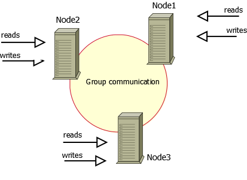
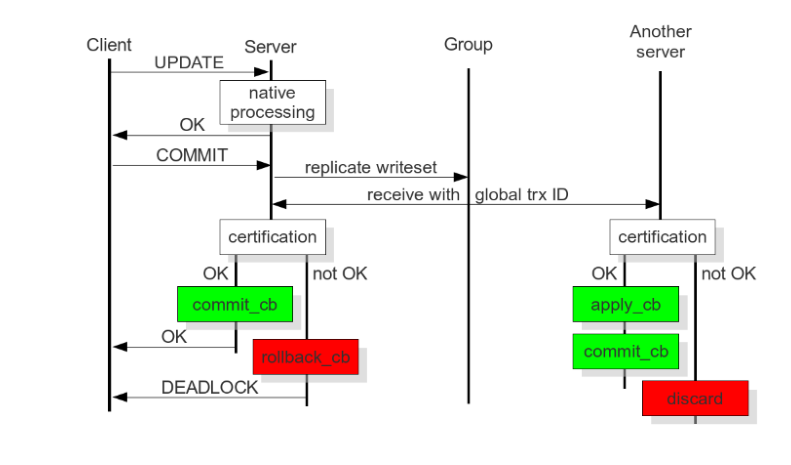

# Percona XtraDB Cluster

- [Percona XtraDB Cluster](#percona-xtradb-cluster)
  - [1. 概述](#1-概述)
    - [1.1. 架构](#11-架构)
      - [1.1.1. 优势](#111-优势)
      - [1.1.2. 缺点](#112-缺点)
    - [1.2. 组件](#12-组件)
    - [1.3. 集群限制](#13-集群限制)
  - [2. Percona XtraDB Cluster 快速引导](#2-percona-xtradb-cluster-快速引导)
    - [2.1. 安装 Percona XtraDB](#21-安装-percona-xtradb)
      - [2.1.1. Debian 和 Ubuntu](#211-debian-和-ubuntu)
        - [2.1.1.1. 先决条件](#2111-先决条件)
        - [2.1.1.2. 从软件仓库安装](#2112-从软件仓库安装)
      - [2.1.2. RHEL 和 CentOS](#212-rhel-和-centos)
        - [2.1.2.1. 先决条件](#2121-先决条件)
        - [2.1.2.2. 从 Percona 软件仓库安装](#2122-从-percona-软件仓库安装)
        - [2.1.2.3. 完成安装](#2123-完成安装)
      - [2.1.2. 备选安装方案](#212-备选安装方案)
        - [2.1.2.1. 对于 Debian 或 Ubuntu 系统](#2121-对于-debian-或-ubuntu-系统)
        - [2.1.2.2. 对于 RHEL 或 CentOS 系统](#2122-对于-rhel-或-centos-系统)
    - [2.2. 初始化集群](#22-初始化集群)
      - [2.2.1. 配置集群节点](#221-配置集群节点)
        - [2.2.1.1. 配置文件模板](#2211-配置文件模板)
        - [2.2.1.2. 配置变量说明](#2212-配置变量说明)
      - [2.2.2. 启动主节点](#222-启动主节点)
      - [2.2.3. 加入其它节点](#223-加入其它节点)
        - [2.2.3.1. 启动第二个节点](#2231-启动第二个节点)
        - [2.2.3.2. 启动第三个节点](#2232-启动第三个节点)
      - [2.2.3. 验证集群复制](#223-验证集群复制)
    - [2.3. 使用容器](#23-使用容器)
      - [2.3.1. 环境变量](#231-环境变量)
      - [2.3.2. 配置文件](#232-配置文件)
      - [2.3.3. 启动容器](#233-启动容器)
        - [2.3.3.1. 容器启动顺序](#2331-容器启动顺序)
        - [2.3.3.2. 容器健康检查](#2332-容器健康检查)
        - [2.3.3.3. 移除故障节点并重新并入集群](#2333-移除故障节点并重新并入集群)

## 1. 概述

PerconaDB 提供了一种集群建立模式 (OpenSource), 即 Percona XtraDB Cluster, 它是将 Percona Server for MySQL, Percona XtraBackup 以及 Calera 库集成在一起, 在实现数据库高可用的基础上, 提供了强数据一致性

这种模式类似于 MySQL 的 MGR 集群, 但提供了更简易的配置方式以及更强的数据一致性且无同步延迟

### 1.1. 架构

整个群集由节点组成, 其中每个节点都包含相同的数据集, 进行跨节点同步, 集群的每一台机器都可以读取和写入, 所有的读取都发生在本地, 不会获取任何远程数据, 而所有对数据的变更, 也会立即同步给集群中的所有节点

建议的配置是至少具有 `3` 个 节点, 但也可以只有 `2` 个节点, 每个节点都是一个常规的 MySQL 数据库实例 (例如 Percona Server). 可以转换现有的 MySQL 服务器实例到节点, 并使用此节点作为基础运行群集, 也可以从群集中分离任何节点, 并将其用作常规 MySQL 数据库实例, 非常灵活



整个集群的数据同步流程如下:



#### 1.1.1. 优势

- 执行的查询将在节点上本地执行, 所有数据都在本地可用而无需远程访问;
- 可以随时下线任何节点而不影响集群运行, 且不会丢失数据;
- 具有良好的扩展性, 每个节点都可以进行数据读取;

#### 1.1.2. 缺点

- 加入新节点的开销较大. 加入新节点时, 必须从现有节点复制所有数据 (如果有 `100GB` 数据, 则新节点加入时就需要复制 `100GB` 数据);
- 不能作为有效的写扩展来使用. 例如, 当将写操作分散到 2 个节点上, 确实比全部写在 1 个节点上吞吐量要大, 但不会提升很多, 因为最终数据仍要写入到全部的节点上;
- 数据会重复存储, 如果有 3 个节点, 数据就会重复 3 次;

### 1.2. 组件

[Percona XtraDB Cluster](https://www.percona.com/software/mysql-database/percona-xtradb-cluster) 基于 Percona Server for [MySQL](https://www.mysql.com/) 与 [XtraDB](https://www.percona.com/software/mysql-database/percona-server/xtradb) 组成, 其中使用 [Galera](https://github.com/percona/galera) 库, 这是由 [Codership Oy](https://www.galeracluster.com/) 开发的写集复制 (wsrep) API 的实现. 默认和推荐的数据传输方式是通过 Percona [XtraBackup](https://www.percona.com/software/mysql-database/percona-xtrabackup)

### 1.3. 集群限制

使用 Percona XtraDB 具有如下的一些限制:

- 所有的节点必须使用 InnoDB 存储引擎, 其它的引擎 (例如 MyISAM 引擎) 不会进行同步;

- 不支持的查询, LOCK TABLES 和 UNLOCK TABLES 相关指令, 例如 `GET_LOCK()`, `RELEASE_LOCK()` 等锁定函数;

- 无法将查询日志重定向到表, 如果启用了查询日志, 则必须将日志存储到文件

  ```ini
  log_output = FILE
  ```

  通过 `general_log` 和 `general_log_file` 启用查询日志和日志文件名

- 允许的最大事务大小由 `wsrep_max_ws_rows` 以及 `wsrep_max_ws_size` 变量定义, `LOAD DATA INFILE` 进程会在每 `10000` 行提交. 所以, 因为 `LOAD DATA` 导致的大事务会被拆分为一系列若干小事务;

- 目前, 事务提交仍可能被中止, 由于集群级的乐观并发控制, 所以可能有两个事务写入相同的行并在单独的 Percona XtraDB 集群节点中提交, 并且只有一个可以成功提交, 另一个将会中止, 集群会返回死锁错误代码:

  ```plaintext
  (Error: 1213 SQLSTATE: 40001  (ER_LOCK_DEADLOCK)).
  ```

- 不支持 XA 事务 (分布式事务), 因为提交随时可能被回滚;

- 具有木桶效应, 整个集群的吞吐量受最差的一个节点吞吐量限制, 如果一个节点变慢, 整个集群就会变慢, 所以每个节点的性能都应该足够;

- 建议集群最少具备 3 个节点, 因为集群需要一个节点作为"仲裁"节点;

- `enforce_storage_engine=InnoDB` 和 `with wsrep_replicate_myisam=OFF` 不兼容, 默认情况下 `wsrep_replicate_myisam` 的默认值为 `OFF`;

- 集群模式下, 要避免在集群模式下使用 `ALTER TABLE ... IMPORT/EXPORT` 负载, 如果未在所有节点上执行, 会导致节点不一致;

- 所有的表必须都有一个主键, 这样可以保证每个节点上相同的行具有相同的顺序, 另外, 如果没有主键, 则 `DELETE` 语句无法执行, 参见 [Galera 文档：没有主键的表](https://galeracluster.com/library/training/tutorials/differences.html#tables-without-primary-keys);

- 避免将持久表的名称用于临时表, 虽然 MySQL 允许将临时表和持久表用同一个名称, 但不建议这么做, Calera 集群会阻止复制这部分名称重复的表, 当设置 `wsrep_debug=` 时, 错误日志可能会包含如下信息:

  ```plaintext
  ... [Note] WSREP: TO BEGIN: -1, 0 : create table t (i int) engine=innodb
  ... [Note] WSREP: TO isolation skipped for: 1, sql: create table t (i int) engine=innodb.Only temporary tables affected.
  ```

  参见 [MySQL 文档：临时表的问题](https://dev.mysql.com/doc/refman/8.0/en/temporary-table-problems.html)

从版本 8.0.21 开始, 查询 `INPLACE ALTER TABLE` 执行期间采用内部共享锁. `LOCK=NONE` 导致所有 `INPLACE ALTER TABLE` 查询使用该子句

这个改动解决了死锁情况, 死锁可能会导致整个集群在以下场景中挂起:

- 在一个会话中执行 `INPLACE ALTER TABLE` 查询, 或者应用为 Total Order Isolation (`TOI`);

- 来自另一个会话中对同一个表上的 DML 操作;

定义以下变量时, 不要包含任何 `.` 字符:

- `log_bin`

- `log_bin_index`

MySQL 和 XtraBackup 对这些变量的处理方式不同, 会导致不可预测的行为

## 2. Percona XtraDB Cluster 快速引导

下面介绍如何设置 Percona XtraDB 集群

本例假设了 3 个集群节点, 分别为:

| 节点   |主机  |IP 地址         |
|:------|:----|:--------------|
| 节点 1 |PXC1 | 192.168.70.61 |
| 节点 2 |PXC2 | 192.168.70.62 |
| 节点 3 |PXC3 | 192.168.70.63 |

> 注意, 避免使用 2 个或任意偶数节点, 这可能会导致脑裂, 参考 [群集故障转移](https://docs.percona.com/percona-xtradb-cluster/8.0/manual/failover.html#failover)

### 2.1. 安装 Percona XtraDB

在用作集群节点的所有主机上安装 Percona XtraDB Cluster, 并确保对每个节点的 MySQL 都具备 root 访问权限

建议从官方软件仓库安装 Percona XtraDB Cluster, 包括:

#### 2.1.1. Debian 和 Ubuntu

有关受支持的平台, 产品和版本的特定信息, 请参考 [Percona 软件和平台生命周期](https://www.percona.com/services/policies/percona-software-platform-lifecycle#mysql)

这些软件包可以在官方的 [软件仓库](https://www.percona.com/downloads/Percona-XtraDB-Cluster-80/LATEST/) 中, 建议从官方仓库通过 `apt` 安装 Percona XtraDB Cluster

##### 2.1.1.1. 先决条件

需要在 Percona XtraDB Cluster 的节点上具有 root 访问权限 (即以具有 `root` 权限的用户身份登录或能够使用 `sudo` 执行命令)

确保以下端口未被防火墙阻止或未被其他软件使用

- `3306`
- `4444`
- `4567`
- `4568`

参见 [启用 AppArmor](https://docs.percona.com/percona-xtradb-cluster/8.0/security/apparmor.html#apparmor)

##### 2.1.1.2. 从软件仓库安装

更新软件源

```bash
sudo apt update
```

安装必要的软件包

```bash
sudo apt install -y wget gnupg2 lsb-release curl
```

下载和安装分发工具

```bash
wget <https://repo.percona.com/apt/percona-release_latest.generic_all.deb>
sudo dpkg -i percona-release_latest.generic_all.deb
```

再次更新软件源

```bash
sudo apt update
```

启用 Percona XtraDB Cluster 分发版本软件源

```bash
sudo percona-release setup pxc80
```

安装 Percona XtraDB Cluster

```bash
sudo apt install -y percona-xtradb-cluster
```

安装过程中, 需要设置 MySQL root 用户的密码

注意: 如果需要, 可以安装 `percona-xtradb-cluster-full` 元软件包, 包含如下软件包:

- `libperconaserverclient21`
- `libperconaserverclient21-dev`
- `percona-xtradb-cluster`
- `percona-xtradb-cluster-client`
- `percona-xtradb-cluster-common`
- `percona-xtradb-cluster-dbg`
- `percona-xtradb-cluster-full`
- `percona-xtradb-cluster-garbd`
- `percona-xtradb-cluster-garbd-debug`
- `percona-xtradb-cluster-server`
- `percona-xtradb-cluster-server-debug`
- `percona-xtradb-cluster-source`
- `percona-xtradb-cluster-test`

#### 2.1.2. RHEL 和 CentOS

可以通过一些方法安装 Percona XtraDB Cluster

- 通过 YUM 使用官方软件仓库;
- 从 [Percona Product Downloads](http://www.percona.com/downloads/Percona-XtraDB-Cluster-80/LATEST/) 下载并手动安装;
- 使用 Percona 软件仓库;

##### 2.1.2.1. 先决条件

需要在 Percona XtraDB Cluster 的节点上具有 root 访问权限 (即以具有 `root` 权限的用户身份登录或能够使用 `sudo` 执行命令)

确保以下端口未被防火墙阻止或未被其他软件使用

- `3306`
- `4444`
- `4567`
- `4568`

有关 SELinux 的信息, 请参阅 [启用 SELinux](https://docs.percona.com/percona-xtradb-cluster/8.0/security/selinux.html#selinux)

##### 2.1.2.2. 从 Percona 软件仓库安装

For more information on the Percona Software repositories and configuring Percona Repositories with percona-release, see the Percona Software Repositories Documentation.

有关通过 `percona-release` 使用 Percona 软件存储库和配置 Percona 存储库的详细信息, 请参阅 [Percona 软件存储库文档](https://docs.percona.com/percona-software-repositories/index.html)

1. 在 RHEL 7 版本安装

    ```bash
    sudo yum install <https://repo.percona.com/yum/percona-release-latest.noarch.rpm>
    sudo percona-release enable-only pxc-80 release
    sudo percona-release enable tools release
    sudo yum install percona-xtradb-cluster
    ```

2. 在 RHEL 8 以上版本安装

    ```bash
    sudo yum install https://repo.percona.com/yum/percona-release-latest.noarch.rpm
    sudo percona-release setup pxc-80
    sudo yum install percona-xtradb-cluster
    ```

##### 2.1.2.3. 完成安装

安装后, 启动服务并获取临时密码

```bash
sudo service mysql start
sudo grep 'temporary password' /var/log/mysqld.log
```

通过临时密码登录数据库

```bash
mysql -u root -p
```

通过 `ALTER USER` 语句修改临时密码

```sql
ALTER USER 'root'@'localhost' IDENTIFIED BY 'rootPass';
```

并重启服务

```sql
sudo service mysql restart
```

#### 2.1.2. 备选安装方案

Percona 还提供了包含所有必需文件和二进制文件的通用压缩包, 用于手动安装

可以从 <https://www.percona.com/downloads/Percona-XtraDB-Cluster-80> 下载相应的压缩包

压缩包名称中的版本号必须替换为适用于目标操作系统的版本号, 为了表明这样的语句中需要替换, 命令中使用了 `<version-number>` 来替代该版本号

| 名称                                                             | 类型 | 描述                                          |
|:----------------------------------------------------------------|:----|:----------------------------------------------|
| `Percona-XtraDB-Cluster_-Linux.x86_64.glibc2.17.tar.gz`         | 完整 | 包含二进制文件, 库, 测试文件和调试符号               |
| `Percona-XtraDB-Cluster_-Linux.x86_64.glibc2.17.minimal.tar.gz` | 最小 | 包含二进制文件和库, 但不包括测试文件或调试符号        |

对于 Percona XtraDB Cluster 8.0.20-11 之前的安装, **Linux - Generic** 部分包含多个基于操作系统名称的压缩包:

```plaintext
Percona-XtraDB-Cluster_8.0.18-9.3_Linux.x86_64.bionic.tar.gz
Percona-XtraDB-Cluster_8.0.18-9.3_Linux.x86_64.buster.tar.gz
...
```

例如, 可以通过 `curl` 下载

```bash
curl -O https://downloads.percona.com/downloads/Percona-XtraDB-Cluster-LATEST/Percona-XtraDB-Cluster-8.0.27/binary/tarball/Percona-XtraDB-Cluster_8.0.27-18.1_Linux.x86_64.glibc2.17-minimal.tar.gz
```

检查操作系统, 确保对应的 PXC 的版本依赖包已经安装

##### 2.1.2.1. 对于 Debian 或 Ubuntu 系统

```bash
sudo apt install -y \
  socat libdbd-mysql-perl \
  libaio1 libc6 libcurl3 libev4 libgcc1 libgcrypt20 \
  libgpg-error0 libssl1.1 libstdc++6 zlib1g libatomic1
```

##### 2.1.2.2. 对于 RHEL 或 CentOS 系统

```bash
sudo yum install -y openssl socat  \
  procps-ng chkconfig procps-ng coreutils shadow-utils
```

如果要从源代码构建 Percona XtraDB Cluster, 请参阅 [从源代码编译和安装](https://docs.percona.com/percona-xtradb-cluster/8.0/install/compile.html#compile)

### 2.2. 初始化集群

#### 2.2.1. 配置集群节点

安装好 Percona XtraDB Cluster 软件包后, 需要对集群进行配置. 以 [快速引导](#2-percona-xtradb-cluster-快速引导) 一节假设的服务器节点为例:

1. 停止 Percona XtraDB Cluster 服务

    ```bash
    sudo service mysql stop
    ```

2. 编辑第一个节点的配置文件

    对于 Debian 和 Ubunt 系统, 需要编辑 `/etc/mysql/mysql.conf.d/mysqld.cnf`

    ```ini
    wsrep_provider=/usr/lib/galera4/libgalera_smm.so
    wsrep_cluster_name=pxc-cluster
    wsrep_cluster_address=gcomm://192.168.70.61,192.168.70.62,192.168.70.63
    ```

    如果使用 RHEL 或 CentO, 需要编辑 `/etc/my.cnf`

    ```ini
    wsrep_provider=/usr/lib64/galera4/libgalera_smm.so
    wsrep_cluster_name=pxc-cluster
    wsrep_cluster_address=gcomm://192.168.70.61,192.168.70.62,192.168.70.63
    ```

3. 配置节点 1

    ```ini
    wsrep_node_name=pxc1
    wsrep_node_address=192.168.70.61
    pxc_strict_mode=ENFORCING
    ```

4. 以相同方式设置节点 2 和 3: 停止服务并更新配置文件, 除 `wsrep_node_name` 和 `wsrep_node_address` 外, 其它设置都应相同

    对于节点 2

    ```ini
    wsrep_node_name=pxc2
    wsrep_node_address=192.168.70.62
    ```

    对于节点 3

    ```ini
    wsrep_node_name=pxc3
    wsrep_node_address=192.168.70.63
    ```

5. 设置 SSL, 令集群中的所有节点使用相同的 SSL 证书

    ```ini
    [mysqld]
    wsrep_provider_options="socket.ssl_key=server-key.pem;socket.ssl_cert=server-cert.pem;socket.ssl_ca=ca.pem"

    [sst]
    encrypt=4
    ssl-key=server-key.pem
    ssl-ca=ca.pem
    ssl-cert=server-cert.pem
    ```

关于如何产生证书密钥文件, 请参考 [Percona XtraDB Cluster 身份校验](./doc/create-ssl-certificate.md) 一节

> 注意: 在 Percona XtraDB Cluster 8.0 以上版本中, SSL 时默认开启的, 如果无需 SSL, 需要在节点的配置文件中设置 `pxc_encrypt_cluster_traffic=OFF`

##### 2.2.1.1. 配置文件模板

```ini
# Template my.cnf for PXC
# Edit to your requirements.
[client]
socket=/var/lib/mysql/mysql.sock

[mysqld]
server-id=1
datadir=/var/lib/mysql
socket=/var/lib/mysql/mysql.sock
log-error=/var/log/mysqld.log
pid-file=/var/run/mysqld/mysqld.pid

# Binary log expiration period is 604800 seconds, which equals 7 days
binlog_expire_logs_seconds=604800

######## wsrep ###############
# Path to Galera library
wsrep_provider=/usr/lib64/galera4/libgalera_smm.so

# Cluster connection URL contains IPs of nodes
# If no IP is found, this implies that a new cluster needs to be created,
# in order to do that you need to bootstrap this node
wsrep_cluster_address=gcomm://

# In order for Galera to work correctly binlog format should be ROW
binlog_format=ROW

# Slave thread to use
wsrep_slave_threads=8
wsrep_log_conflicts

# This changes how InnoDB autoincrement locks are managed and is a requirement for Galera
innodb_autoinc_lock_mode=2

# Node IP address
# wsrep_node_address=192.168.70.63

# Cluster name
wsrep_cluster_name=pxc-cluster
# If wsrep_node_name is not specified,  then system hostname will be used
wsrep_node_name=pxc-cluster-node-1
# pxc_strict_mode allowed values: DISABLED,PERMISSIVE,ENFORCING,MASTER
pxc_strict_mode=ENFORCING
# SST method
wsrep_sst_method=xtrabackup-v2
```

##### 2.2.1.2. 配置变量说明

- `wsrep_provider`

  指定 Galera 库的路径, 位置取决于不同的系统:

  - Debian 和 Ubuntu: `/usr/lib/galera4/libgalera_smm.so`
  - RHEL 和 CentOS: `/usr/lib64/galera4/libgalera_smm.so`

- `wsrep_cluster_name`

  指定群集名称, 对于群集中的所有节点必须相同

- `wsrep_cluster_address`

  指定集群 IP 地址, 可以是集群中任意节点的 IP (建议为主节点 IP), 可以输入多个, 用 `,` 分隔, 这样如果一个节点宕机, 集群可以依次选择下一个节点

  > 注意, 集群中的初始节点无需地址, 但仍建议指定, 这将确保该节点在出现故障后能够重新加入集群

- `wsrep_node_name`

  为每个节点设置的名称, 默认为主机名

- `wsrep_node_address`

  指定当前节点的 IP 地址

- `wsrep_sst_method`

  默认情况下, Percona XtraDB Cluster 使用 Percona XtraBackup 进行状态快照传输. `xtrabackup-v2` 是此变量唯一支持的值, 此方法要求在初始节点上设置 SST 的用户

- `pxc_strict_mode`

  PXC 严格模式默认启用并设置为 `ENFORCING`, 这将阻止在 Percona XtraDB Cluster 中使用技术预览功能和不支持的功能

- `binlog_format`

  Galera 仅支持行级复制, 因此需设置 `binlog_format=ROW`

- `default_storage_engine`

  Galera 仅支持 InnoDB 存储引擎. 无法与 MyISAM 或任何其它非事务性存储引擎配合. 所以该变量只能设置为 `default_storage_engine=InnoDB`

- `innodb_autoinc_lock_mode`

  Galera 仅支持 InnoDB 的 **交错锁定 (interleaved lock, 值为 `2`)** 模式. 设置为 **传统锁定 (traditional, 值为 `0`)** 模式或 **连续锁定 (consecutive, 值为 `1`)** 模式会导致死锁并引发复制失败. 所以该设置只能为 `innodb_autoinc_lock_mode=2`

注: 在早期版本中, 还有一个 `wsrep_sst_auth` 配置项, 用于指定同步 SST 快照的用户名和密码, 格式为

```ini
wsrep_sst_auth=<username>:<password>
```

这个变量在 Percona XtraDB Cluster 8 以后的版本已经取消, 集群会自行创建 SST 同步用户和权限

#### 2.2.2. 启动主节点

完成节点配置后, 按如下引导完成第一个节点的配置. 初始节点必须包含所有希望复制到其它节点的数据

启动意味着启动集群的第一个节点: 如果此时 `wsrep_cluster_address` 设置为空, Percona XtraDB Cluster 将假定当前节点为第一个节点并初始化集群

执行如下的命令启动第一个节点:

```bash
systemctl start mysql@bootstrap.service
```

使用该命令启动节点时, 会以 `wsrep_cluster_address=gcomm://` 设置执行 `bootstrap` 模式. 会将当前节点以配置 `wsrep_cluster_conf_id=1` 来初始化集群, 当加入了其它节点后, 就可以用普通方式重启当前节点

注意, 以 `mysql@bootstrap` 模式启动的节点, 必须以同样的方式停止, 即 `systemctl stop mysql@bootstrap.service`, 使用 `systemctl stop mysql` 无法停止此实例

可以用以下语句来确认集群是否完成初始化

```sql
SHOW STATUS LIKE 'wsrep%';

+----------------------------+--------------------------------------+
| Variable_name              | Value                                |
+----------------------------+--------------------------------------+
| wsrep_local_state_uuid     | c2883338-834d-11e2-0800-03c9c68e41ec |
| ...                        | ...                                  |
| wsrep_local_state          | 4                                    |
| wsrep_local_state_comment  | Synced                               |
| ...                        | ...                                  |
| wsrep_cluster_size         | 1                                    |
| wsrep_cluster_status       | Primary                              |
| wsrep_connected            | ON                                   |
| ...                        | ...                                  |
| wsrep_ready                | ON                                   |
+----------------------------+--------------------------------------+
```

该语句的输出显示目前集群包含了 `1` 个节点, 且为主节点, 节点处于 `Synced` 模式, 且完全连接并准备进行写复制

#### 2.2.3. 加入其它节点

加入集群的新节点会自动进行配置. 当通过 `wsrep_cluster_address` 变量中的某个 (至少一个) 正在运行节点启动当前节点时, 该节点将自动加入集群并和集群同步

注意, 节点中已存在的数据都将被覆盖, 以匹配集群中其它节点的数据和配置. 另外, 不要同时加入多个节点, 以避免产生过大的流量而导致加入集群失败

Percona XtraDB Cluster 使用 Percona XtraBackup 进行状态快照传输, 所以 `wsrep_sst_method` 变量应该一直设置为 `xtrabackup-v2`

##### 2.2.3.1. 启动第二个节点

使用以下命令启动第二个节点

```bash
systemctl start mysql
```

服务器启动后, 它会自动接收 SST

若要检查第二个节点的状态, 请运行以下语句

```sql
SHOW STATUS LIKE 'wsrep%';

+----------------------------------+--------------------------------------------------+
| Variable_name                    | Value                                            |
+----------------------------------+--------------------------------------------------+
| wsrep_local_state_uuid           | a08247c1-5807-11ea-b285-e3a50c8efb41             |
| ...                              | ...                                              |
| wsrep_local_state                | 4                                                |
| wsrep_local_state_comment        | Synced                                           |
| ...                              |                                                  |
| wsrep_cluster_size               | 2                                                |
| wsrep_cluster_status             | Primary                                          |
| wsrep_connected                  | ON                                               |
| ...                              | ...                                              |
| wsrep_provider_capabilities      | :MULTI_MASTER:CERTIFICATION: ...                 |
| wsrep_provider_name              | Galera                                           |
| wsrep_provider_vendor            | Codership Oy <info@codership.com>                |
| wsrep_provider_version           | 4.3(r752664d)                                    |
| wsrep_ready                      | ON                                               |
| ...                              | ...                                              |
+----------------------------------+--------------------------------------------------+
```

输出的结果显示新节点已成功添加到集群. 集群大小现在时 `2` 个节点, 是主节点组件, 且完成连接并准备好写复制

如果节点的状态为和第一个节点一样, 都为 `Synced`, 则节点和集群同步, 接受了接收完整的 SST, 此时可以继续添加下一个节点

注意, 如果节点的状态为 `Joiner`, 表示节点加入了集群但尚未接收完毕 SST, 此时无法继续加入新节点, 直到节点状态转为 `Synced`

##### 2.2.3.2. 启动第三个节点

第三个 (或后续节点) 的启动和第二个节点的启动一致

```bash
systemctl start mysql
```

同样通过如下命令验证节点是否加入集群

```bash
SHOW STATUS LIKE 'wsrep%';

+----------------------------+--------------------------------------+
| Variable_name              | Value                                |
+----------------------------+--------------------------------------+
| wsrep_local_state_uuid     | c2883338-834d-11e2-0800-03c9c68e41ec |
| ...                        | ...                                  |
| wsrep_local_state          | 4                                    |
| wsrep_local_state_comment  | Synced                               |
| ...                        | ...                                  |
| wsrep_cluster_size         | 3                                    |
| wsrep_cluster_status       | Primary                              |
| wsrep_connected            | ON                                   |
| ...                        | ...                                  |
| wsrep_ready                | ON                                   |
+----------------------------+--------------------------------------+
```

结果显示节点状态为 `Synced`, 且当前集群共有 `3` 个节点

#### 2.2.3. 验证集群复制

通过以下操作验证集群复制: 在第二个节点上创建新数据库, 在第三个节点上为该库建立一个表, 并在第一个节点上为这张表增加一些数据, 然后在其它节点读取这些数据

1. 在第二个节点上创建数据库

    ```sql
    CREATE DATABASE percona;

    Query OK, 1 row affected (0.01 sec)
    ```

2. 在第三个节点上创建一个表

    ```sql
    CREATE TABLE `example` (
      `node_id` INT PRIMARY KEY,
      `node_name` VARCHAR(30)
    );

    Query OK, 0 rows affected (0.05 sec)
    ```

3. 在第一个节点上为该表插入记录

    ```sql
    USE percona;
    Database changed

    INSERT INTO `example` VALUES (1, 'percona1');
    Query OK, 1 row affected (0.02 sec)
    ```

4. 在其它节点查询数据

    ```sql
    USE percona;
    Database changed

    SELECT * FROM `example`;
    +---------+-----------+
    | node_id | node_name |
    +---------+-----------+
    |       1 | percona1  |
    +---------+-----------+
    ```

### 2.3. 使用容器

可以通过官方的 `percona/percona-xtradb-cluster` 镜像生成容器, 该镜像已经内置了基础的配置和基本操作, 所以比直接使用软件包要简单很多

本例即以容器进行演示

#### 2.3.1. 环境变量

和 Percona Server for MySQL 一样, 可以通过环境变量设置 Percona 服务的初始变量, 具体设置可以参考 [通过环境变量定义管理员密码](../standalone/README.md#11-通过环境变量定义管理员密码) 一节

除了 Percona 本身使用的环境变量, Percona XtraDB Cluster 还增加了两个新的环境变量, 包括:

- `CLUSTER_NAME`, 表示要加入集群的名称
- `CLUSTER_JOIN`, 要加入的集群地址, 该地址应为集群第一个节点的 Hostname (或者没设置 Hostname, 则为容器名), 且**第一个节点无需设置该环境变量**;

所以 [env/xtradb.env](./env/xtradb.env) 文件中包含了 `MYSQL_ROOT_PASSWORD` 以及 `CLUSTER_NAME` 两个环境变量, 并让所有的容器引用此环境变量, 即在 [docker-compose.yml](./docker-compose.yml) 中为所有容器指定

```yml
env_file:
  - ./env/xtradb.env
```

另外, 需要在非主节点的其它节点容器中加入 `CLUSTER_JOIN` 变量, 均指向主节点, 即在 [docker-compose.yml](./docker-compose.yml) 中为 `xtradb-02` 和 `xtradb-03` 容器指定

```yml
environment:
  - CLUSTER_JOIN=xtradb_01
```

且变量值为 `xtradb-01` 容器的 Hostname

#### 2.3.2. 配置文件

需要为每个节点提供配置文件, 主要是指定日志存储等, 包括:

```ini
[mysqld]
server-id = 1

pxc_encrypt_cluster_traffic=OFF

general_log = ON
general_log_file = /var/log/mysql/xtradb-01_mysqld.log

slow_query_log = ON
long_query_time = 10.000000
slow_query_log_file = /var/log/mysql/xtradb-01_mysql_slow_query.log
```

必须为每个容器配置不同的 `server-id` 配置项 (或者不配置)

因为本例中日志都是位于 `./log` 目录下, 所以需要在每个容器的配置文件中指定不同的日志名称以防冲突

这也是使用容器的方便之处, 无需在配置文件配置和集群相关的配置 (`wsrep_` 系列配置), 极大程度的简化了配置的复杂度

如果不使用 SSL 认证, 则需要在配置文件中指定 `pxc_encrypt_cluster_traffic=OFF`, 这样就无需 `ssl-` 这一系列的配置项, 也无需生成证书密钥文件

本例为了简单, 不使用 SSL 证书密钥, 参见 [conf/xtradb-01.cnf](./conf/xtradb-01.cnf), [conf/xtradb-02.cnf](./conf/xtradb-02.cnf) 以及 [conf/xtradb-03.cnf](./conf/xtradb-03.cnf) 配置文件

如果要启用 SSL 证书和密钥, 则需在配置文件中加入如下配置项

```ini
[mysqld]
ssl-ca = /cert/ca.pem
ssl-cert = /cert/server-cert.pem
ssl-key = /cert/server-key.pem

[client]
ssl-ca = /cert/ca.pem
ssl-cert = /cert/client-cert.pem
ssl-key = /cert/client-key.pem

[sst]
encrypt = 4
ssl-ca = /cert/ca.pem
ssl-cert = /cert/server-cert.pem
ssl-key = /cert/server-key.pem
```

关于如何产生和配置证书密钥文件, 请参考 [Percona XtraDB Cluster 身份校验](./doc/create-ssl-certificate.md) 一节

配置文件需要映射到容器的 `/etc/my.cnf.d/` 路径下

```yml
volumes:
  - ./conf/xtradb-01.cnf:/etc/my.cnf.d/xtradb-01.cnf:ro
```

#### 2.3.3. 启动容器

##### 2.3.3.1. 容器启动顺序

注意, 和不使用容器的情况类似, Percona XtraDB Cluster 容器一个节点一个节点的启动, 每个节点都需要完成 SST 处理, 达到 `Synced` 状态后, 才能启动下一个节点, 否则会产生错误

本例中使用 Docker Compose, 并通过 Healthcheck 来确保每个容器启动时, 其所依赖的容器已经达到正确状态

所以需要先启动第一个容器如下:

```bash
docker-compose up xtradb-01
```

稍后查看容器集群的状态, 直到其 `wsrep_local_state_comment` 转为 `Synced`

```bash
docker exec -it pxc-01 mysql -uhealth -e "show status like 'wsrep%'" | grep -P '\w*_local_state_comment | \w*_cluster_size'

| wsrep_local_state_comment        | Synced
| wsrep_cluster_size               | 1
```

此时可以启动下一个节点

```bash
docker-compose up
```

稍后继续查看容器集群的状态, 直到其转为 `wsrep_cluster_size` 值为 `3`, 说明所有的节点都并入了集群

注意, 关闭集群的节点也需要按顺序进行, 特别的, 最后一个关闭的节点记录了集群最后的执行状态, 所以下次启动集群, 必须从最后一个关闭的节点开始, 逐个节点启动

##### 2.3.3.2. 容器健康检查

可以使用如下脚本进行健康检查

```bash
mysql -uhealth -e "show status like 'wsrep%'" | grep 'wsrep_local_state_comment' | awk '{print $$2}' | grep -q 'Synced'
```

注意, `awk` 命令的 `$2` 参数需要转义为 `$$2`, 否则会被错误认为是 Docker Compose 的环境变量占位符

用户 `health` 需要在启动容器后第一时间创建, 本例中通过 [sql/initialize.sql](./sql/initialize.sql) 脚本进行, 需要将该文件挂载到容器的 `/docker-entrypoint-initdb.d/` 路径下

```yml
volumes:
  - ./sql/initialize.sql:/docker-entrypoint-initdb.d/initialize.sql:ro
```

##### 2.3.3.3. 移除故障节点并重新并入集群

如果某个节点状态异常, 可以通过如下命令将其移除, 如:

```bash
docker stop pxc-01
docker rm -f pxc-01
```

修复节点后, 可以将其重新并会集群, 这里要注意, 并入集群时, 都需要设置 `CLUSTER_JOIN` 环境变量, 指向剩余的任意节点 Hostname 即可

对于例子中的三个节点, 可以通过下面的命令启动

重新加入节点 `pxc-01`, `CLUSTER_JOIN` 可以指向 `pcx_02`

```bash
docker run --rm  \
  -e MYSQL_ROOT_PASSWORD=root  \
  -e CLUSTER_NAME=pxc-cluster \
  -e CLUSTER_JOIN=pxc_02 \
  --name=pxc-01 \
  --hostname=pxc_01 \
  --net=cluster-xtradb_pxc-network \
  -v ./conf/xtradb-01.cnf:/etc/my.cnf.d/xtradb-01.cnf:ro \
  -v cluster-xtradb_pxc-01-data:/var/lib/mysql  \
  -v ./log:/var/log/mysql \
  percona/percona-xtradb-cluster
```

重新加入节点 `pxc-02`, `pxc-03`, `CLUSTER_JOIN` 可以指向 `pcx_01`

```bash
docker run --rm  \
  -e MYSQL_ROOT_PASSWORD=root  \
  -e CLUSTER_NAME=pxc-cluster \
  -e CLUSTER_JOIN=pxc_01 \
  --name=pxc-02 \
  --hostname=pxc_02 \
  --net=cluster-xtradb_pxc-network \
  -v ./conf/xtradb-02.cnf:/etc/my.cnf.d/xtradb-01.cnf:ro \
  -v cluster-xtradb_pxc-02-data:/var/lib/mysql  \
  -v ./log:/var/log/mysql \
  percona/percona-xtradb-cluster
```

```bash
docker run --rm  \
  -e MYSQL_ROOT_PASSWORD=root  \
  -e CLUSTER_NAME=pxc-cluster \
  -e CLUSTER_JOIN=pxc_01 \
  --name=pxc-03 \
  --hostname=pxc_03 \
  --net=cluster-xtradb_pxc-network \
  -v ./conf/xtradb-03.cnf:/etc/my.cnf.d/xtradb-01.cnf:ro \
  -v cluster-xtradb_pxc-03-data:/var/lib/mysql  \
  -v ./log:/var/log/mysql \
  percona/percona-xtradb-cluster
```

注意, `--net` 和 `-v` 参数都要和 Docker Compose 生成的网络和卷名称一致, 本例中为

```bash
--net=cluster-xtradb_pxc-network
-v cluster-xtradb_pxc-<01/02/03>-data:/var/lib/mysql
```

完成后, 执行如下命令查看集群状态即可

```bash
docker exec -it pxc-01 mysql -uhealth -e "show status like 'wsrep%'" | grep -P '\w*_local_state_comment | \w*_cluster_size'
```

至此, 通过容器搭建 Percona XtraDB Cluster 的流程完毕
