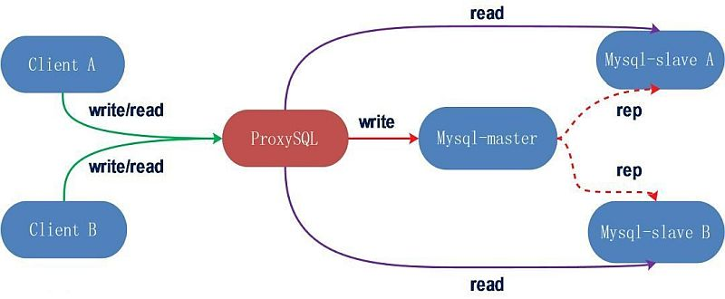
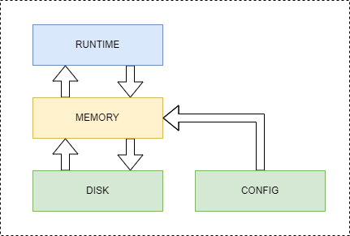

# ProxySQL

- [ProxySQL](#proxysql)
  - [1. ProxySQL 说明](#1-proxysql-说明)
    - [1.1. ProxySQL 配置存储结构](#11-proxysql-配置存储结构)
    - [1.2. ProxySQL 内置数据库说明](#12-proxysql-内置数据库说明)
  - [2. 配置 ProxySQL](#2-配置-proxysql)
    - [2.1. 登录 ProxySQL](#21-登录-proxysql)
      - [2.1.1. 登录配置](#211-登录配置)
      - [2.1.2. 登录 ProxySQL Admin](#212-登录-proxysql-admin)
    - [2.2. 添加后端数据库](#22-添加后端数据库)
      - [2.2.1. 配置后端数据库](#221-配置后端数据库)
      - [2.2.2. 查看配置结果](#222-查看配置结果)
    - [2.3. 添加访问用户](#23-添加访问用户)
      - [2.3.1. 为 Percona 数据库创建用户](#231-为-percona-数据库创建用户)
      - [2.3.2. 将用户加入 ProxySQL](#232-将用户加入-proxysql)
      - [2.3.3. 查看设置结果](#233-查看设置结果)
      - [2.3.4. 查看监控状态](#234-查看监控状态)
        - [查询后端数据库连接日志](#查询后端数据库连接日志)
        - [查询后端数据库 ping 日志](#查询后端数据库-ping-日志)
    - [2.4. 创建复制组](#24-创建复制组)
    - [2.5. 创建读写分离规则](#25-创建读写分离规则)
      - [2.5.1. 主库规则](#251-主库规则)
      - [2.5.2. 从库规则](#252-从库规则)
      - [2.5.3. 令配置生效](#253-令配置生效)
      - [2.5.4. 测试读写分离](#254-测试读写分离)
        - [2.5.4.1. 登录 ProxySQL](#2541-登录-proxysql)
        - [2.5.4.2. 执行测试](#2542-执行测试)
      - [2.5.5. 其它规则](#255-其它规则)
  - [3. 进阶配置](#3-进阶配置)
    - [3.1. 使用配置文件](#31-使用配置文件)
    - [3.1. SQL Rewrite](#31-sql-rewrite)
    - [3.2. 查询缓冲](#32-查询缓冲)
    - [3.3. 配置集群](#33-配置集群)
    - [3.4. 查询注解](#34-查询注解)

配置了主从同步 (或双主同步) 后, 即可以进行"读写分离", 即在 Master 节点上进行"写操作", 在 Slave (或另一个 Master) 节点上进行"读操作"

如果通过编程来控制读写分离, 会让程序变的比较复杂, 而 ProxySQL 这类的中间件可以代理 MySQL 服务, 并将不同的 SQL 语句发送到不同的服务上

本例中, 通过 [基于 Binlog 的主从模式](../cluster-ms/README.md) 章节介绍的方式搭建数据库集群



对于读写分离, 有一些方法论可以遵循, 可以参考 [读写分离方法论](./doc/rw-separation.md) 章节

## 1. ProxySQL 说明

### 1.1. ProxySQL 配置存储结构

ProxySQL 配置分为 `RUNTIME`, `MEMORY` 以及 `DISK` + `CONFIG` 三层, 其中:



- ProxySQL 执行时获取的配置均存储在 `RUNTIME` 部分, 这部分内容通过 SQLite 内存数据库进行管理;
- 在 `CONFIG` 中的配置项, 在第一次 ProxySQL 启动时和 `DISK` 中的配置合并, 进而加载到 `RUNTIME` 中, 冲突的部分以 `DISK` 为准;
- 在 `DISK` 中的配置信息会在 ProxySQL 启动的时候加载到 `RUNTIME`;
- 通过 ProxySQL Admin 对配置进行的修改会存储到 `MEMORY` 中, 不会立即生效, 需要手动将其加载到 `RUNTIME` 中或存储到 `FILE` 中;

加载和写入配置是通过 `LOAD .. FROM/TO ...` 指令以及 `SAVE ... FROM/TO ...` 指令, 其中:

- 将配置从 `MEMORY` 加载到 `RUNTIME` 中

  ```sql
  LOAD [MYSQL USERS/SERVERS/QUERY RULES/VARIABLES]/[ADMIN VARIABLES] [FROM MEMORY/TO RUNTIME];
  ```

- 将配置从 `DISK` 加载到 `MEMORY` 中

  ```sql
  LOAD [MYSQL USERS/SERVERS/QUERY RULES/VARIABLES]/[ADMIN VARIABLES] [FROM DISK/TO MEMORY];
  ```

- 将配置从 `CONFIG` 加载到 `MEMORY` 中

  ```sql
  LOAD [MYSQL USERS/SERVERS/QUERY RULES/VARIABLES]/[ADMIN VARIABLES] [FROM CONFIG];
  ```

- 将配置从 `RUNTIME` 保存到 `MEMORY` 中

  ```sql
  SAVE [MYSQL USERS/SERVERS/QUERY RULES/VARIABLES]/[ADMIN VARIABLES] [FROM RUNTIME/TO MEMORY];
  ```

- 将配置从 `MEMORY` 保存到 `DISK` 中

  ```sql
  SAVE [MYSQL USERS/SERVERS/QUERY RULES/VARIABLES]/[ADMIN VARIABLES] [FROM MEMORY/TO DISK];
  ```

### 1.2. ProxySQL 内置数据库说明

登录到 ProxySQL 后, 可以查看系统内置的数据库

```sql
show databases;

+-----+---------------+-------------------------------------+
| seq | name          | file                                |
+-----+---------------+-------------------------------------+
| 0   | main          |                                     |
| 2   | disk          | /var/lib/proxysql/proxysql.db       |
| 3   | stats         |                                     |
| 4   | monitor       |                                     |
| 5   | stats_history | /var/lib/proxysql/proxysql_stats.db |
+-----+---------------+-------------------------------------+
```

其中:

- `main`, 内存配置数据库, 即 `MEMORY`, 表里存放后端数据库实例, 用户验证, 路由规则等信息, 主要包含如下几个表:
  - `mysql_servers`, 后端可以连接 MySQL 服务器的列表
  - `mysql_users`, 配置后端数据库的账号和监控的账号
  - `mysql_query_rules`, 指定查询路由到后端不同服务器的规则列表
- `disk`, 持久化到磁盘的配置, 是一个文件 SQLite 数据库
- `stats`, 后端数据的状态和统计情况
- `monitor`, 对后端数据库的监控数据
- `stats_history`, 这个库是 ProxySQL 收集的有关其内部功能的历史指标

## 2. 配置 ProxySQL

ProxySQL 具备两种配置方式:

1. 通过配置文件: 通过 [conf/proxysql.cnf](./conf/proxysql.cnf) 配置文件可以将预设的配置载入 ProxySQL, 但这种方式较少使用
2. 通过指令: 当 ProxySQL 启动后, 可以通过指令动态修改其配置, 并将配置进行持久化, 此时配置文件中只需要包含基本配置内容即可

本例中以 ProxySQL 指令方式演示

### 2.1. 登录 ProxySQL

#### 2.1.1. 登录配置

在配置文件 ([conf/proxysql.cnf](./conf/proxysql.cnf)) 中, 设置 ProxySQL 服务的管理端口, SQL 代理端口, 管理员用户名密码, 监控用户名密码等

管理员用户名用于登录 ProxySQL Admin, 对 ProxySQL 进行管理

监控用户用于 ProxySQL 对于后端数据库进行监控, 所以监控用户也需要在后端数据库中进行创建

```ini
admin_variables =
{
  admin_credentials="admin:admin;radmin:radmin"  # 管理员用户名:密码
  mysql_ifaces="0.0.0.0:6032" # 管理端口
  ...
}

mysql_variables=
{
  monitor_password="monitor" # 监控用户密码
  interfaces="0.0.0.0:3306"  # SQL 代理端口
  threads=4                  # 使用线程数
  ...
}
```

注意, 需要添加 `admin` 和 `radmin` (或任意其它用户名), 因为 `admin` 用户只允许在本地登录, 但 ProxySQL 镜像并未内置 MySQL 客户端, 需要从宿主机 (或通过其它容器) 进行链接, 从而无法使用 `admin` 用户

另外一个比较重要的参数为 `threads`, 默认为 `4`, 具体设置方式请参考[线程及连接池设置](./doc/thread.md)

#### 2.1.2. 登录 ProxySQL Admin

使用 MySQL 客户端即可登录到 ProxySQL

```bash
mysql -uadmin -p -h'127.0.0.1' -P6032 --prompt='Admin> '
```

注意, 必须具备 `-h'127.0.0.1'` 和 `-P6032` 两个参数, 否则连接会失败

### 2.2. 添加后端数据库

#### 2.2.1. 配置后端数据库

```sql
INSERT INTO `mysql_servers` (`hostgroup_id`, `hostname`, `port`, `weight`, `comment`)
VALUES (100, 'percona_master', 3306, 1, 'db0,ReadWrite'),
       (101, 'percona_master', 3306, 1, 'db0,ReadOnly');
       (101, 'percona_slave', 3306, 9, 'db0,ReadOnly');
```

表示:

- `percona_master` 是主库, 分配的组 ID 为 `100`, 负责全部写操作
- `percona_slave` 是从库, 分配的组 ID 为 `101`, 负责全部读操作, 这里将 `percona_master` 也加入该组是避免 `percona_slave` 节点阻塞导致无法读取数据, 让 `percona_master` 承接 $\frac{1}{10}$ 的读操作 (当然, 如果有多台从服务器, 就无须如此操作, 且可以根据从服务器的配置, 分配执行操作的权重)

#### 2.2.2. 查看配置结果

```sql
SELECT * FROM `mysql_servers`;

+--------------+----------------+------+-----------+--------+--------+-------------+-----------------+---------------------+---------+----------------+---------------+
| hostgroup_id | hostname       | port | gtid_port | status | weight | compression | max_connections | max_replication_lag | use_ssl | max_latency_ms | comment       |
+--------------+----------------+------+-----------+--------+--------+-------------+-----------------+---------------------+---------+----------------+---------------+
| 100          | percona_master | 3306 | 0         | ONLINE | 1      | 0           | 1000            | 0                   | 0       | 0              | db0,ReadWrite |
| 101          | percona_slave  | 3306 | 0         | ONLINE | 9      | 0           | 1000            | 0                   | 0       | 0              | db0,ReadOnly  |
+--------------+----------------+------+-----------+--------+--------+-------------+-----------------+---------------------+---------+----------------+---------------+
```

可以通过 `status` 字段查看后端数据库的在线情况

### 2.3. 添加访问用户

ProxySQL 需要提供最少**两个**用户和后端的数据库连接, 包括:

1. 用于在后端数据库执行 SQL 语句的用户;
2. 用于监控后端数据库健康状况的用户;

#### 2.3.1. 为 Percona 数据库创建用户

需要在 Master 和 Slave 数据库上执行如下代码创建 ProxySQL 所需用户

```sql
-- SQL 执行用户
CREATE USER 'proxysql'@'%' IDENTIFIED WITH mysql_native_password BY 'proxysql';
GRANT ALL PRIVILEGES ON *.* TO 'proxysql'@'%';

-- 后端数据库监控用户
CREATE USER 'monitor'@'%' IDENTIFIED WITH mysql_native_password BY 'monitor';
GRANT SELECT, SUPER, PROCESS, SHOW DATABASES, REPLICATION CLIENT, REPLICATION SLAVE ON *.* TO 'monitor'@'%';
```

本例中, 仍是通过 [sql/master_initialize.sql](./sql/master_initialize.sql) 脚本完成上述操作, 注意该文件需要映射到 `/docker-entrypoint-initdb.d` 路径下

#### 2.3.2. 将用户加入 ProxySQL

接下来即可在 ProxySQL 中设置用户信息, 用于和后端数据库进行连接, 该用户要和上一步创建的"SQL 执行用户"一致

```sql
INSERT INTO `mysql_users` (`username`, `password`, `active`, `default_hostgroup`, `max_connections`)
VALUES ('proxysql', 'proxysql', 1, 100, 1000);
```

将配置加载到 `RUNTIME` 以及进行持久化

```sql
LOAD MYSQL USERS TO RUNTIME;
SAVE MYSQL USERS TO DISK;
```

#### 2.3.3. 查看设置结果

```sql
SELECT * FROM `mysql_users`;

+----------+----------+--------+---------+-------------------+----------------+---------------+------------------------+--------------+---------+----------+-----------------+------------+---------+
| username | password | active | use_ssl | default_hostgroup | default_schema | schema_locked | transaction_persistent | fast_forward | backend | frontend | max_connections | attributes | comment |
+----------+----------+--------+---------+-------------------+----------------+---------------+------------------------+--------------+---------+----------+-----------------+------------+---------+
| proxysql | proxysql | 1      | 0       | 100               | NULL           | 0             | 1                      | 0            | 1       | 1        | 1000            |            |         |
+----------+----------+--------+---------+-------------------+----------------+---------------+------------------------+--------------+---------+----------+-----------------+------------+---------+
```

本例中, `monitor` 用于的密码在 ProxySQL 配置文件 ([conf/proxysql.cnf](./conf/proxysql.cnf)) 中已经指定, 如果需要在配置文件中修改, 则需要重启 ProxySQL 实例

如果要在运行时修改, 则可以通过如下指令:

```sql
SET mysql-monitor_username = 'monitor';
SET mysql-monitor_password = 'monitor';

LOAD MYSQL VARIABLES TO RUNTIME;
SAVE MYSQL VARIABLES TO DISK;
```

#### 2.3.4. 查看监控状态

在后端数据库中设置了 `monitor` 用户后, ProxySQL 就会开始执行后端数据库的监控, 通过如下语句可进行查询:

##### 查询后端数据库连接日志

```sql
SELECT * FROM `monitor`.`mysql_server_connect_log` LIMIT 2;

+----------------+------+------------------+-------------------------+---------------+
| hostname       | port | time_start_us    | connect_success_time_us | connect_error |
+----------------+------+------------------+-------------------------+---------------+
| percona_slave  | 3306 | 1682672575637431 | 2150                    | NULL          |
| percona_master | 3306 | 1682672575935555 | 2208                    | NULL          |
+----------------+------+------------------+-------------------------+---------------+
```

- `connect_error` 字段如果不为 `NULL`, 则表示有错误发生

##### 查询后端数据库 ping 日志

```sql
SELECT * FROM `monitor`.`mysql_server_ping_log` LIMIT 10;

+----------------+------+------------------+----------------------+------------+
| hostname       | port | time_start_us    | ping_success_time_us | ping_error |
+----------------+------+------------------+----------------------+------------+
| percona_slave  | 3306 | 1682672735725829 | 333                  | NULL       |
| percona_master | 3306 | 1682672735885374 | 297                  | NULL       |
| percona_slave  | 3306 | 1682672745725898 | 262                  | NULL       |
| percona_master | 3306 | 1682672745829312 | 293                  | NULL       |
| percona_slave  | 3306 | 1682672755726026 | 286                  | NULL       |
| percona_master | 3306 | 1682672755923633 | 319                  | NULL       |
| percona_slave  | 3306 | 1682672765726109 | 343                  | NULL       |
| percona_master | 3306 | 1682672765845055 | 302                  | NULL       |
| percona_master | 3306 | 1682672775726287 | 320                  | NULL       |
| percona_slave  | 3306 | 1682672775922902 | 324                  | NULL       |
+----------------+------+------------------+----------------------+------------+
```

### 2.4. 创建复制组

复制组即指定"写"和"读"的组关系

```sql
INSERT INTO `mysql_replication_hostgroups` (`writer_hostgroup`, `reader_hostgroup`, `comment`)
VALUES (100, 101, 'db0');
```

查看执行结果:

```sql
SELECT * FROM `mysql_replication_hostgroups`;

+------------------+------------------+------------+---------+
| writer_hostgroup | reader_hostgroup | check_type | comment |
+------------------+------------------+------------+---------+
| 100              | 101              | read_only  | db0     |
+------------------+------------------+------------+---------+
```

### 2.5. 创建读写分离规则

注意, 规则的 `rule_id` 必须按指定顺序, 因为 ProxySQL 是按 `rule_id` 的顺序来匹配规则的, 而 `^SELECT` 这条规则会覆盖 `^SELECT .* FOR UPDATE$` 这条规则, 所以后者必须优先匹配

#### 2.5.1. 主库规则

设置主库 (ID 为 `100`) 处理 `SELECT ... FOR UPDATE` 这类查询

```sql
INSERT INTO `mysql_query_rules` (`rule_id`, `active`, `match_pattern`, `destination_hostgroup`,`apply`)
VALUES (20, 1, '^SELECT .* FOR UPDATE$', 100, 1);
```

#### 2.5.2. 从库规则

设置从库 (ID 为 `101`) 处理 `SELECT ...` 这类查询

```sql
INSERT INTO `mysql_query_rules` (`rule_id`, `active`, `match_pattern`, `destination_hostgroup`, `cache_ttl`, `apply`)
VALUES (30, 1, '^SELECT', 101, 5000, 1);
```

- `cache_ttl` 表示查询缓冲时间, 可以加快规则匹配效率

#### 2.5.3. 令配置生效

将配置加载到 `RUNTIME` 以及进行持久化

```sql
LOAD MYSQL QUERY RULES TO RUNTIME;
SAVE MYSQL QUERY RULES TO DISK;
```

查看配置结果

```sql
SELECT `rule_id`, `active`, `match_pattern`, `destination_hostgroup`, `cache_ttl`, `apply`
FROM `mysql_query_rules`;

+---------+--------+------------------------+-----------------------+-----------+-------+
| rule_id | active | match_pattern          | destination_hostgroup | cache_ttl | apply |
+---------+--------+------------------------+-----------------------+-----------+-------+
| 20      | 1      | ^SELECT .* FOR UPDATE$ | 100                   | 5000      | 1     |
| 30      | 1      | ^SELECT                | 101                   | 5000      | 1     |
+---------+--------+------------------------+-----------------------+-----------+-------+
```

#### 2.5.4. 测试读写分离

##### 2.5.4.1. 登录 ProxySQL

通过之前添加到 `mysql_users` 表中的用户, 可以登录 ProxySQL, 之后执行的 SQL 语句, 都会按照设置的规则分发到后端的 Percona 数据库中

即之后就可以将 ProxySQL 当作一个 MySQL 服务来时用, 而无需关注后端的 Percona 实例

```bash
mysql -uproxysql -p -h'127.0.0.1'
```

如果 ProxySQL 是在容器内启动的, 则 `-h'127.0.0.1'` 参数是必须的

##### 2.5.4.2. 执行测试

插入数据

```sql
USE `replicate_test`;

START TRANSACTION;

SELECT @@server_id;
+-------------+
| @@server_id |
+-------------+
|           1 |
+-------------+

INSERT INTO `test` (value) VALUES ('test-replicate-01');

SELECT @@server_id;
+-------------+
| @@server_id |
+-------------+
|           1 |
+-------------+

COMMIT;
```

可以看到自从事物启动后, 直到事物结束前, `@@server_id` 变量的值一直为 `1`, 表示 SQL 执行在后端 Master 数据库实例上

查询数据

```sql
SELECT * FROM `test`;
+----+-------------------+
| id | value             |
+----+-------------------+
|  1 | test-replicate-01 |
+----+-------------------+

SELECT @@server_id;
+-------------+
| @@server_id |
+-------------+
|           2 |
+-------------+
```

可以看到查询语句都在 `@@server_id` 为 `2` 上执行, 即 SQL 执行在后端 Slave 数据库实例上

#### 2.5.5. 其它规则

除了简单的读写分离外, ProxySQL 还可以处理其它更复杂的规则, 参见 [Query Rule](./doc/query-rule.md) 文档

## 3. 进阶配置

### 3.1. [使用配置文件](./doc/config-file.md)

### 3.1. [SQL Rewrite](./doc/sql-rewrite.md)

### 3.2. [查询缓冲](./doc/query-cache.md)

### 3.3. [配置集群](./doc/cluster.md)

### 3.4. [查询注解](./doc/query-annotations.md)
