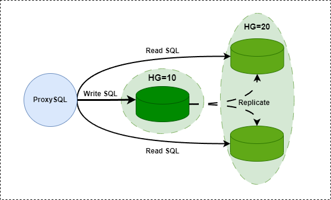
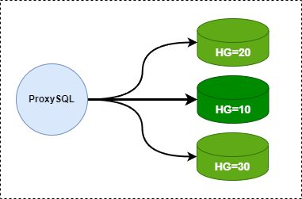
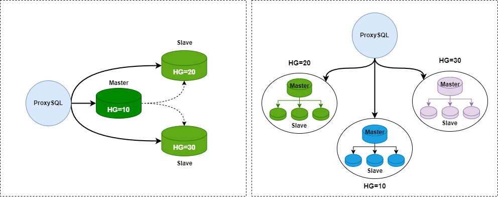
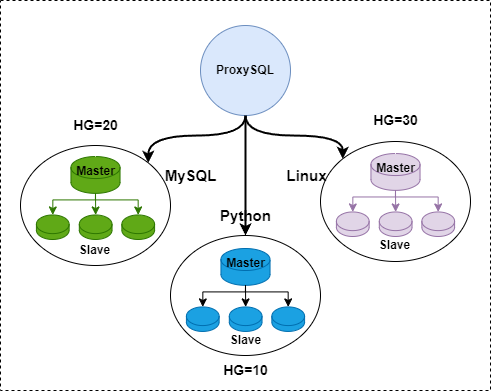

# 读写分离的方法论

- [读写分离的方法论](#读写分离的方法论)
  - [1. 不同类型的读写分离](#1-不同类型的读写分离)
    - [1.1. 最简单的读写分离](#11-最简单的读写分离)
    - [1.2. 多个读组或写组的分离模式](#12-多个读组或写组的分离模式)
    - [1.3. Sharding 后的读写分离](#13-sharding-后的读写分离)
  - [2. 找出需要特殊对待的 SQL 语句](#2-找出需要特殊对待的-sql-语句)

## 1. 不同类型的读写分离

ProxySQL 这类中间件最基本的功能就是实现读写分离, 而且 ProxySQL 支持的路由规则非常灵活, 不仅可以实现最简单的读写分离, 还可以将读/写都分散到多个不同的组, 以及实现分库分表查询 (Sharding)

本文只讨论通过规则制定的语句级读写分离, 不讨论通过 IP/Port, Client, Username, Schemaname 等标识实现的读写分离

下面描述了 ProxySQL 能实现的常见读写分离类型

### 1.1. 最简单的读写分离

如下图



这种模式的读写分离严格区分后端的 Master 和 Slave 节点, 且 Slave 节点必须设置只读选项 (`read_only=1`)

在 ProxySQL 上分两个组: 写组 (`HG=10`) 和读组 (`HG=20`), 同时在 ProxySQL 上开启 monitor 模块的 `read_only` 监控功能, 让 ProxySQL 根据监控到的 `read_only` 值来自动调整节点放在 `HG=10` (Master 会放进这个组) 还是 `HG=20` (Slave会放进这个组)

这种模式的读写分离最为简单, 只需在 ProxySQL Admin 的 `mysql_users` 表中设置用户的默认路由组为写组 `HG=10`, 并在`mysql_query_rules` 中加上两条简单的规则: `SELECT FOR UPDATE` 和 `SELECT` 即可

下面的例子说明了这种模式

- `mysql_replication_hostgroups`

  ```sql
  +------------------+------------------+----------+
  | writer_hostgroup | reader_hostgroup | comment  |
  +------------------+------------------+----------+
  | 10               | 20               | cluster1 |
  +------------------+------------------+----------+
  ```

- `mysql_servers`

  ```sql
  +--------------+----------+------+--------+--------+
  | hostgroup_id | hostname | port | status | weight |
  +--------------+----------+------+--------+--------+
  | 10           | master   | 3306 | ONLINE | 1      |
  | 20           | slave1   | 3306 | ONLINE | 1      |
  | 20           | slave2   | 3306 | ONLINE | 1      |
  +--------------+----------+------+--------+--------+
  ```

- `mysql_users`

  ```sql
  +----------+-------------------+
  | username | default_hostgroup |
  +----------+-------------------+
  | root     | 10                |
  +----------+-------------------+
  ```

- `mysql_query_rules`

  ```sql
  +---------+-----------------------+----------------------+
  | rule_id | destination_hostgroup | match_digest         |
  +---------+-----------------------+----------------------+
  | 1       | 10                    | ^SELECT.*FOR UPDATE$ |
  | 2       | 20                    | ^SELECT              |
  +---------+-----------------------+----------------------+
  ```

这种读写分离模式在环境较小时能满足绝大多数需求, 但是需求复杂, 规模较大时, 这种模式就太过死板 (因为一切都是 monitor 模块控制的)

### 1.2. 多个读组或写组的分离模式

前面那种读写分离模式是通过 monitor 模块监控 `read_only` 变量来调整的, 所以每一个后端集群必须只能分为一个写组和一个读组

但如果想要区分不同的 `SELECT` 并将不同的 `SELECT` 路由到不同的节点上. 例如有些查询语句的开销非常大, 想让它们独占一个**节点/组**, 其它查询共享一个**节点/组**

例如下面这种模式



看上去非常简单, 但是却能适应各种需求. 例如, 后端做了分库, 对某库的查询要路由到特定的主机组

至于各个组机组是同一个主从集群 (下图左), 还是互相独立的主从集群环境 (下图右), 则要看具体的需求, 不过这种读写分离模式都能应付



在实现这种模式的前提是不开启 monitor 模块的 `read_only` 监控功能, 也不设置 `mysql_replication_hostgroup` 表

例如, 对于上图左的结构, 写请求路由给 `HG=10`, 对 `test1` 库的 `SELECT` 语句路由给 `HG=20`, 其它 `SELECT` 路由给 `HG=30`

- `mysql_servers`

  ```sql
  +--------------+----------+------+--------+--------+
  | hostgroup_id | hostname | port | status | weight |
  +--------------+----------+------+--------+--------+
  | 10           | host1    | 3306 | ONLINE | 1      |
  | 20           | host2    | 3306 | ONLINE | 1      |
  | 30           | host3    | 3306 | ONLINE | 1      |
  +--------------+----------+------+--------+--------+
  ```

- `mysql_users`

  ```sql
  +----------+-------------------+
  | username | default_hostgroup |
  +----------+-------------------+
  | root     | 10                |
  +----------+-------------------+
  ```

- `mysql_query_rules`

  ```sql
  +---------+-----------------------+----------------------+
  | rule_id | destination_hostgroup | match_digest         |
  +---------+-----------------------+----------------------+
  | 1       | 10                    | ^SELECT.*FOR UPDATE$ |
  | 2       | 20                    | ^SELECT.*test1\..*   |
  | 3       | 30                    | ^SELECT              |
  +---------+-----------------------+----------------------+
  ```

### 1.3. Sharding 后的读写分离

ProxySQL 对 Sharding 的支持较弱, 要写 Sharding 的路由规则较为繁琐. 但无论如何, ProxySQL 通过定制路由规则是能实现简单的 Sharding 的. 这也算是读写分离的一种情况

如下图, 将课程信息放在三个库: "MySQL", "Python" 和 "Linux", 当查询条件中的筛选条件是 "MySQL" 时, 就路由给 MySQL 库所在的主机组 `HG=20`, 筛选条件是 "Python" 时就路由给 `HG=10`, 同理 `HG=30`



## 2. 找出需要特殊对待的 SQL 语句

有些 SQL 语句执行次数较多, 性能开销较大, 执行时间较长等等, 这几类语句都需要特殊对待. 例如, 将它们路由到独立的"节点/主机组", 或者为它们开启缓存功能

本测试通过 Sysbench 来模拟, 测试用例来自 [官方文档](https://proxysql.com/blog/configure-read-write-split/)

1. 首先创建测试数据库 `sbtest`, 这里我直接连接到后端的 MySQL 节点创建库和表

    ```bash
    mysqladmin -h'192.168.100.22' -uroot -pP@ssword1! -P3306 CREATE sbtest;
    ```

2. 准备测试表, 假设以 2 张表为例, 每个表中 10W 行数据. 填充完后, 两张表命名为 `sbtest1` 和 `sbtest2`

    ```bash
    export SYSBENCH=/usr/share/sysbench/

    sysbench --mysql-host=192.168.100.22 \
             --mysql-port=3306 \
             --mysql-user=root \
             --mysql-password=P@ssword1! \
             $SYSBENCH/oltp_common.lua \
             --tables=1 \
             --table_size=100000 \
             prepare
    ```

3. sysbench 连接到 ProxySQL, 做只读测试. 注意下面的选项 `--db-ps-mode` 必须设置为 `disable`, 表示禁止 ProxySQL 使用 `prepare statement` (目前 ProxySQL 还不支持对 prepare 语句的缓存, 不过ProxySQL作者已经将此功能提上日程了)

    ```bash
    sysbench --threads=4 \
             --time=20 \
             --report-interval=5 \
             --mysql-host=127.0.0.1 \
             --mysql-port=6033 \
             --mysql-user=root \
             --mysql-password=P@ssword1! \
             --db-ps-mode=disable \
             $SYSBENCH/oltp_read_only.lua \
             --skip_trx=on \
             --tables=1 \
             --table_size=100000 \
             run
    ```

    由于这时候还没有设置 sysbench 的测试语句的路由, 所以它们全都会路由到同一个主机组 (例如默认的组)

4. 查看 `stats_mysql_query_digest`表, 按照各种测试指标条件进行排序, 例如按照总执行时间字段 `sum_time` 降序以便找出最耗时的语句, 按照 `count_star` 降序排序找出执行次数最多的语句, 还可以按照平均执行时间降序等等. 请参照上面列出的 [官方手册](https://proxysql.com/blog/configure-read-write-split/)

    例如, 此处按照 `sum_time` 降序排序

    ```sql
    SELECT `count_star`, `sum_time`, `digest`, `digest_text`
    FROM `stats_mysql_query_digest`
    ORDER BY `sum_time` DESC
    LIMIT 4;

    +------------+----------+--------------------+---------------------------------------------+
    | count_star | sum_time | digest             | digest_text                                 |
    +------------+----------+--------------------+---------------------------------------------+
    | 72490      | 17732590 | 0x13781C1DBF001A0C | SELECT c FROM sbtest1 WHERE id=?            |
    | 7249       | 9629225  | 0x704822A0F7D3CD60 | SELECT DISTINCT c FROM sbtest1 XXXXXXXXXXXX |
    | 7249       | 6650716  | 0xADF3DDF2877EEAAF | SELECT c FROM sbtest1 WHERE id XXXXXXXXXXXX |
    | 7249       | 3235986  | 0x7DD56217AF7A5197 | SELECT c FROM sbtest1 WHERE id yyyyyyyyyyyy |
    +------------+----------+--------------------+---------------------------------------------+
    ```

5. 对那些开销大的语句, 制定独立的路由规则, 并决定是否开启查询缓存以及缓存过期时长

6. 写好规则后进行测试
