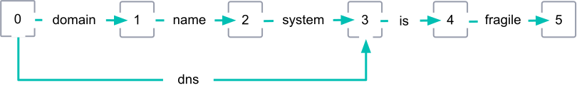
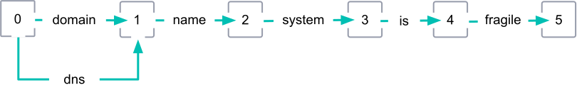

# 过滤器

- [过滤器](#过滤器)
  - [1. 词过滤器](#1-词过滤器)
    - [1.1. 撇号过滤器](#11-撇号过滤器)
    - [1.2. ASCII 折叠过滤器](#12-ascii-折叠过滤器)
    - [1.3. 中日韩二元模型过滤器](#13-中日韩二元模型过滤器)
    - [1.4. 中日韩字符宽度过滤器](#14-中日韩字符宽度过滤器)
    - [1.5. 经典过滤器](#15-经典过滤器)
    - [1.6. 常用词二元模型过滤器](#16-常用词二元模型过滤器)
    - [1.7. 条件过滤器](#17-条件过滤器)
    - [1.8. 数字过滤器](#18-数字过滤器)
    - [1.9. 分隔负载过滤器](#19-分隔负载过滤器)
      - [负载](#负载)
    - [1.10. 字典解码器过滤器](#110-字典解码器过滤器)
    - [1.11. 边缘 n-gram 标记过滤器](#111-边缘-n-gram-标记过滤器)
    - [1.12. 省略标记过滤器](#112-省略标记过滤器)
    - [1.13. 指纹标记过滤器](#113-指纹标记过滤器)
    - [1.14. 扁平化标记图过滤器](#114-扁平化标记图过滤器)
    - [1.15. Hunspell 令牌筛选器](#115-hunspell-令牌筛选器)
  - [2. 字符过滤器](#2-字符过滤器)

## 1. 词过滤器

[Token Filter](https://www.elastic.co/guide/en/elasticsearch/reference/current/analysis-tokenfilters.html)

分词过滤器接受来自分词器的结果流，可以在此基础上完成：

- 修改分词结果（如改为小写字母）
- 删除词汇（如删除停止词）
- 添加词汇（如同义词）

### 1.1. 撇号过滤器

[Apostrophe Token Filter](https://www.elastic.co/guide/en/elasticsearch/reference/current/analysis-apostrophe-tokenfilter.html)

删除撇号后的所有字符，包括撇号本身

这个过滤器包含在 Elasticsearch 内置的 [土耳其语分析器](https://www.elastic.co/guide/en/elasticsearch/reference/current/analysis-lang-analyzer.html#turkish-analyzer) 中。它使用 [Lucene 撇号过滤器](https://lucene.apache.org/core/8_4_0/analyzers-common/org/apache/lucene/analysis/tr/ApostropheFilter.html)，是为土耳其语构建的

```json
PUT /analyzer-apostrophe
{
    "settings": {
        "analysis": {
            "analyzer": {
                "apostrophe_analyzer": {
                    "tokenizer": "standard",
                    "filter": [
                        "apostrophe"
                    ]
                }
            }
        }
    }
}

POST /analyzer-apostrophe/_analyze
{
    "analyzer": "apostrophe_analyzer",
    "text": "Istanbul'a veya Istanbul'dan"
}
```

### 1.2. ASCII 折叠过滤器

[ASCII Folding Token Filter](https://www.elastic.co/guide/en/elasticsearch/reference/current/analysis-asciifolding-tokenfilter.html)

将不属于基本拉丁 Unicode 块(前 `127` 个 ASCII 字符)的字母、数字和符号转换为 ASCII 等效字符（如果存在的话）。例如，过滤器将 `à` 更改为 `a`

这个过滤器使用 Lucene 的 [ASCIIFoldingFilter](https://lucene.apache.org/core/8_4_0/analyzers-common/org/apache/lucene/analysis/miscellaneous/ASCIIFoldingFilter.html)

```json
PUT /analyzer-asciifolding
{
    "settings": {
        "analysis": {
            "analyzer": {
                "asciifolding_analyzer": {
                    "tokenizer": "standard",
                    "filter": [
                        "asciifolding"
                    ]
                }
            }
        }
    }
}

POST /analyzer-asciifolding/_analyze
{
    "analyzer": "asciifolding_analyzer",
    "text": "açaí à la carte"
}
```

### 1.3. 中日韩二元模型过滤器

[CJK Bigram Token Filter](https://www.elastic.co/guide/en/elasticsearch/reference/current/analysis-cjk-bigram-tokenfilter.html)

使用 CJK (中文、日文和韩文) 标记形成 “二元模型”

该过滤器包含在 Elasticsearch 的内置 [CJK 语言分析器中](https://www.elastic.co/guide/en/elasticsearch/reference/current/analysis-lang-analyzer.html#cjk-analyzer)。它使用 Lucene 的 [CJKBigramFilter](https://lucene.apache.org/core/8_4_0/analyzers-common/org/apache/lucene/analysis/cjk/CJKBigramFilter.html)

```json
PUT /analyzer-cjk-bigram
{
    "settings": {
        "analysis": {
            "analyzer": {
                "cjk_bigram_analyzer": {
                    "tokenizer": "standard",
                    "filter": [
                        "cjk_bigram"
                    ]
                }
            }
        }
    }
}

POST /analyzer-cjk-bigram/_analyze
{
    "analyzer": "cjk_bigram_analyzer",
    "text": "東京都は、日本の首都であり"
}
```

### 1.4. 中日韩字符宽度过滤器

[CJK Width Token Filter](https://www.elastic.co/guide/en/elasticsearch/reference/current/analysis-cjk-width-tokenfilter.html)

将中日韩文字的宽度差异正常化如下:

- 将全宽度 ASCII 字符变体折叠成等效的基本拉丁字符
- 将半宽度片假名字符变体折叠成等效的假名字符
- 该过滤器包含在 Elasticsearch 的内置 [CJK 语言分析器](https://www.elastic.co/guide/en/elasticsearch/reference/current/analysis-lang-analyzer.html#cjk-analyzer) 中。它使用 Lucene 的 [CJKWidthFilter](https://lucene.apache.org/core/8_4_0/analyzers-common/org/apache/lucene/analysis/cjk/CJKWidthFilter.html)

```json
PUT /analyzer-cjk-width
{
    "settings": {
        "analysis": {
            "analyzer": {
                "cjk_width_analyzer": {
                    "tokenizer": "standard",
                    "filter": [
                        "cjk_bigram"
                    ]
                }
            }
        }
    }
}

POST /analyzer-cjk-width/_analyze
{
    "analyzer": "cjk_width_analyzer",
    "text": "ｼｰｻｲﾄﾞﾗｲﾅｰ"
}
```

### 1.5. 经典过滤器

[Classic Token Filter](https://www.elastic.co/guide/en/elasticsearch/reference/current/analysis-classic-tokenfilter.html)

对 [经典分词器](https://www.elastic.co/guide/en/elasticsearch/reference/current/analysis-classic-tokenizer.html) 生成的 **词** 执行可选的后置处理

这个过滤器将英语所有格 `'s` 从单词的末尾移除，并将缩略词中的点移除。它使用 Lucene 的 [ClassicFilter](https://lucene.apache.org/core/8_4_0/analyzers-common/org/apache/lucene/analysis/standard/ClassicFilter.html)

```json
PUT /analyzer-classic
{
    "settings": {
        "analysis": {
            "analyzer": {
                "classic_analyzer": {
                    "tokenizer": "standard",
                    "filter": [
                        "classic"
                    ]
                }
            }
        }
    }
}

POST /analyzer-classic/_analyze
{
    "analyzer": "classic_analyzer",
    "text": "The 2 Q.U.I.C.K. Brown-Foxes jumped over the lazy dog's bone."
}
```

### 1.6. 常用词二元模型过滤器

[Common Grams Token Filter](https://www.elastic.co/guide/en/elasticsearch/reference/current/analysis-common-grams-tokenfilter.html)

为一组指定的常用词生成 [二元模型](https://en.wikipedia.org/wiki/Bigram) 组合。例如，可以指定 `is` 和 `the` 作为常用单词。然后该过滤器将标记 `[the, quick, fox, is, brown]` 转换为 `[the, the_quick, quick, fox, fox_is, is, is_brown, brown]`

如果不想完全忽略常见单词，可以使用 `common_grams` 过滤器来代替 `stop 过滤器`

这个过滤器使用 Lucene 的 [CommonGramsFilter](https://lucene.apache.org/core/8_4_0/analyzers-common/org/apache/lucene/analysis/commongrams/CommonGramsFilter.html)。

```json
PUT /analyzer-common-grams
{
    "settings": {
        "analysis": {
            "analyzer": {
                "common_grams_analyzer": {
                    "tokenizer": "whitespace",
                    "filter": [
                        "common_grams_filter"
                    ]
                }
            },
            "filter": {
                "common_grams_filter": {
                    "type": "common_grams",
                    "common_words": [
                        "a",
                        "is",
                        "the"
                    ],
                    "ignore_case": true,
                    "query_mode": true
                }
            }
        }
    }
}

POST /analyzer-common-grams/_analyze
{
    "analyzer": "common_grams_analyzer",
    "text": "the quick fox is brown"
}
```

- `common_words` 词表。过滤器为这些词标记生成二元词组。此参数或 `common_words_path` 参数都是必需的
- `common_words_path` 包含词汇列表的文件路径。过滤器为这些标记生成二元词组。该文件必须是 UTF-8 编码，每个标记必须用一个换行符分隔。此参数或 `common_words` 参数都是必需的
- `ignore_case` 如果为`true`，则单词匹配不区分大小写。默认值为`false`
- `query_mode` 建议为文本分析器启用此参数，默认值为`false`，如果为`true`，则过滤器从输出中排除以下词汇
  - 常用词汇的一元模型
  - 词汇后接普通单词的一元模型

### 1.7. 条件过滤器

[Conditional Token Filter](https://www.elastic.co/guide/en/elasticsearch/reference/current/analysis-condition-tokenfilter.html)

将一组过滤器应用于与所提供的“条件脚本”相符的词汇中。例如：将 `lowercase` 过滤器应用于符合 `token.getTerm().length() < 5` 条件的词汇中

这个过滤器使用 Lucene 的 [ConditionalTokenFilter](https://lucene.apache.org/core/8_4_0/analyzers-common/org/apache/lucene/analysis/miscellaneous/ConditionalTokenFilter.html)

下例中，将词长度在 `5` 以内的结果转换为 **小写**

```json
PUT /analyzer-condition-token
{
    "settings": {
        "analysis": {
            "analyzer": {
                "condition_token_analyzer": {
                    "tokenizer": "standard",
                    "filter": [
                        "condition_filter"
                    ]
                }
            },
            "filter": {
                "condition_filter": {
                    "type": "condition",
                    "filter": [
                        "lowercase"
                    ],
                    "script": {
                        "source": "token.getTerm().length() < 5"
                    }
                }
            }
        }
    }
}

POST /analyzer-condition-token/_analyze
{
    "analyzer": "condition_token_analyzer",
    "text": "THE QUICK BROWN FOX"
}
```

- `filter`: 过滤器的数组。如果某词汇与参数中的 “条件脚本” 匹配，则按照提供的顺序将这些过滤器应用词汇。在定义索引的字段映射关系时，这些过滤器可以包括在自定义过滤器中
- `script`: Painless 脚本，表示一个条件。如果某词汇与此脚本匹配，则指定的过滤器将应用于该词汇。有关有效参数，请参阅 [脚本参数](https://www.elastic.co/guide/en/elasticsearch/reference/current/modules-scripting-using.html#_script_parameters)。只支持内联脚本，Painless 脚本在分析谓词上下文中执行，并且需要一个词汇属性

### 1.8. 数字过滤器

[Decimal Digit Token Filter](https://www.elastic.co/guide/en/elasticsearch/reference/current/analysis-decimal-digit-tokenfilter.html)

将 Unicode `Decimal_Number` 常规类别中的所有数字转换为阿拉伯数字 (`0`-`9`)。例如，过滤器会将孟加拉数字 `৩` 转为 `3`

这个过滤器使用 Lucene 的 [DecimalDigitFilter](https://lucene.apache.org/core/8_4_0/analyzers-common/org/apache/lucene/analysis/core/DecimalDigitFilter.html)

将语言特定的数字字符转为阿拉伯字符串

```json
PUT /analyzer-decimal-digit
{
    "settings": {
        "analysis": {
            "analyzer": {
                "decimal_digit_analyzer": {
                    "tokenizer": "whitespace",
                    "filter": [
                        "decimal_digit"
                    ]
                }
            }
        }
    }
}

POST /analyzer-decimal-digit/_analyze
{
    "analyzer": "decimal_digit_analyzer",
    "text": "१-one two-२ ३"
}
```

### 1.9. 分隔负载过滤器

[Delimited Payload Token Filter](https://www.elastic.co/guide/en/elasticsearch/reference/current/analysis-delimited-payload-tokenfilter.html)

通过指定的分隔符将词汇流分隔为词汇和负载。例如，可以使用带 `|` 分隔符的 `delimited_payload` 过滤器来将 `the|1 quick|2 fox|3` 拆分为 `the`、`quick` 和 `fox`，它们的有效负载分别为 `1`、`2` 和 `3`

这个过滤器使用 Lucene 的 [DelimitedPayloadTokenFilter](https://lucene.apache.org/core/8_4_0/analyzers-common/org/apache/lucene/analysis/payloads/DelimitedPayloadTokenFilter.html)

#### 负载

负载是用户定义的与词汇位置关联的二进制数据，并以 base64 编码的字节存储。默认情况下，Elasticsearch 不存储词汇负载。要存储有效载荷，您必须:

- 将 `term_vector` 映射参数设置为 `with_positions_payloads` 或`with_positions_offsets_payloads`，用于存储任何有效载荷的字段
- 使用一个包含 `delimited_payload` 过滤器的索引分析器

您可以使用 [Term vectors API](https://www.elastic.co/guide/en/elasticsearch/reference/current/docs-termvectors.html) 查看存储的有效载荷

```json
PUT /analyzer-delimited-payload
{
    "settings": {
        "analysis": {
            "analyzer": {
                "delimited_payload_analyzer": {
                    "tokenizer": "whitespace",
                    "filter": [
                        "delimited_payload"
                    ]
                }
            }
        }
    }
}

POST /analyzer-delimited-payload/_analyze
{
    "analyzer": "delimited_payload_analyzer",
    "text": "the|0 brown|10 fox|5 is|0 quick|10"
}
```

### 1.10. 字典解码器过滤器

[Dictionary Decompounder Token Filter](https://www.elastic.co/guide/en/elasticsearch/reference/current/analysis-dict-decomp-tokenfilter.html#analysis-dict-decomp-tokenfilter)

> 在大多数情况下，我们建议使用更快的 `hyphenation_decompounder` 令牌过滤器来代替这个过滤器。但可以使用 `dictionary_decompounder` 过滤器来检查单词列表的质量，然后再在 `hyphenation_decompounder` 过滤器中实现它

使用指定的单词列表和暴力方法来查找复合词中的子单词。如果找到则这些子单词将包含在词汇输出中

这个过滤器使用 Lucene 的 [DictionaryCompoundWordTokenFilter](https://lucene.apache.org/core/8_4_0/analyzers-common/org/apache/lucene/analysis/compound/DictionaryCompoundWordTokenFilter.html)，它是为日耳曼语言构建的

```json
PUT /analyzer-dictionary-decompounder
{
    "settings": {
        "analysis": {
            "analyzer": {
                "dictionary_decompounder_analyzer": {
                    "tokenizer": "whitespace",
                    "filter": [
                        "dictionary_decompounder_filter"
                    ]
                }
            },
            "filter": {
                "dictionary_decompounder_filter": {
                    "type": "dictionary_decompounder",
                    "word_list": [
                        "Donau",
                        "dampf",
                        "meer",
                        "schiff"
                    ]
                }
            }
        }
    }
}

POST /analyzer-dictionary-decompounder/_analyze
{
    "analyzer": "dictionary_decompounder_analyzer",
    "text": "Donaudampfschiff"
}
```

### 1.11. 边缘 n-gram 标记过滤器

[Edge n-gram Token Filter](https://www.elastic.co/guide/en/elasticsearch/reference/current/analysis-edgengram-tokenfilter.html)

从词汇的开头形成指定长度的 `n-gram`。例如，您可以使用 `edge_ngram` 词过滤器将其快速更改为 `qu`。如果没有自定义，默认情况下过滤器会创建 `1` 字符的边缘 n-gram 个字符。

这个过滤器使用 Lucene 的 [EdgeNGramTokenFilter](https://lucene.apache.org/core/8_4_0/analyzers-common/org/apache/lucene/analysis/ngram/EdgeNGramTokenFilter.html)

> `edge_ngram` 过滤器类似于 [ngram token filter](https://www.elastic.co/guide/en/elasticsearch/reference/current/analysis-ngram-tokenizer.html)。但是，`edge_ngram` 只输出从标记开头开始的 `n` 个字符。这些边缘 n-grams 对于 [“按类型搜索”](https://www.elastic.co/guide/en/elasticsearch/reference/current/search-as-you-type.html) 查询非常有用

下例中获取每个词汇的前两个字符

```json
PUT /analyzer-edge-ngram
{
    "settings": {
        "analysis": {
            "analyzer": {
                "edge_ngram_analyzer": {
                    "tokenizer": "whitespace",
                    "filter": [
                        "edge_ngram_filter"
                    ]
                }
            },
            "filter": {
                "edge_ngram_filter": {
                    "type": "edge_ngram",
                    "min_gram": 1,
                    "max_gram": 2
                }
            }
        }
    }
}

POST /analyzer-edge-ngram/_analyze
{
    "analyzer": "edge_ngram_analyzer",
    "text": "the quick brown fox jumps"
}
```

- `max_gram` 待查找的子单词列表。如果找到，子单词将包含在词汇输出中。必须指定此参数或`word_list_path` 参数
- `min_gram` 待查找的子单词列表文件的路径。如果找到，子单词将包含在令牌输出中
- `side` 最大子字符长度。较长的子单词标记被排除在输出之外。默认为 `15`

### 1.12. 省略标记过滤器

[Elision Token Filter](https://www.elastic.co/guide/en/elasticsearch/reference/current/analysis-elision-tokenfilter.html)

删除令牌开头的指定 [省略](https://en.wikipedia.org/wiki/Elision)。例如，您可以使用此筛选器将 `l'avion` 更改为 `avion`

当未自定义时，过滤器默认删除以下法语部分: `l'`, `m'`, `t'`, `qu'`, `n'`, `s'`, `j'`, `d'`, `c'`, `jusqu'`, `quoiqu'`, `lorsqu'`, `puisqu'`

这个过滤器的定制版本包含在 Elasticsearch 的几个内置语言文本分析器中:

- [加泰罗尼亚](https://www.elastic.co/guide/en/elasticsearch/reference/current/analysis-lang-analyzer.html#catalan-analyzer)
- [法国](https://www.elastic.co/guide/en/elasticsearch/reference/current/analysis-lang-analyzer.html#french-analyzer)
- [爱尔兰](https://www.elastic.co/guide/en/elasticsearch/reference/current/analysis-lang-analyzer.html#irish-analyzer)
- [意大利](https://www.elastic.co/guide/en/elasticsearch/reference/current/analysis-lang-analyzer.html#italian-analyzer)

这个过滤器使用 Lucene 的 [ElisionFilter](https://lucene.apache.org/core/8_4_0/analyzers-common/org/apache/lucene/analysis/util/ElisionFilter.html)

```json
PUT /analyzer-elision
{
    "settings": {
        "analysis": {
            "analyzer": {
                "elision_analyzer": {
                    "tokenizer": "whitespace",
                    "filter": [
                        "elision"
                    ]
                }
            }
        }
    }
}

POST /analyzer-elision/_analyze
{
    "analyzer": "elision_analyzer",
    "text": "the quick brown fox jumps"
}
```

- `max_gram` 待查找的子单词列表。如果找到，子单词将包含在词汇输出中。必须指定此参数或 `word_list_path` 参数
- `min_gram` 待查找的子单词列表文件的路径。如果找到，子单词将包含在令牌输出中
- `side` 最大子字符长度。较长的子单词标记被排除在输出之外。默认为 `15`

### 1.13. 指纹标记过滤器

[Fingerprint Token Filter](https://www.elastic.co/guide/en/elasticsearch/reference/current/analysis-fingerprint-tokenfilter.html)

从分词结果流中排序并删除重复的词汇，然后将该流连接到单个输出结果中

例如，这个过滤器将 `[ the, fox, was, very, very, quick ]` 词汇流更改如下:

1. 将代币按字母顺序排列`[ fox, quick, the, very, very, was ]`
2. 删除重复的 `very` 词汇
3. 输出单个结果 `[fox quick the very was ]`

这个过滤器产生的输出标记对于指纹识别和聚集 [OpenRefine](https://github.com/OpenRefine/OpenRefine/wiki/Clustering-In-Depth#fingerprint) 项目中描述的文本非常有用

这个过滤器使用 Lucene 的 [FingerprintFilter](https://lucene.apache.org/core/8_4_0/analyzers-common/org/apache/lucene/analysis/miscellaneous/FingerprintFilter.html)

```json
PUT /analyzer-fingerprint
{
    "settings": {
        "analysis": {
            "analyzer": {
                "fingerprint_analyzer": {
                    "tokenizer": "whitespace",
                    "filter": [
                        "fingerprint_filter"
                    ]
                }
            },
            "filter": {
                "fingerprint_filter": {
                    "type": "fingerprint",
                    "separator": "-"
                }
            }
        }
    }
}

POST /analyzer-fingerprint/_analyze
{
    "analyzer": "fingerprint_analyzer",
    "text": "zebra jumps over resting resting dog"
}
```

- `max_output_size` 输出结果的最大字符长度，包括空格。默认为 `255`。如果连接的令牌长度超过此值，则不会产生结果输出
- `separator` 用于连接结果分词流的字符。默认为空格

### 1.14. 扁平化标记图过滤器

[Flatten Graph Token Filter](https://www.elastic.co/guide/en/elasticsearch/reference/7.16/analysis-flatten-graph-tokenfilter.html)

将其它图标记过滤器产生的结果扁平化，例如：[synonym_graph (同义词图过滤器)](https://www.elastic.co/guide/en/elasticsearch/reference/current/token-graphs.html) 或 [word_delimiter_graph](https://www.elastic.co/guide/en/elasticsearch/reference/current/analysis-word-delimiter-graph-tokenfilter.html) 生成的标记图

将包含多位置标记的标记图压扁，使其适合于索引。索引不支持包含多位置标记的标记图

> 扁平化图是一个有损过程
> 如果可能，避免使用展平图过滤器。相反，只在搜索分析器中使用图标记过滤器。这样就不需要平坦图过滤器了

扁平化可以使下面的标记图


转换为


```json
PUT /analyzer-synonym-graph
{
    "settings": {
        "analysis": {
            "analyzer": {
                "synonym_graph_analyzer": {
                    "tokenizer": "standard",
                    "filter": [
                        "synonym_graph_filter",
                        "flatten_graph"
                    ]
                }
            },
            "filter": {
                "synonym_graph_filter": {
                    "type": "synonym_graph",
                    "synonyms": [
                        "dns, domain name system"
                    ]
                }
            }
        }
    }
}

POST /analyzer-synonym-graph/_analyze
{
    "analyzer": "synonym_graph_analyzer",
    "text": "domain name system is fragile"
}
```

- `max_output_size` 输出结果的最大字符长度，包括空格。默认为 `255`。如果连接的令牌长度超过此值，则不会产生结果输出
- `separator` 用于连接结果分词流的字符。默认为空格

### 1.15. Hunspell 令牌筛选器

[Hunspell Token Filter](https://www.elastic.co/guide/en/elasticsearch/reference/7.16/analysis-hunspell-tokenfilter.html)

基于词典提取词干的词汇过滤器。该过滤器从文件系统（`<path.conf>/hunspell`）选取 Hunspell 字典。每个字典都应使用区域代码（例如 `zh_CN`）设置（语言）命名的自己的目录。此字典目录应保存单个 `.aff` 和一个或多个 `.dic` 文件（所有这些文件将自动选取）
例如，假设使用默认的 Hunspell 位置，以下目录布局将定义 `en_US` 字典：

```plain
- conf
    |-- hunspell
    |    |-- en_US
    |    |    |-- en_US.dic
    |    |    |-- en_US.aff
```

每个字典都可以配置一个设置：

- `ignore_case` 如果为`true`，则字典匹配将不区分大小写（默认值为`false`）

此设置可以在 `elasticsearch.yml` 配置文件中全局配置:

- `indices.analysis.hunspell.dictionary.ignore_case`

或特定词典：

- `indices.analysis.hunspell.dictionary.en_US.ignore_case`

还可以包含在典目录下的 `settings.yml` 文件中（这将覆盖 `elasticsearch.yml` 中定义的设置）

```json
PUT /analyzer-hunspell
{
    "settings": {
        "analysis": {
            "analyzer": {
                "hunspell_analyzer": {
                    "tokenizer": "standard",
                    "filter": [
                        "lowercase",
                        "hunspell_filter"
                    ]
                }
            },
            "filter": {
              "hunspell_filter": {
                "type": "hunspell",
                "locale": "en_US",
                "dedup": true
              }
            }
        }
    }
}

POST /analyzer-hunspell/_analyze
{
    "analyzer": "hunspell_analyzer",
    "text": "The 2 Q.U.I.C.K. Brown-Foxes jumped over the lazy dog's bone."
}
```

- `locale` 此筛选器的区位设置。如果未设置，则改为使用 `lang` 或 `language` 参数——即至少设置这三个参数的其中一个
- `dictionary` 字典的名称。在通过 `indices.analysis.hunspell.dictionary.location` 之前配置 hunspell 字典的路径
- `dedup` 如果只返回唯一的词汇，则需要将此词设置为 `true`。默认值为 `true`
- `longest_only` 如果只应返回最长的词汇，则设置为 `true`。默认值为 `false`, 返回所有可能的结果

> 与 snowball stemmers（基于算法）相反，这是一个基于字典查找的过滤器器，因此结果的质量取决于字典的质量。

## 2. 字符过滤器
