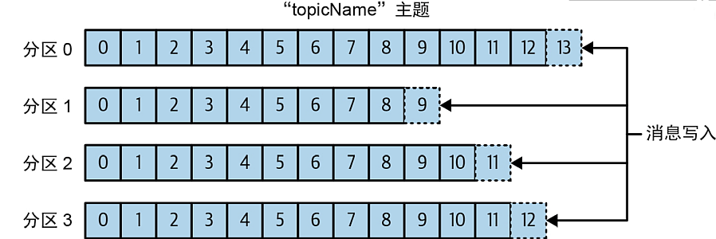
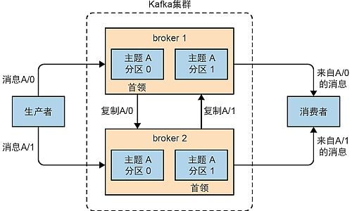
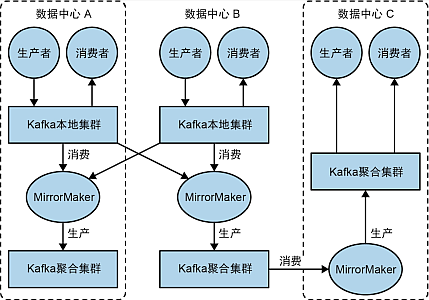

# Kafka

- [Kafka](#kafka)
  - [1. 安装配置](#1-安装配置)
    - [1.1. 单实例模式](#11-单实例模式)
    - [1.2. 集群模式](#12-集群模式)
      - [1.2.1. 使用 KRaft](#121-使用-kraft)
      - [1.2.2. 使用 Zookeeper](#122-使用-zookeeper)
  - [2. 使用及配置详解](#2-使用及配置详解)
    - [2.1. 简介](#21-简介)
      - [2.1.1. 消息和批次](#211-消息和批次)
      - [2.1.2. 模式](#212-模式)
      - [2.1.3. 主题和分区](#213-主题和分区)
      - [2.1.4. 生产和消费者](#214-生产和消费者)
      - [2.1.5. Broker 和集群](#215-broker-和集群)
      - [2.1.6. 多集群](#216-多集群)
    - [2.2. Broker 配置](#22-broker-配置)
      - [2.2.1. 服务配置](#221-服务配置)
      - [2.2.2. 安全认证](#222-安全认证)
    - [2.3. 客户端配置](#23-客户端配置)
      - [2.3.1. 生产者配置](#231-生产者配置)
      - [2.3.2. 消费者配置](#232-消费者配置)
    - [2.4. 使用容器](#24-使用容器)
    - [2.5. Kafka 集群](#25-kafka-集群)
      - [2.5.1. Zookeeper 集群](#251-zookeeper-集群)
        - [2.5.1.1. Zookeeper 集群配置](#2511-zookeeper-集群配置)
        - [2.5.1.2. Zookeeper 集群容器化配置](#2512-zookeeper-集群容器化配置)
      - [2.5.2. KRaft 集群](#252-kraft-集群)
        - [2.5.2.1. KRaft 集群配置](#2521-kraft-集群配置)
        - [2.5.2.2. KRaft 集群容器化配置](#2522-kraft-集群容器化配置)

## 1. 安装配置

为了便于在单机实验和演示, 本例使用 Docker 容器完成单实例和集群的配置和启动, 对于非容器环境, 只需要在本机启动

### 1.1. 单实例模式

单例模式配置参考 [单实例模式](./docker/standalone/README.md)

### 1.2. 集群模式

#### 1.2.1. 使用 KRaft

对于新版 Kafaka 集群, 可以脱离 Zookeeper 独立运行, 使用内部的 KRaft 来完成集群控制, 参考 [KRaft 集群](./docker/cluster-kraft/README.md) 章节

#### 1.2.2. 使用 Zookeeper

如果使用旧版 Kafka, 或者不想使用 KRaft 集群, 则可继续使用 Zookeeper 作为, 参考 [Zookeeper 集群](./docker/cluster-zk/README.md) 章节

## 2. 使用及配置详解

### 2.1. 简介

Kafka 是一款基于发布和订阅模式的消息系统 (即"分布式流式平台"), 其数据按一定的顺序持久化保存, 并可以按需读取. 此外, Kafka 的数据分布在整个系统中, 具备数据故障恢复能力和性能伸缩能力

Kafka 的优势:

1. 多生产者/消费者, Kafka 可以无缝支持多个生产者 (即任意数量的消费者可以创建多个主题写入消息), 同时一个消息主题可以被多个消费者消费, 多个消费者还可以组成群组;
2. 基于磁盘的数据存储, Kafka 接收到生产者发送的消息后会将其存储到磁盘, 并根据设置的保留策略进行保留 (各个主体都可以设置不同的保留策略), 这样就保证了数据不会丢失;
3. 伸缩性, Kafka 可以很容易进行扩展, 例如开发阶段使用单 Broker, 生产环境扩展到 3 个 Broker 的小型集群, 随着业务量的增长, 可以扩展到包含数百上千个 Broker 的大型集群, 且对集群的扩展不影响系统的整体连续性;
4. 高性能, Kafka 可以处理巨大的数据量 (消息流), 在处理大量数据的同时, 还能保证极低的消息延迟;

#### 2.1.1. 消息和批次

消息类似于数据库中的一个"数据行" (或一条"记录")

消息对于 Kafka 来说没有具体的格式或意义

消息可以具有一个可选的"元"数据, 也就是消息的"键". 键同样没有具体的格式和含义. 有些时候, 需要以一种可控方式将消息写入不同分区时, 需要用到键 (例如为键生成一致性哈希值, 再根据主题分区数进行取模, 将相同键的消息写到相同的分区)

消息会被分批写入 Kafka. "批次"包含了一组属于同一个主题和分区的消息 (把消息分批传输可以减少网络开销), 批次的大小越大, 单次传输的时间越长, 反之, 网络 IO 次数频繁, 需要妥善考虑

#### 2.1.2. 模式

模式即自定义的消息格式

Kafka 本身不限制消息的格式, 只是存储字节数组, 所以消息格式由生产者来定义, 也称为"模式"

模式可以是 JSON 或 XML, 也可以使用其它格式 (例如 Apache Avro), 各种不同的模式有各自的优缺点 (例如 Apache Avro 就可以支持强类型和模式演化, 可以向前向后兼容)

#### 2.1.3. 主题和分区

Kafka 消息通过 **主题** (Topic) 进行分类, 主题类似于数据库的表或者 Schema

一个主题被分为若干个 **分区** (Partition), 每个分区就是一个提交日志, 消息会按顺序被追加到各个分区, 然后按照 FIFO 的顺序被消费

无法在整个主题范围保证消息有序性, 但在同一分区, 消息是有序的

分区可以分布在多台服务器上, 以此来对 Kafka 进行冗余和伸缩, 即主题可以跨服务器. 另外, 分区可以被复制, 相同分区的多个副本可以保存在多台服务器上, 以此来避免单点故障

Kafka 也支持流式处理, 即在数据流转的各个环节中进行实时处理

#### 2.1.4. 生产和消费者

**生产者** (Producer) 和 **消费者** (Consumer) 都属于 Kafka 的客户端, 除此以外, Kafka 的客户端还包括 Kafka Connect API (用于数据集成) 和 Kafka Streams (用于流式处理)

生产者用于创建消息, 创建的消息会被发布到一个特定主题上. 默认情况下, 消息会均匀的分布到主题的所有分区中, 或者通过消息的键和分区器将消息发布到该主题的特定分区上

消费者用于读取消息, 消费者可以订阅一个或多个主题, 并按照消息写入分区的顺序来读取它们. 消费者通过 Offset (偏移量) 来区分已读取或未读取的消息, 每条消息的 Offset 都是唯一的, 且单调递增, 由作为消费者的客户端来维护这个数值. 如果消费者故障, 也不会导致消息丢失

若干消费者客户端可以组成 **群组**, 一个群组的全部消费者都用于读取同一个主题, 且主题中的每个分区都将分配给不同的消费者来读取, 例如下图中, 一个主题的 4 个分区分配给了三个消费者进行读取, 其中 `C1` 消费者同时读取两个分区

这样一来, 消费者对一个主题的消息进行并行处理, 而且任何一个消费者失效, 则该主题的消息都会被其它消费者接管

#### 2.1.5. Broker 和集群

一台 Kafka 服务器就称为一个 **Broker**. Broker 接收从生产者发送的消息, 为其设置偏移量, 并保存到磁盘. Broker 会为消费者提供服务, 对读取分区的消费者请求做出响应, 并将消息发送给该消费者

一个 Kafka Broker 可以处理 **上千个分区** 和 **百万级别/s** 的消息

多个 Broker 组成了**集群**, 每个集群都有一个 Broker 充当了 **集群控制器** 的角色, 用于为所有 Broker 分配分区和对 Broker 进行监控

在集群中, 一个分区从属于一个 Broker, 该 Broker 称为分区的 Leader, 该分区的一个副本会同步复制到另一个 Broker 上, 称为该分区的 Follower. 其中 Leader 用于消费者写入消息, 而 Leader 和 Follower 都可以被消费者读取消息

#### 2.1.6. 多集群

可以将多个 Kafka 集群分散到不同的数据中心中, 这就需要在集群间复制消息

通过 **MirrorMaker** 工具, 可以将数据复制到其它集群中, 如图所示:

### 2.2. Broker 配置

#### 2.2.1. 服务配置

Broker 服务相关的配置和使用参考 [Broker 配置](./doc/broker.md) 章节

#### 2.2.2. 安全认证

Broker 安全相关的配置和使用参考 [安全认证](./doc/certificate.md) 章节

### 2.3. 客户端配置

#### 2.3.1. 生产者配置

参考 [生产者配置](./doc/producer.md) 章节

#### 2.3.2. 消费者配置

参考 [消费者配置](./doc/consumer.md) 章节

### 2.4. 使用容器

参考 [单实例容器](./docker/standalone/README.md) 章节

### 2.5. Kafka 集群

#### 2.5.1. Zookeeper 集群

##### 2.5.1.1. Zookeeper 集群配置

##### 2.5.1.2. Zookeeper 集群容器化配置

#### 2.5.2. KRaft 集群

##### 2.5.2.1. KRaft 集群配置

参考 [KRaft 集群](./doc/kraft.md) 章节

##### 2.5.2.2. KRaft 集群容器化配置

参考 [KRaft 集群容器化](./docker/cluster-kraft/README.md) 章节
