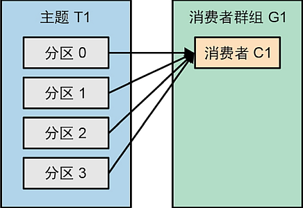
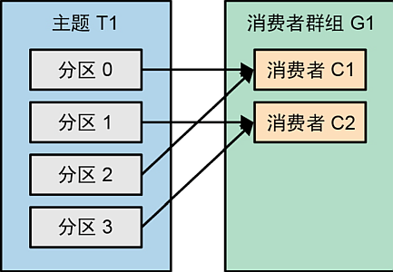
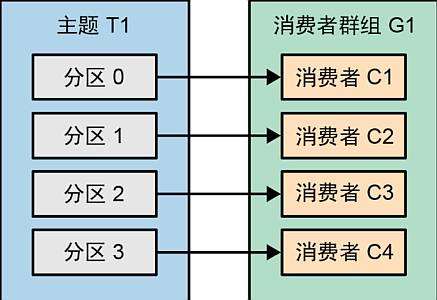
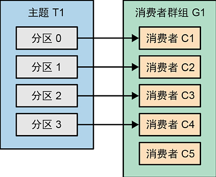
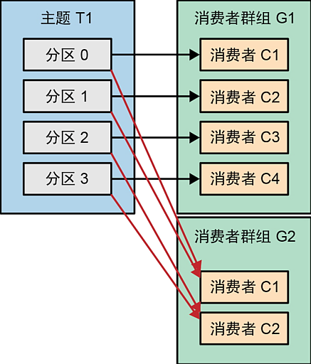
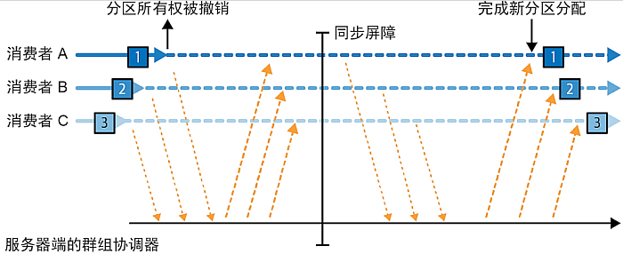
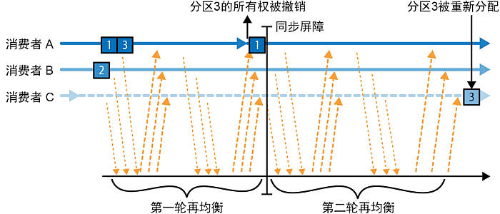

# 消费者

- [消费者](#消费者)
  - [1. 消费者相关概念](#1-消费者相关概念)
    - [1.1. 消费者和消费者组](#11-消费者和消费者组)
    - [1.2. 分区再平衡](#12-分区再平衡)
      - [1.2.1. 主动再平衡](#121-主动再平衡)
      - [1.2.2. 协作再平衡](#122-协作再平衡)
    - [1.3. 固定群组成员](#13-固定群组成员)
  - [2. 创建消费者](#2-创建消费者)
    - [2.1. 设置必要属性](#21-设置必要属性)
    - [2.2. 订阅主题](#22-订阅主题)
    - [2.3. 启动轮询](#23-启动轮询)
    - [2.4. 设置其它属性](#24-设置其它属性)

## 1. 消费者相关概念

**消费者** (Consumer) 即从 Kafka 读取消息的角色, 即生产者向 Kafka 写入消息, 由消费者从 Kafka 读取消息

### 1.1. 消费者和消费者组

Kafka 消费者从属于 **消费者组** (Consumer Group), 一个群组里的消费者订阅的是同一个主题的消息, 且主题的每个分区会分配给唯一的一个消费者. 即: 每个分区只能有一个消费者消费 (不可能将一个分区交给多个消费者), 但一个消费者可以同时消费多个分区

一般来说, 消费要比生产的速度慢, 所以消费者群组是对消费者进行横向扩展的方法

假设主题 `T1` 包含四个分区: `分区0 ~ 分区3`, 一个消费者组 `G1`, 则 `G1` 包含不同数量的消费者情况为:

1. 单消费者

   

   此时, 单独的一个消费者会消费主题中所有分区的消息

2. 多消费者

   

   此时, 四个分区会均匀的分配给两个消费者, 其中 `C1` 消费 `分区0` 和 `分区2`, `C2` 消费 `分区1` 和 `分区3`

3. 每个分区一个消费者

   

   如果能为每个分区配备一个消费者, 则可以达到最佳的吞吐量

4. 消费者多于分区

   

   如果消费者的数量多于分区的数量, 则多余的消费者将无法收到任何分区的消息, 因为一个分区不得被多个消费者消费, 所以设置多余分区数量的消费者是无意义的

可以增加多个消费者组, 例如为上面的例子增加消费者组 `G2` 也订阅主题 `T1` 的消息, 则 `G1` 和 `G2` 都会收到主题 `T1` 的全部消息, 即:



增加消费者组和消费者, 不会影响 Kafka 的性能

### 1.2. 分区再平衡

分区再平衡 (Rebalance) 指的是当一个主题相关的消费者群组中的消费者发生变化时 (加入新的消费者或关闭已有的消费者), 则分区会进行 **再平衡**

消费者会向被指定为群组协调器的 Broker (不同消费者群组的协调器可能不同) 发送心跳, 以此来保持群组成员关系和对分区的所有权关系

心跳是由消费者的一个后台线程发送的, 只要消费者能够以正常的时间间隔发送心跳, Kafka 集群就会认为该消费者还"存活"; 如果消费者在足够长的一段时间内没有发送心跳, 群组协调器会认为它已经"死亡", 进而触发再平衡

在消费者被判定为"死亡"的这几秒时间里, "死亡"的消费者不会读取分区里的消息, 在关闭消费者后, 协调器会立即触发一次再平衡, 尽量降低处理延迟

根据消费者群组所使用的分区分配策略的不同, 分区再平衡分为两种情况

#### 1.2.1. 主动再平衡

在进行主动再平衡期间, 所有消费者都会停止读取消息, 放弃分区所有权并重新加入消费者群组, 并获得重新分配到的分区

主动再平衡会导致整个消费者群组在一个很短的时间窗口内不可用, 这个时间窗口的长短取决于消费者群组的大小和几个配置参数



可以看到, 主动再平衡包含两个不同的阶段:

- 第一个阶段, 所有消费者都放弃分区所有权;
- 第二个阶段, 消费者重新加入群组, 获得重新分配到的分区, 并继续读取消息;

#### 1.2.2. 协作再平衡

协作再平衡, 也称为增量再平衡, 通常是指将一个消费者的部分分区重新分配给另一个消费者，其他消费者则继续读取没有被重新分配的分区

这种再平衡包含两个或多个阶段:

- 在第一个阶段, 消费者群组首领会通知所有消费者, 它们将失去部分分区的所有权, 然后消费者会停止读取这些分区, 并放弃对它们的所有权;
- 在第二个阶段, 消费者群组首领会将这些没有所有权的分区分配给其他消费者;

虽然这种增量再平衡可能需要进行几次迭代, 直到达到稳定状态, 但它避免了主动再平衡中出现的停顿窗口期, 这对大型消费者群组来说尤为重要, 因为它们的再平衡可能需要很长时间



### 1.3. 固定群组成员

默认情况下, 消费者的群组成员身份标识是临时的:

- 当一个消费者离开群组时, 分配给它的分区所有权将被撤销；
- 当该消费者重新加入时, 将通过再平衡协议为其分配一个新的成员 ID 和新分区;

可以给消费者分配一个唯一的 `group.instance.id`, 让它成为群组的固定成员:

- 当消费者第一次以固定成员身份加入群组时, 群组协调器会按照分区分配策略给它分配一部分分区;
- 当该消费者被关闭时, 不会自动离开群组, 即它仍然是群组的成员, 直到会话超时;
- 当这个消费者重新加入群组时, 它会继续持有之前的身份, 并分配到之前所持有的分区;
- 群组协调器缓存了每个成员的分区分配信息, 只需要将缓存中的信息发送给重新加入的固定成员, 不需要进行再平衡;

注意: 如果两个消费者使用相同的 `group.instance.id` 并加入同一个群组, 则后加入的消费者会收到错误, 告诉它具有相同 ID 的消费者已存在

注意: 设置了 `group.instance.id` 属性的固定消费组成员再关闭后, 不会立即离开该组 (只是暂时不再接收消息), 分配给其的分区也不会被组中的其它消费者读取 (因为不会发生再平衡), 固定成员关闭后, 真正离开消费者组的时间由消费者的 `session.timeout.ms` 属性决定:

- 可以将 `session.timeout.ms` 属性的值设置大一些, 给被关闭的消费者留有足够重新加入群组的时间, 这样该群组不会发生再平衡, 避免整体暂停的情况; 当消费者重新加入群组时, 会立即开始读取其原本关联的分区, 该分区的读取进度会稍稍落后一些, 但很快就会被赶上;
- 但也不能将 `session.timeout.ms` 属性的值设置的过大, 这样被关闭的消费者一旦出现无法恢复的情况, 则意味着很长一段时间内, 其对应的分区都无法被读取, 会出现较大的滞后;
- 正确的做法是估算一般情况下消费者故障恢复的时间, 以此来作为 `session.timeout.ms` 属性的上限值, 超过该事件, 应该让消费组进行再平衡, 将无人读取的分区分配给其它消费者处理;

## 2. 创建消费者

通过 `KafkaConsumer` 类型可以创建消费者对象, 同创建生产者对象类似, 创建消费者对象同样是通过保存一组消费者属性的 `Properties` 对象来进行

### 2.1. 设置必要属性

创建消费者需要设置一些属性, 其中必要的属性包括:

1. `bootstrap.servers`, 指定要连接的 Kafka 集群的地址, 这个属性的含义和生产者的 `bootstrap.servers` 属性一致, 参见生产者的 [设置必要属性](./producer.md#21-设置必要属性) 章节;

2. `group.id`, 指定要加入的消费组 ID, 这个值非必填, 缺省表示加入 **默认组** (即单个消费者自成一组), 一般情况下应该提供该属性值;

3. `key.deserializer`, 指定用于对读取的消息键进行反序列化的类型, 对应生产者的 `key.serializer` 属性, 作用相反, 参见生产者的 [设置必要属性](./producer.md#21-设置必要属性) 章节, 其中介绍的所有 Serializer 类型, 都对应有一个 Deserializer 类型用于消费者;

4. `value.deserializer`, 指定用于对读取的消息值进行反序列化的类型, 对应生产者的 `value.serializer` 属性, 作用相反, 参见生产者的 [设置必要属性](./producer.md#21-设置必要属性) 章节, 其中介绍的所有 Serializer 类型, 都对应有一个 Deserializer 类型用于消费者;

### 2.2. 订阅主题

创建 `KafkaConsumer` 类型对象后, 即可让其订阅主题

一个消费者可以订阅多个主题, 所以订阅的主题是一个 `List` 集合, 即:

```java
consumer.subscribe(List.of("Topic1", "Topic2", ...));
```

另一种订阅多个主题的方式是通过正则表达式, 即符合该正则表达式的主题都会自动被该消费者订阅, 即便该主题是后于消费者加入 Kafka 集群的, 例如:

```java
consumer.subscribe(Pattern.compile("Topic\\d+"));
```

这就表示, 所有符合 `"Topic" + 数字` 模式的主题, 都会被这个消费者订阅

但一般情况下不建议一个消费者订阅一个以上的主题, 这违背了 Kafka 对消息进行负载均衡的初衷, 例外情况包括:

1. 数据同步程序 (ETL), 即所有发布的数据源主题, 都应该被该消费者订阅并处理;
2. 测试程序;

> 注意: 利用正则表达式订阅主题会带来以下的一些副作用:
>
> 1. 消费者需要不定期的向 Broker 请求所有订阅的分区和主题列表, 依次来检查是否有新增主题需要进行订阅, 所以如果集群中存在大量的分区和主题, 这会给系统带来额外的网络开销;
> 2. 为了能够通过正则表达式订阅主题, 对应消费者必须掌握集群的全部主题元数据, 需要能够获取整个集群元数据的权限;

### 2.3. 启动轮询

### 2.4. 设置其它属性
