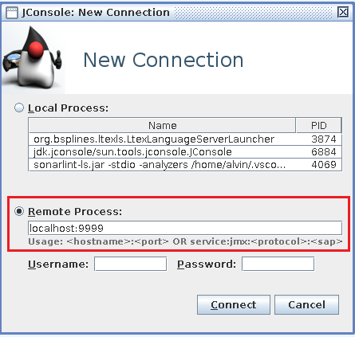
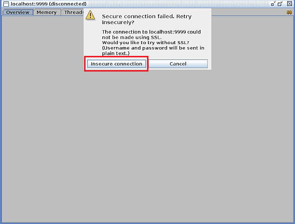
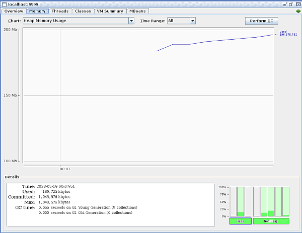
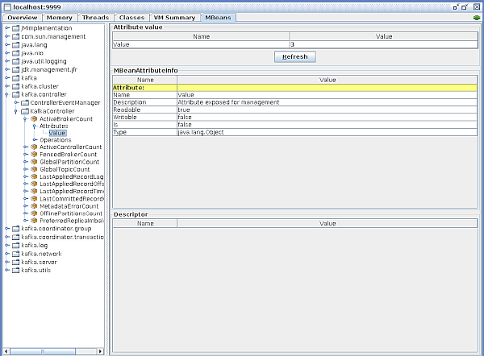

# Kafka 监控

## 1. 通过 JMX 监控

JMX 是 Kafka 遵循 JDK 规范启动的监控服务, 除了可以监控 Kafka JVM 的基本情况外, Kafka 还提供了一组 MBean 用于监控 Kafka 集群的情况

### 1.1. 设定 JMX 端口

在启动 Kafka 进程前, 设定环境变量 `JMX_PORT` 环境变量指定 JMX 服务的监听端口即可, 一般设置为 `9999`, 例如:

```bash
export JMX_PORT=9999
kafka-server-start.sh ./config/server.properties
```

或者

```bash
JMX_PORT=9999 kafka-server-start.sh ./config/server.properties
```

### 1.2. 查看 JMX 监控

通过 JDK 自带工具 `jconsole` 并连接到 Kafka 的 JMX 服务, 即可查看 JMX 监控信息, 以 `jconsole` 连接本地 Kafka 为例:

1. 启动 `jconsole` 并连接 Kafka

   直接运行 `jconsole` 命令, 并设置到 Kafka 进程的连接

   

   因为是本地连接, 没有开启 SSL 安全连接, 所以会有一个警告, 直接点击 "非安全连接" 即可

   

2. 查看 Kafka 监控

   完成连接后, 即可在选项卡中选择各种监控窗口进行查看, 包括 JVM 监控和 Kafka 监控数据

   

   MBean 数据查看

   

## 2. 通过 Prometheus 监控

使用 `jconsole` 在很多情况下并不方便 (特别是生产环境), 所以可以通过 Prometheus 服务来采集 Kafka 的监控情况

这里只介绍如何暴露 Kafka 的监控数据, Prometheus 的安装配置和 Grafana 仪表盘的安装配置不再说明

### 2.1. 使用 JMX Exporter

使用 JMX Exporter 的前提是 Kafka 的 `JMX_PORT` 已经设置

到 [jmx_exporter 官方](https://github.com/prometheus/jmx_exporter) 下载 `jmx_prometheus_javaagent-<version>.jar` 文件, 放入 Kafka 的 `libs` 目录

再根据官方文档中给出的配置文件范例, 编写 JMX Exporter 配置文件, 文件名定为 `kafka-jmx-exporter.yml`, 注意, 该配置文件中必须通过 `hostPort` 或 `jmxUrl` 指定 Kafka 的 JMX 服务地址

为 Kafka 增加额外的启动参数, 通过设置 `KAFKA_OPTS` 环境变量来完成

```bash
KAFKA_OPTS=-javaagent:/opt/bitnami/kafka/libs/jmx_prometheus_javaagent-<version>.jar=8090:kafka-jmx-exporter.yml
```

则通过访问 Kafka 服务地址的 `8090` 端口, 则可以看到监控指标, 即:

```bash
curl -fs http://localhost:8090/metrics
```

### 2.2. 使用 Kafka Exporter

另一种更为简单的方式是使用 Kafka Exporter, 其可以作为一个独立服务和 Kafka 部署在同一个集群内, 通过指定要监控的 Kafka 集群地址来采集集群内所有节点的监控状态

从 [Kafka Exporter 官方](https://github.com/danielqsj/kafka_exporter) 下载执行文件, 部署到 Kafka 集群的任意节点上 (或可以访问集群的新节点), 通过如下命令启动:

```bash
nohup ./kafka_exporter \
   --kafka.server=kf01:9092 \
   --kafka.server=kf02:9092 \
   --kafka.server=kf03:9092 \
   --web.listen-address=:9308 &
```

- `--kafka.server`, 指定 Kafka Exporter 要监控的 Kafka 节点地址, 要监控几个就写几个该参数;
- `--web.listen-address=:9308`, 指定 Kafka Exporter 绑定的服务地址, 通过此地址可以查看监控数据;

当然, 也可以使用 `systemd` 或者 `supervisord` 进行启动, 更为可靠

Kafka Exporter 服务启动后, 即可通过设定的监听端口访问服务, 获取监控信息

```bash
curl -fs http://localhost:9308/metrics
```

推荐使用此方式作为 Kafka 集群的监控方式, 只需一个服务即可监控全部集群状态
