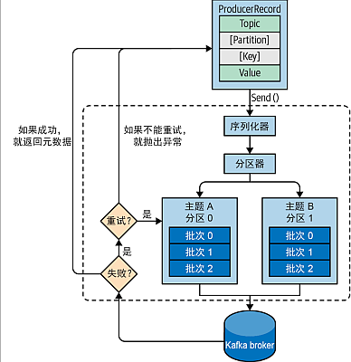
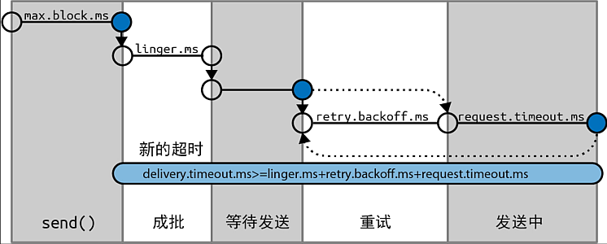

# 生产者

- [生产者](#生产者)
  - [1. 生产者相关概念](#1-生产者相关概念)
  - [2. 创建生产者](#2-创建生产者)
    - [2.1. 设置必要属性](#21-设置必要属性)
    - [2.2. 设置其它属性](#22-设置其它属性)
    - [2.3. 生产者发送模式](#23-生产者发送模式)
  - [3. 分区器](#3-分区器)
  - [4. 消息头](#4-消息头)
  - [5. 拦截器](#5-拦截器)
  - [6. 配额和节流](#6-配额和节流)
    - [6.1. 配置配额](#61-配置配额)
    - [6.2. 动态修改配额](#62-动态修改配额)
    - [6.3. 配额的工作模式](#63-配额的工作模式)
  - [7. 序列化器](#7-序列化器)
    - [7.1. 使用 Avro 序列化器](#71-使用-avro-序列化器)
    - [7.2. 自定义序列化器](#72-自定义序列化器)

## 1. 生产者相关概念

**生产者** (Producer) 将消息发送到 Kafka, 有 Kafka 保存后, 依次传递给消费者

各类消息都可以被生产者写入 Kafka, 且不同类型的消息具有不同的要求, 例如:

- 是否允许丢失消息;
- 是否允许消息重复;
- 是否有严格的消息延迟和吞吐量要求;

有些场景对消息的要求不高, 例如记录网站点击情况的场景, 允许有部分丢失和重复的消息, 也不会严格要求消息的延迟和处理性能; 但另一些场景, 例如信用卡交易消息, 则不允许消息的丢失或重复, 且对消息的延迟和吞吐量也有着严格的要求

Kafka 生产者发送消息的流程如下:



- 首先, 生产者发送的消息会包装为一个 `ProducerRecord` 消息对象, 其中包含目标 **主题** 和要发送的 **内容**. 另外, 还可以指定键, 分区, 时间戳或标头. 在发送 `ProducerRecord` 消息对象时, 生产者需要先把键和值对象序列化成字节数组, 才能在网络上传输;
- 接下来, 如果未指定分区, 则 `ProducerRecord` 消息对象将被传递给 **分区器**, 由分区器根据消息的 **键** 选择一个分区, 并将消息对象添加到一个 **消息批次** 中, 发往对应主题的分区;
- Broker 在接收到消息后会返回一个响应:
  - 如果消息写入成功, 返回 `RecordMetaData` 对象, 其中包含了主题和分区的信息, 以及消息在分区中的偏移量;
  - 如果写入失败, 则返回一个错误信息, Producer 在接收到错误信息后会尝试重试, 并在重试次数超过阈值后放弃重试, 将错误信息返回给客户端;

## 2. 创建生产者

通过 `KafkaProducer` 类型即可创建一个生产者对象, 创建时要指定生产者属性, 即通过一个保存属性的 `Properties` 对象创建生产者

### 2.1. 设置必要属性

创建生产者需要设置一些属性, 其中必要的属性包括:

1. `bootstrap.servers`, 指定 Broker 的地址 (格式为 `<host>:<port>`), 可以由多个地址组成 (以 `,` 分隔), 生产者通过这些地址建立初始的 Kafka 集群连接:

   - 无需包含集群内所有 Broker 的地址, 因为连接建立后, 可以从 Broker 中获取完整的集群信息;
   - 建议至少提供两个地址, 这样其中一个节点宕机, 仍有一个地址来保证可用性;

2. `key.serializer`, 指定消息 **键** 数据的序列化器类型, 该属性的值是一个"类"名字符串, 表示一个 Kafka 内置的序列化器类型:
   - 序列化器是一个实现了 `org.apache.kafka.common.serialization.Serializer` 的类, 用于将所给的数据转化为字节序列 (即 `byte[]`);
   - Kafka 客户端默认提供了 `ByteArraySerializer`, `StringSerializer`, `IntegerSerializer` 等序列化器, 一般可以满足需求, 如有特殊情况, 可以自定义序列化器;
   - 需要注意, `key.serializer` 这个属性是必选项, 即使消息中没有键, 仍需要将 `Void` 作为键类型, 并使用 `VoidSerializer` 序列化器;

3. `value.serializer`, 指定消息 **值** 数据的序列化器类型, 和 `key.serializer` 属性基本一致;

### 2.2. 设置其它属性

1. `client.id`, 表示当前客户端的一个唯一标识, 可以是任意字符串; Broker 会记录这个标识, 用于跟踪每条消息的发送来源, 对于后续程序诊断, 链路追踪可以起到帮助;

2. `acks`, 表示客户端需要接收多少个分区副本的响应才会认为消息写入成功, 默认情况下客户端只需要收到副本 Leader 的响应即认为消息发送成功, 如果需要更高的可靠性, 可以调整该属性值, 包括:

   - `0`, 表示不需要收到任何副本的响应, 消息发出去即认为成功;
   - `1`, 默认值, 表示只需接收到副本 Leader 的响应即认为消息发送成功;
   - `all`, 表示当所有副本均返回接收消息的响应后, 才认为消息写入成功, 这种方式安全性最高, 即便个别 Broker 宕机, 也不影响集群的可用性, 缺点是延迟比前两种方式要高;

3. `max.block.ms`, 表示生产者客户端在调用 `send()` 方法 (或通过 `partitionsFor()` 请求元数据) 时, 可以被阻塞的时间, 当生产者的发送缓冲被填满或元数据不可用时, 这些方法会发生阻塞, 超出 `max.block.ms` 属性定义的时间, 会抛出异常;

4. `delivery.timeout.ms`, 表示消息从准备发送到 Broker 返回响应 (或客户端放弃发送) 所需的时间， 这个时间应该大于, 如果配置的时间无法满足这一点, 则会抛出异常;

   

   > 该参数可以设置为一个较长时间 (例如几分钟), 并使用默认的重试次数 (几乎无限重试), 这样一来, 只要生产者在成功发送之前, 会持续重试;
   > 如果 Broker 宕机, 则重新选举 Leader 通常需要 `30` 秒, 加上冗余时间, 可以持续重试 `120` 秒, 即将 `delivery.timeout.ms` 设置为 `120`;

5. `request.timeout.ms`, 表示生产者在发送消息时等待服务器的响应时间, 这个时间只包括请求发送后接收到响应的这一段时间, 不包括消息发送之前或者重试的时间. 如果在设定的时间内没有收到服务端响应, 则会进行重试或者抛出 `TimeoutException` 异常;

6. `retries` 和 `retry.backoff.ms`, 表示客户端在收到服务端"可恢复"异常时, 进行重试的次数, 以及每次重试间隔的时间:

   - 某些异常是"可恢复"异常 (例如分区暂时没有 Leader, 这个异常会导致消息发送失败, 但稍后新的 Leader 选举成功, 这个异常就会被消除), 对于此类异常, 可以通过客户端重试来解决;
   - 对于"不可恢复"异常 (例如消息大小超出服务端规定), 则客户端会放弃发送并抛出异常;
   - 每次重试会有一个间隔时间, 默认 `100` 毫秒, 可以通过 `retry.backoff.ms` 来进行修改;
   - 通过设置 `retries` 为 `0` 来禁止生产者客户端进行重试;

7. `linger.ms`, 表示在发送消息前等待的一个时间, 这个等待时间是为了能让更多的消息加入当前 **批次**, 所以:

   - 生产者客户端的消息是成批次发送的, 这样可以提升消息的吞吐量;
   - 设置 `linger.ms` 参数会增加发送的延迟, 但会提升批次消息的数量;
   - 一批消息会在批次缓冲填满, 或者 `linger.ms` 时间到达时进行发送;

8. `buffer.memory`, 表示发送缓冲区大小, 单位是字节:

   - 发送的数据先写入生产者的发送缓冲区内, 生产者从缓冲拿取数据发往服务端;
   - 如果服务端发送速度小于调用 `send()` 方法的速度, 则缓冲区最终将被耗尽, 此时 `send()` 方法将被阻塞, 阻塞时间超出 `buffer.memory` 属性值后, 会抛出异常;

9. `compression.type`, 表示生产者对要发送消息的压缩格式:

    - 默认情况下, 消费者不会对发送的消息进行压缩;
    - 压缩格式表示 `snappy`, `gzip`, `lz4` 以及 `zstd`, 其中: `snappy` 算法的 CPU 占用最低, 但压缩比略低, 而 `gzip` 的压缩比最高, 但对 CPU 占用率略高;
    - 消息压缩可以提升网络传输效率, 降低存储的开销;

10. `batch.size`, 表示生产者发送消息的批次缓存的大小, 单位是字节:

    - 发往同一个分区的消息会尝试放在一个批次中一起发送;
    - 当批次缓存被填满后, 生产者会将其中的消息一次性发送给服务端;
    - 即使批次缓存没有填满, 但超出了设定的 `linger.ms` 时间, 也会将该批次进行发送;

11. `max.in.flight.requests.per.connection`, 表示生产者在收到服务端响应前, 可以发送多少个消息批次, 这个值越大, 占用的内存也就越多, 同时吞吐量也会增大;

12. `max.request.size`, 表示生产者发送请求大小的上限值, 单位是字节:

    - 该属性并不限制消息的数量, 例如该属性值为 `1MB`, 则可能是一条 `1MB` 的消息或者 100 条 `10KB` 的消息;
    - 在 Broker 一侧, 需要定义匹配的 `message.max.bytes` 配置, 以免发送的消息因不符合 Broker 的限制而失败;

13. `receive.buffer.bytes` 和 `send.buffer.bytes`, 表示生产者 Socket 发送和接收缓冲区大小, 默认值为 `-1`, 即使用操作系统默认设置;

14. `enable.idempotence`, 表示是否启用 **幂等性**, 此选项可以避免 Broker 接收到重复消息:

    - 如果生产者启用了重试, 则一种可能的情况是, 消息没有正确发送给所有的副本, 或者消息已写入副本但客户端没有如期收到响应, 此时客户端会重试发送消息, 导致 Broker 上具有相同的消息;
    - 开启幂等性后, 生产者会在每条消息上增加一个唯一序列号, 这样一来, 当 Broker 接收到重复消息后, 可以对其进行拒绝 (`DuplicateSequenceException`), 从而避免了重复消息的存储;
    - 要开启幂等性, 需要 `max.in.flight.requests.per.connection` 属性值小于等于 `5`, `retries` 属性值大于 `0`, 且 `acks` 属性值为 `all`, 如果设置不当, 生产者会抛出 `ConfigException` 异常;

### 2.3. 生产者发送模式

生产者有以下三种发送消息的模式, 选择哪一种主要看消息的重要程度, 例如: 对于页面点击或记录坐标等消息, 则可以发送并忘记, 但对于交易类消息, 则每一条消息都需要获取其发送响应判断是否发送成功, 这些模式包括:

1. 发送并忘记:

   即将消息发送给服务器, 但不关心是否送达. 因为 Kafka 本身的高可用以及客户端的重试机制, 消息一般都会送达, 但一旦出现例外情况 (消息未设置重试, 或者网络中断), 则消息可能会丢失, 且无任何错误提示;

2. 同步发送:

   一般来说, 生产者是异步的, 即通过调用 `send()` 方法返回一个 `Future` 对象, 但可以通过该对象同步获取发送结果, 这会阻塞当前线程;

3. 异步发送:

   同样是调用 `send()` 方法, 但可以通过回调等手段异步获取发送结果;

## 3. 分区器

一条消息可以具备 **键**, 键的作用不仅仅是标识消息, 还用于消息分区的依据: 具有相同键的消息会被写入同一个分区, 要达到这个目标的前提是分区的数量不能变更, 因为分配分区的依据是 `Hash(键) % 分区数`

如果消息的键为 `null`, 则消息会均匀的发送到不同的分区 (Round-Robin 算法), 但同一批次的消息仍会写入同一个分区, 其目的是为了减少请求次数, 降低延迟

除了默认分区器, 生产者还提供 `RoundRobinPartitioner` 和 `UniformStickyPartitioner` 分区器: 前者对分区进行均匀随机分配, 后者对分区进行粘性随机分配. 如果消息的键重复性较高, 且对消息的顺序没有要求, 则可以使用 `UniformStickyPartitioner` 分区器, 以避免某个分区的负载过高

如果有特殊分区需求 (例如: 键值为 `139` 开头的消息全部放到一个分区, 其余的消息随机分配), 则可以实现 `Partitioner` 接口来自定义分区器, 例如:

```java
public class MobilePartitioner implements Partitioner {
    public int partition(String topic, Object key, byte[] keyBytes, Object value, byte[] valueBytes, Cluster cluster) {
        int partitionSize = cluster.partitionsForTopic(topic).size();

        if (((String) key).startsWith("139")) {
            return partitionSize - 1;   // 返回最后一个分区索引
        }

        // 其余消息的根据键的哈希值分散到最后一个分区以外的其它分区
        return Math.abs(Utils.murmur2(keyBytes)) % (partitionSize - 1);
    }
}
```

## 4. 消息头

每个消息还可以包含一系列的 **消息头** (Header), 类似于 HTTP 协议的 Header, 用于记录一些和消息相关的元数据, 例如:

```java
var record = new ProducerRecord<String, String>("Topic", "Key", "Value");
record.headers().add("value-type", "JSON".getBytes(StandardCharsets.UTF_8));
```

## 5. 拦截器

可以为生产者设置拦截器, 以对发送的消息和接收的响应进行拦截

拦截器需要实现 `ProducerInterceptor` 接口, 包括：

- `ProducerInterceptor` 接口包括 `onSend` 和 `onAcknowledgement` 方法, 前者在要发送消息被序列化前调用, 后者在收到服务端确认响应后调用;
- `ProducerInterceptor` 接口继承了 `Configurable` 接口, 覆盖 `configure` 方法, 可以获取生产者的配置信息, 并修改其中的一部分;
- `ProducerInterceptor` 接口的 `close` 方法会在消费者关闭时执行, 用于进行一些清理;

利用拦截器可以完成: 1. 对消息的发送 (发送前和响应后) 进行记录和追踪; 2. 添加统一的消息头; 3. 对敏感信息脱敏等

## 6. 配额和节流

### 6.1. 配置配额

Kafka 可以通过配额机制来限制生产消息和消费消息的速率, 有 `3` 种配额类型: 生产, 消费和请求

**生产配额** 和 **消费配额** 限制了客户端发送和接收数据的速率 (以 `Bps` 为单位); 请求配额限制了 Broker 用于处理客户端请求的时间百分比

可以为所有客户端 (使用默认配额), 特定客户端, 特定用户或特定客户端及特定用户设置配额. 特定用户的配额只有在集群配置了安全特性并对客户端进行身份验证后才有效

默认的生产配额和消费配额是 Broker 配置文件的一部分, 例如要限制生产者平均发送消息不超过 `2Mps`, 则可以在 Broker 配置文件中增加

```ini
quota.producer.default=2M
```

也可以通过配置对特定客户端设置特殊的配额, 例如对 clientA 的配合设置为 `4Mps`, clientB 的配合设置为 `10Mps`, 则配置如下:

```ini
quota.producer.override="clientA:4M,clientB:10M"
```

### 6.2. 动态修改配额

Broker 配置文件的设置都是静态的, 如果修改则必须重启 Broker, 如果可以通过 Kafka 管理工具 `kafka-configs` 进行设置, 例如:

```bash
# 对特定 client-id 的客户端设置配额, 限制生产者的速率
bin/kafka-configs --alter \
   --bootstrap-server localhost:9092 \
   --add-config 'producer_byte_rate=1024' \
   --entity-name clientC
   --entity-type clients

# 对特定访问用户设置配额, 限制生产者和消费者的速率
bin/kafka-configs --alter \
   --bootstrap-server localhost:9092 \
   --add-config 'producer_byte_rate=1024,consumer_byte_rate=2048' \
   --entity-name user1
   --entity-type users
```

### 6.3. 配额的工作模式

一旦设置了节流, Broker 会限制客户端请求, 以防止超出配额, 这意味着 Broker 将延迟对客户端请求做出响应. 对大多数客户端来说, 这样会自动降低请求速率 (因为执行中的请求数量也是有限制的), 并将客户端流量降到配额允许的范围内

注意, 被节流的客户端还是有可能向服务器端发送额外的请求, 为了不受影响, Broker 将在一段时间内暂停与客户端之间的通信通道, 以满足配额要求

> 注意:
>
> 如果是通过异步调用 `send()` 方法, 且发送速率超过了配额设置, 则消息会被放到客户端的内存队列中, 如果发送速率持续高于接收速率, 则缓冲区会被耗尽, 并阻塞后续的 `send()` 调用. 如果阻塞时间超出设置的 `delivery.timeout.ms` 时间, 则抛出 `TimeoutException` 异常

## 7. 序列化器

序列化器的作用是将消息处理为字节数组 (`byte[]`), 以便进行发送, 且生产者的序列化器一定要消费者的反序列化一一对应 (参见 [反序列化器](./consumer.md#7-反序列化器) 章节)

Kafka 内置了几乎所有常用的序列化器, 包括: `Avro`, `Thrift` 以及 `Protobuf`, 基本可以覆盖所有应用场景

当然, 生产者也可以不使用 Kafka 提供的序列化器, 而是通过其它方式将消息处理为字节数组 (或处理为字符串后, 编码为字节数组), 常见的包括: Java 序列化, JSON, XML 等, 这样当消费者获取到消息后, 通过对应的手段将其还原为原始消息即可

### 7.1. 使用 Avro 序列化器

Avro 序列化器基于 JSON 格式, 其作用是将一个对象描述为 JSON 格式字符串, 该 JSON 中包括对象的 **元数据** (`namespace`, `type`, `name` 等) 以及对象的字段信息 (`fields`)

Avro 序列化器的一个特性就是 **向下兼容**, 在业务发展过程中, 对象类型的字段很可能会不断发生变化, 这就意味着对象的编码模式必须要做到向后兼容, 防止生产者对消息进行的修改

例如在业务一开始, 对象序列化的模式为:

```json
{
  "namespace": "customerManagement.avro",
  "type": "record",
  "name": "Customer",
  "fields": [
    {
      "name": "id",
      "type": "int"
    },
    {
      "name": "name",
      "type": "string"
    },
    {
      "name": "faxNumber",
      "type": ["null", "string"],
      "default": null
    }
  ]
}
```

其中:

- `id`, `name` 字段是必填项;
- `faxNumber` 字段是可选项, 且默认值为 `null`;

业务经过若干轮迭代后, 需要增加 `email` 字段且不再使用 `faxNumber` 字段, 则模式变更如下:

```json
{
  "namespace": "customerManagement.avro",
  "type": "record",
  "name": "Customer",
  "fields": [
    {
      "name": "id",
      "type": "int"
    },
    {
      "name": "name",
      "type": "string"
    },
    {
      "name": "email",
      "type": ["null", "string"],
      "default": null
    }
  ]
}
```

在新的模式下, 消费者端不在设置 `faxNumber` 字段, 但消费者通过 `getFaxNumber` 方法仍能获取一个 `null` 值而不会发生错误, 且通过 `getEmail` 方法可以获取到新增的 `email` 字段

另外, Avro 序列化器还兼容简单类型, 如 `int`, `double`, `string` 等

使用 Avro 序列化器的基本步骤如下:

首先, 需要一个存取 Schema 的中间件服务, 并设置其地址, 例如:

```java
var schemaUrl = "http://localhost:8081";
```

其作用如下:

- Avro 序列化协议中, 需要附带类型的 Schema, 以便反序列化器了解如何对数据进行 Unpack;
- 每次在通讯中携带 Schema 无疑会增加带宽的使用, 所以可以用一个 [Schema Registry](https://docs.confluent.io/platform/current/schema-registry/index.html) 服务来注册所需的 Schema;
- 当生产者和消费者使用同一个 Schema Registry 服务时, 即可以通过该服务注册和获取 Schema, 而无需和数据一同传输;

接下来, 即可设置序列化器为 `KafkaAvroSerializer` 类型并发送消息

```java
var props = new Properties();
// 设置 Broker 集群地址
props.put("bootstrap.servers", "localhost:9092");
// 设置 Key 的序列化器, 使用字符串序列化器
props.put("key.serializer", "org.apache.kafka.common.serialization.StringSerializer");
// 设置 Value 的序列化器, 使用 Avro 序列化器
props.put("value.serializer", "io.confluent.kafka.serializers.KafkaAvroSerializer");
// 设置 Schema 注册地址
props.put("schema.registry.url", schemaUrl);

// 创建生产者对象
var producer = new KafkaProducer<String, Customer>(props);

// 消息主题
var topic = "customerContacts";

try {
    // 模拟发送消息
    while (!closed) {
        var customer = CustomerGenerator.create();   // 创建一个 Avro 对象
        System.out.printf("New Customer generated: %s%n", customer);

        // 发送消息
        var record = new ProducerRecord<>(topic, customer.getName(), customer);
        producer.send(record);

        Thread.sleep(1000L);
    }
} catch (InterruptException e) {
    // ignore
} finally {
    producer.close();
}
```

这里需要注意以下几点:

- `Customer` 类型对象是一个 Avro 对象, 而非 Java 中的 POJO 对象, Avro 对象需要通过特殊方式生成, 参考 [官网范例](https://avro.apache.org/docs/1.11.1/getting-started-java/#serializing-and-deserializing-with-code-generation);
- 将 Avro 对象放入 `ProducerRecord` 类型对象中进行发送即可, `KafkaAvroSerializer` 会自动进行所需的处理;

当然, 如果不想为 Java 项目中引入特殊的 Avro 对象, 也可以通过 `GenericRecord` 类型来构建发送对象, 例如:

首先, 将 Schema 描述放入一个 `.avsc` 文件中 (例如 `customer.avsc`, 当然, 文件名和扩展名可以任意), 内容如下:

```json
{
  "namespace": "customerManagement.avro",
  "type": "record",
  "name": "Customer",
  "fields": [
    {
      "name": "id",
      "type": "int"
    },
    {
      "name": "name",
      "type": "string"
    },
    {
      "name": "email",
      "type": ["null", "string"],
      "default": null
    }
  ]
}
```

将该文件放入 Java 资源目录下, 例如 `resources/kafka-schema/customer.avsc`, 并对该资源进行读取, 例如：

```java
var schemaContent = Resources.asCharSource("/kafka-schema/customer.avsc").read();
```

通过该 Schema 描述字符串, 即可想组装一个 `Map` 对象一样组装 `GenericRecord` 对象, 即:

```java
var props = new Properties();
// 设置 Broker 集群地址
props.put("bootstrap.servers", "localhost:9092");
// 设置 Key 的序列化器, 使用字符串序列化器
props.put("key.serializer", "org.apache.kafka.common.serialization.StringSerializer");
// 设置 Value 的序列化器, 使用 Avro 序列化器
props.put("value.serializer", "io.confluent.kafka.serializers.KafkaAvroSerializer");
// 设置 Schema 注册地址
props.put("schema.registry.url", schemaUrl);

// 创建生产者对象
var producer = new KafkaProducer<String, GenericRecord>(props);

// 消息主题
var topic = "customerContacts";

// 生成一个 Avro Schema 解析器对象, 并获取 Schema 对象
var parser = new Schema.Parser();
var schema = parser.parse(schemaContent);

try {
    // 模拟发送消息
    while (!closed) {
        var customer = CustomerGenerator.create();   // 创建一个 Avro 对象
        System.out.printf("New Customer generated: %s%n", customer);

        // 通过 Schema 对象实例化一个 GenericData.Record 对象, 并写入字段
        var customerRecord = new GenericData.Record(schema);
        customerRecord.put("id", customer.getId());
        customerRecord.put("name", customer.getName());
        customerRecord.put("email", customer.getEmail());

        // 发送消息
        var record = new ProducerRecord<>(topic, customer.getName(), customerRecord);
        producer.send(record);

        Thread.sleep(1000L);
    }
} catch (InterruptException e) {
    // ignore
} finally {
    producer.close();
}
```

### 7.2. 自定义序列化器

大部分情况下, 无需自定义序列化器, 这一方面会增加系统的复杂度, 令系统不容易维护, 另一方面也很难让自定义序列化器匹配不同的主题

但自定义序列化器仍是一种解决问题的思路, 例如对于特殊类型消息, 自定义序列化器可能具有超高的存储效率或更高的安全性

通过实现 Kafka 的 `Serializer<T>` 接口即可自定义一个序列化器如下:

```java
public class CustomerSerializer implements Serializer<Customer> {
  @Override
  public void configure(Map configs, boolean isKey) {
    // 获取生产者配置信息
  }

  @Override
  public byte[] serialize(String topic, customer data) {
    // 对指定对象执行序列化
    try (var bo = new ByteArrayOutputStream()) {
      try (var oo = new ObjectOutputStream(bo)) {
        oo.writeObject(data);
        oo.flush();
      }
      return bo.toByteArray();
    }
  }

  @Override
  public void close() {
    // 执行清理代码
  }
}
```

创建生产者对象时, 将 `value.serializer` 属性设置为自定义序列化器即可, 注意:

1. 使用该自定义序列化器的生产者只能读取特定类型的消息, 其它类型的消息将无法处理 (除非自定序列化器有处理各种类型消息的能力);
2. 消费者端要定义对应的反序列化器;
