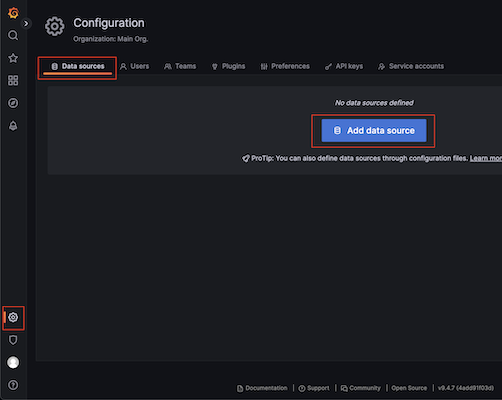
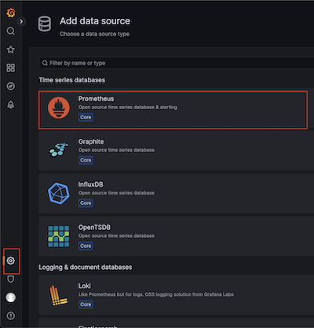
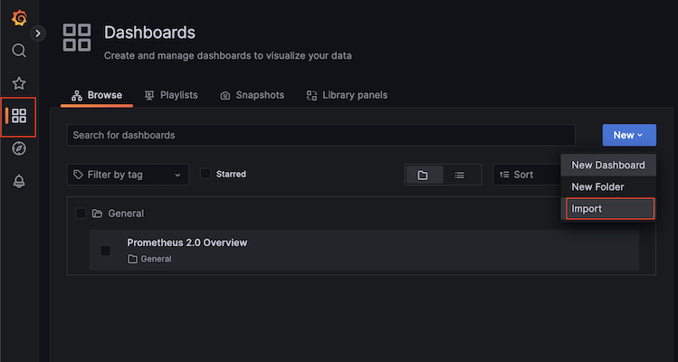
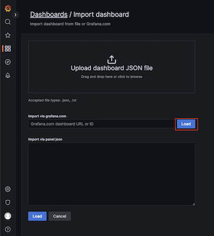
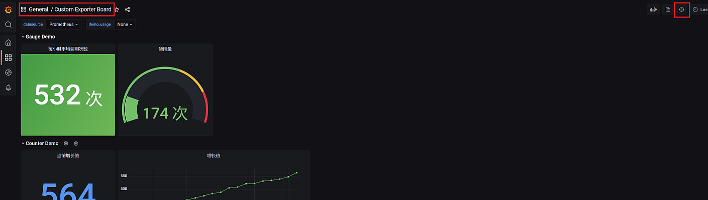
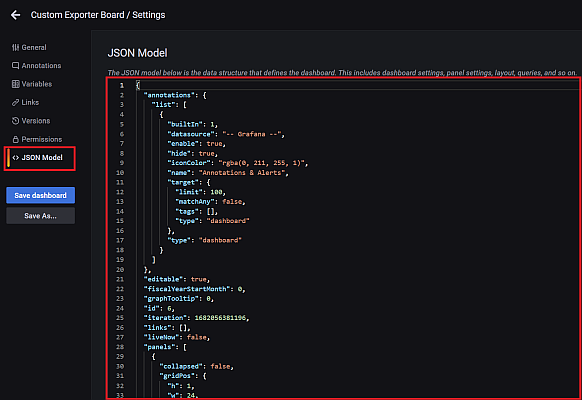
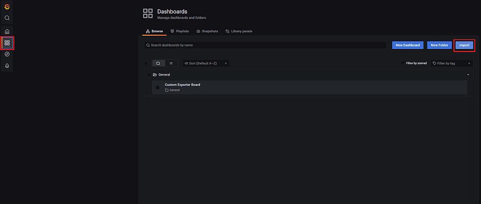
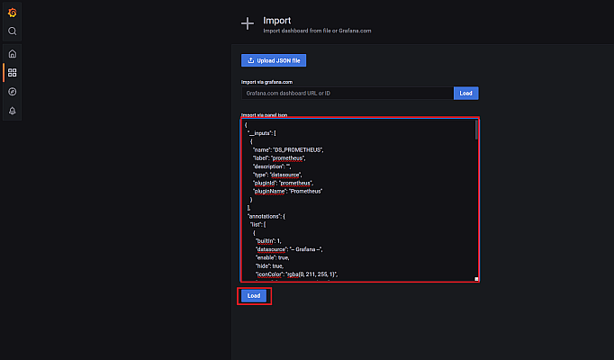

# Prometheus

## 1. 配置

### 1.1. Prometheus

#### 1.1.1. 设置服务发现

Prometheus 通过服务发现获取到目标服务, 并从目标服务上读取监控数据

服务发现在 `prometheus.yml` 配置文件的 `scrape_configs` 配置项中进行配置

服务发现主要配置目标服务的 **"URL", "标签"以及"认证方式"**

可以通过 `static_configs` 在同一个配置文件中配置服务发现, 也可以通过 `file_sd_configs` 将服务发现配置放在另外的 `json` 文件中, 参见 [conf/prometheus.yml](./docker/conf/prometheus.yml) 文件

1. 通过 `static_configs` 进行配置

    ```yml
    scrape_configs:
      - job_name: prometheus
        static_configs:
          - targets: # 目标服务 URL 列表
              - localhost:9090
            labels: # 服务标签
              instance: prometheus
    ```

2. 通过 `file_sd_configs` 进行配置

    ```yml
    scrape_configs:
      - job_name: node-exporter
        file_sd_configs:
          - files: # 指定服务发现配置文件
              - targets/node_exporter_sd.json
            refresh_interval: 1m # 服务发现文件刷新周期
    ```

    而定义服务发现的 `json` 配置文件可以为

    ```json
    [
      {
        "targets": [
          "node_exporter:9100"
        ],
        "labels": {
          "instance": "Local Host"
        }
      }
    ]
    ```

> `job_name`+`labels` 共同组成了每个服务监控的唯一标识, 用于进行筛选

#### 1.1.2. 集群配置

Prometheus 集群的重点在于统一存储, 一般使用 InfluxDB, 它有 1.x 和 2.x 两个大版本, 使用方式有很大的不同

##### 1.1.2.1. 使用 InfluxDB 1.x 版本

> 1.x 系列的最新版本为 `1.8`

Prometheus 内部具备对 InfluxDB 1.x 的支持, 通过配置即可集成两者

1. 通过环境变量 [env/influxdb.env](./docker/env/influxdb.env) 文件设置 Influxdb 的账号, 密码和数据库名, 参见 [cluster/docker-compose.yml](./docker/cluster/docker-compose.yml) 的 `influxdb` 部分

2. 在 Prometheus 的配置文件中, 增加 `remote_write` 和 `remote_read` 配置, 使 Prometheus 可以存取远程 InfluxDB 上的数据, 参见 [conf/prometheus_cluster.yml](./docker/conf/prometheus_cluster.yml) 文件

3. 配置 Prometheus 的多个容器实例, 参见 [cluster/docker-compose.yml](./docker/cluster/docker-compose.yml) 中的 `prometheus01` 和 `prometheus02` 部分

至此已经具备了启动 Prometheus 集群的全部条件, 只需要对不同的 Prometheus 实例进行负载均衡即可, 参见 [conf/nginx_prometheus.conf](./docker/conf/nginx_prometheus.conf) 以及 [/cluster/docker-compose.yml](./docker/cluster/docker-compose.yml) 中的 `nginx` 部分

启动所有容器, 通过 Nginx 的反向代理访问 Prometheus 实例即可

##### 1.1.2.2. 使用 InfluxDB 2.x 版本

Prometheus 无法直接将数据存储到 InfluxDB 2.x 版本的实例中, 需要借助 telegraf 这个中间件完成

1. 配置 telegraf 中间件

    拉取 telegraf 镜像

    ```bash
    docker pull telegraf
    ```

    生成 telegraf 配置文件

    ```bash
    docker run telegraf telegraf config > telegraf.conf
    ```

    修改配置文件内容, 增加一下部分的配置以支持 Prometheus, 其余配置可使用默认值即可

    ```ini
    # 输出到 InfluxDB 的配置
    [[outputs.influxdb_v2]]
      # InfluxDB 地址
      urls = ["http://influxdb:8086"]
      # InfluxDB API 令牌
      token = "<token>"
      # InfluxDB 租户
      organization="<org>"
      # InfluxDB 存储 Prometheus 数据的桶名称
      bucket = "prometheus"

    # 监听从 Prometheus 输入数据的配置
    [[inputs.http_listener_v2]]
      # 监听端口
      service_address = ":8087"
      # URL 路径
      paths = ["/receive"]
      # Prometheus 发送数据转换格式
      data_format = "prometheusremotewrite"

    # 采集 Prometheus 集群本身的状态的配置 (可选)
    [[inputs.prometheus]]
      urls = ["http://prometheus01:9090/metrics", "http://prometheus02:9090/metrics"]
    ```

    将生成的配置文件放在合适的位置备用, 例如 [conf/telegraf.conf](./docker/conf/telegraf.conf)

2. 配置 Prometheus

    修改 [conf/prometheus_cluster.yml](./docker/conf/prometheus_cluster.yml) 配置文件, 增加写入 telegraf 中间件的配置

    ```yml
    remote_write:
      - url: "http://telegraf:8087/receive"
    ```

    这里的端口号以及路径应和 [conf/telegraf.conf](./docker/conf/telegraf.conf) 中 `[[inputs.http_listener_v2]]` 部分配置一致

3. 配置容器集群

    增加 telegraf 容器配置, 设置容器配置文件为步骤 1 产生的配置文件, 参见 [cluster/docker-compose.yml](./docker/cluster/docker-compose.yml) 中 `telegraf` 部分

    ```yml
    telegraf:
      ...
      volumes:
        - ../conf/telegraf.conf:/etc/telegraf/telegraf.conf:ro
    ```

至此, 整个集群配置完毕, 在此架构下, Prometheus 会将所有数据写入到 InfluxDB 中, 但不会从 InfluxDB 中读取数据, 所以 Grafana 需要以 InfluxDB 为后端数据源 (而不再是 Prometheus)

### 1.2. Grafana

#### 1.2.1. Grafana 容器配置文件

参考官网: [configure-docker](https://grafana.com/docs/grafana/latest/setup-grafana/configure-docker/)

容器路径 `/etc/grafana/grafana.ini` 文件中为 Grafana 配置信息

可以通过映射这个文件将配置文件放在宿主机上, 参考: [conf/grafana.ini](./docker/conf/grafana.ini) 文件

```yml
volumes:
  - ../conf/grafana.ini:/etc/grafana/grafana.ini:ro
```

更常用的方式是通过系统变量修改 Grafana 配置

#### 1.2.2. Grafana 容器环境变量

通过设置容器的环境变量文件或环境变量值可以覆盖 `grafana.ini` 中的配置项

```yml
environment:
  - GF_DEFAULT_INSTANCE_NAME=Grafana
  - ...
```

或者

```yml
env_file:
  - ../env/grafana.env
```

在 [env/grafana.env](./docker/env/grafana.env) 文件中设置环境变量值

通过 `GF_<段名称>_<配置项名称> = <配置项值>` (字母为大写) 格式可以覆盖 `grafana.ini` 文件中的对应配置项, 例如:

配置项

```ini
[security]
admin_user=admin
```

对应的环境变量为

```ini
GF_SECURITY_ADMIN_USER=admin
```

> 注意: `GF_SECURITY_ADMIN_USER` 和 `GF_SECURITY_ADMIN_PASSWORD` 这两个配置项尽在第一次启动容器时有效, 一旦登录过系统, 用户名密码就会写入数据库

#### 1.2.3. Grafana 常用路径配置

配置项中部分配置用于对 Grafana 常用路径进行配置, 包括:

| 配置项                   | 默认值                       |
|:------------------------|:----------------------------|
| `GF_PATHS_CONFIG`       | `/etc/grafana/grafana.ini`  |
| `GF_PATHS_DATA`         | `/var/lib/grafana`          |
| `GF_PATHS_HOME`         | `/usr/share/grafana`        |
| `GF_PATHS_LOGS`         | `/var/log/grafana`          |
| `GF_PATHS_PLUGINS`      | `/var/lib/grafana/plugins`  |
| `GF_PATHS_PROVISIONING` | `/etc/grafana/provisioning` |

#### 1.2.4. 配置数据源

1. 点击"设置", 进入"数据源设置"界面

    

2. 选择"Prometheus"项目进行配置

    

3. 填入"URL", 即 Prometheus 服务地址, 除此之外, 界面中的其它项均为可选项, 点击"保存 & 测试"按钮即可

#### 1.2.5. 使用 MySQL 作为持久化数据库

在 Docker 中添加 Percona 容器 (或其它 MySQL 容器)

在容器的初始化脚步中增加创建数据库以及用户等内容, 参见 [sql/grafana.sql](/docker/sql/grafana.sql) 文件内容

设置 Grafana 配置, 以设置 MySQL 数据库信息 (这里通过环境变量进行配置, 参见 [env/grafana.env](./docker/env/grafana.env) 文件)

#### 1.2.6. 配置集群

如果已经在上一步将 Grafana 的后端存储设置为 MySQL (或其它数据库), 则使用相同的配置启动多个 Grafana 实例, 参见 [cluster/docker-compose.yml](./docker/cluster/docker-compose.yml) 的 `grafana01` 和 `grafana02` 部分

最后, 对这些实例做负载均衡即可, 参见 [conf/nginx_grafana.conf](./docker/conf/nginx_grafana.conf)

## 2. 导出和导入仪表盘

### 2.1. 从官方"仪表盘库"导入

 一般情况下, 不会从头去建立一个仪表盘, 而是从 `https://grafana.com/grafana/dashboards` 地址导入模板

1. 点击"仪表盘", 进入"仪表盘"设置界面, 通过"新建">"导入", 进入仪表盘导入界面

    

2. 导入"仪表盘模板"

    

    在"从 grafana.com 导入"文本框中填入模板页面地址或者模板 ID, 并设置数据源, 即可利用该模板创建仪表盘

    > 导入的仪表盘可以进一步进行编辑, 并进行命名, 分组等操作

### 2.2. 以 JSON 格式导入导出

修改后的仪表盘可以导出为 JSON 格式, 以方便之后恢复仪表盘或将仪表盘复制到另一个 Grafana 实例上

#### 2.2.1. 导出仪表盘 JSON

1. 进入指定的仪表盘, 点击仪表盘设置

    

2. 点击 "JSON Model" 菜单, 将呈现出的 JSON 内容复制保存即可

    

#### 2.2.2. 从 JSON 导入仪表盘

1. 在"仪表盘主页", 点击"导入"

    

2. 在"导入"界面, 填入之前保存的 JSON 文本, 点击"读取", 即可将之前保存的仪表盘导入

    

#### 2.2.3. 完善导出的 JSON

导出的 JSON 可以在当前 Grafana 正确导入, 但无法直接导入到另一个 Grafana 实例中, 主要是另一个 Grafana 实例的 "Datasource" 和当前实例不同 (Datasource 的 `uid` 不一样, 所以导入后需要手动逐面板重新设置数据源, 非常麻烦), 所以需要对导出的 JSON 做适当修改, 使其能够支持任意设置数据源

1. 为仪表盘 JSON 加入 `__input` 字段, 使其可以支持导入时选择数据源, 并以名为 `DS_PROMETHEUS` 的变量来代表实际的数据源

    ```json
    "__inputs": [
      {
        "type": "datasource",
        "name": "DS_PROMETHEUS",
        "label": "prometheus",
        "description": "-",
        "pluginId": "prometheus",
        "pluginName": "Prometheus"
      }
    ]
    ```

    这段脚本可以增加在仪表盘 JSON 的任意位置 (例如最开头), 表示在导入仪表盘时, 可以选择一个已有的 Prometheus 作为数据源

2. 将仪表盘 JSON 中, 所有 `targets` 字段下的 `datasource` 字段修改为 `${DS_PROMETHEUS}`

    ```json
    "targets": [
      {
        "datasource": "${DS_PROMETHEUS}",
        // ...
      }
    ],
    ```

    至此, 导入的仪表盘即可绑定一个指定的 Prometheus 数据源

3. 可以在 `templating` 字段下增加一个数据源项, 即可在仪表盘导入后, 仍可以通过下拉框切换数据源

    ```json
    "templating": {
      "list": [
        {
          "datasource": "Prometheus",
          "description": null,
          "error": null,
          "hide": 0,
          "includeAll": false,
          "label": "datasource",
          "multi": false,
          "name": "DS_PROMETHEUS",
          "options": [],
          "query": "prometheus",
          "refresh": 1,
          "regex": "",
          "skipUrlSync": false,
          "type": "datasource"
        },
        // ...
      ]
    }
    ```

    注意, 这里的 `name` 字段定义的变量名需要和 JSON 中 `datasource` 字段使用的变量名一致, 这里应为 `${DS_PROMETHEUS}`

## 3. 常用监控配置

### 3.1. 监控 Prometheus 自身

1. **Prometheus 配置**

   Prometheus 自身即可报告监控数据, 可通过执行 `curl http://localhost:9090/metrics` 来进行测试

   在服务发现配置中, 将 `targets` 设置为 Prometheus 服务地址 (无需 `/metrics` 后缀), 添加 `labels` 配置即可, 参见 [conf/prometheus.yml](./docker/conf/prometheus.yml) 中 `job_name: prometheus` 部分

2. **Grafana 仪表盘**

   - 使用 `https://grafana.com/grafana/dashboards/3662-prometheus-2-0-overview/` 仪表盘, ID 为 `3662` (推荐)

### 3.2. 监控宿主机 (node-exporter)

1. **`node-exporter` 容器配置**

    要在容器内获取到宿主机的状态, 需要将监控路径由 `/` 切换 (例如 `/host`), 再将宿主机的 `/` 路径挂载到容器的 `/host` 路径下 (只读)

    所以需要为 `node-exporter` 容器增加命令行参数 `--path.rootfs=/host`, 并且将宿主机的 `/` 挂载到容器的 `/host` 下

    ```yml
    volumes:
      - /:/host:ro
    ```

    参见 [standalone/docker-compose.yml](./docker/standalone/docker-compose.yml) 文件中的 `node-exporter` 部分

    可通过 `docker exec node_exporter wget -qO- localhost:9100/metrics` 命令进行测试

2. **Prometheus 配置**

    在服务发现配置中, 将 `targets` 设置为 `node-exporter` 服务地址, 添加 `labels` 配置即可

    参见 [conf/prometheus.yml](./docker/conf/prometheus.yml) 文件的 `job_name: node-exporter` 部分以及 [conf/targets/node_exporter_sd.json](./docker/conf/targets/node_exporter_sd.json) 文件内容

3. **Grafana 仪表盘**

    - 使用 `https://grafana.com/grafana/dashboards/1860-node-exporter-full/` 仪表盘, ID 为 `1860` (推荐)

### 3.3. 监控 MySQL (mysqld-exporter)

1. **`mysqld-exporter` 容器配置**

    需要在容器的环境变量中设置目标 MySQL 的访问地址, 以及用户名密码

    ```yml
    environment:
      - DATA_SOURCE_NAME=<username>:<password>@(url)/
    ```

    > 注意, 数据库连接串末尾必须具备 `/` 字符

    参见 [standalone/docker-compose.yml](./docker/standalone/docker-compose.yml) 文件中的 `mysqld-exporter` 部分

    可通过 `docker exec mysqld_exporter wget -qO- localhost:9104/metrics` 命令进行测试

2. **Prometheus 配置**

    在服务发现配置中, 将 `targets` 设置为 `mysqld-exporter` 服务地址, 添加 `labels` 配置即可

    参见 [conf/prometheus.yml](./docker/conf/prometheus.yml) 文件的 `job_name: mysqld-exporter` 部分以及 [conf/targets/mysqld_exporter_sd.json](./docker/conf/targets/mysqld_exporter_sd.json) 文件内容

3. **Grafana 仪表盘**

    - 使用 `https://grafana.com/grafana/dashboards/14031-mysql-dashboard/` 仪表盘, ID 为 `14031` (推荐)

### 3.4. 监控容器 (cadvisor)

1. **`cadvisor` 容器配置**

    使用 `cadvisor` 需要将宿主机的若干路径进行映射 (`volumes`), 并且赋予容器管理权限 (`privileged`), 参见 [standalone/docker-compose.yml](./docker/standalone/docker-compose.yml) 文件中的 `cadvisor` 部分

    可通过 `docker exec cadvisor wget -qO- localhost:8080/metrics` 命令进行测试

2. **Prometheus 配置**

    在服务发现配置中, 将 `targets` 设置为 `cadvisor` 服务地址, 添加 `labels` 配置即可

    参见 [conf/prometheus.yml](./docker/conf/prometheus.yml) 文件的 `job_name: cadvisor` 部分以及 [conf/targets/cadvisor_sd.json](./docker/conf/targets/cadvisor_sd.json) 文件内容

3. **Grafana 仪表盘**

    - 使用 `https://grafana.com/grafana/dashboards/179-docker-prometheus-monitoring/` 仪表盘, ID 为 `179` (推荐)
    - 使用 `https://grafana.com/grafana/dashboards/11600-docker-container/` 仪表盘, ID 为 `11600`

### 3.5. 监控 Nginx (nginx-prometheus-exporter)

1. **`nginx-prometheus-exporter` 容器配置**

    `nginx-prometheus-exporter` 组件是基于 Nginx 状态报告生成的, 所以需要先启用 Nginx 的状态报告, 确认 Nginx 具备 `http_stub_status_module` 模块并启用

    ```bash
    docker exec -it nginx nginx -V | grep "with-http_stub_status_module"
    ```

    将 [conf/nginx_status.conf](./docker/conf/nginx_status.conf) 配置文件映射到 Nginx 容器的 `/etc/nginx/conf.d/` 路径下

    ```yml
    nginx:
      ...
      volumes:
        - ../conf/nginx_status.conf:/etc/nginx/conf.d/status.conf:ro
        ...
    ```

    启动容器, 确认可以访问到 Nginx 状态报告

    ```bash
    docker exec -it nginx curl localhost:8090/stub_status
    ```

    在 `nginx-prometheus-exporter` 容器中, 设置 `SCRAPE_URI` 环境变量, 指向 Nginx 状态报告地址

    ```yml
    nginx-prometheus-exporter:
      ...
      environment:
        - SCRAPE_URI=http://nginx:8090/stub_status
    ```

    至此容器配置完毕

2. **Prometheus 配置**

    在服务发现配置中, 将 `targets` 设置为 `nginx-prometheus-exporter` 服务地址, 添加 `labels` 配置即可

    参见 [conf/prometheus_cluster.yml](./docker/conf/prometheus_cluster.yml) 文件的 `job_name: nginx_exporter` 部分以及 [conf/targets/nginx_exporter_sd.json](./docker/conf/targets/nginx_exporter_sd.json) 文件内容

3. **Grafana 仪表盘**

    目前 Grafana 仪表盘库中还未有特别符合要求的 `nginx-prometheus-exporter` 仪表盘, 可以使用官方提供的 JSON 文件, 参见:
    [dashboard.json](https://github.com/nginxinc/nginx-prometheus-exporter/blob/main/grafana/dashboard.json) (或 [本地文件](/docker/cluster/dashboards/nginx_prometheus_exporter.json)), 将其导入为仪表盘即可
