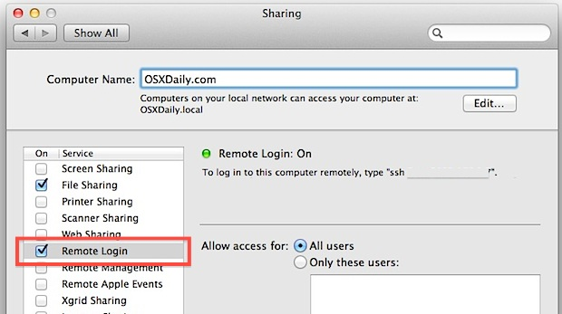

# How to use SSH

## 1. 启动SSH服务

### 1.1. Linux下

- 安装SSH命令（以Debian为例）：

```bash
# 安装SSH服务
$ sudo apt-get install openssh-server

# 安装SSH命令
$ sudo apt-get install ssh
```

- 启动/停止SSH server：

```bash
$ /etc/init.d/ssh start     # 启动服务
$ /etc/init.d/ssh stop      # 停止服务
$ /etc/init.d/ssh restart   # 重启服务
```

- 设置开机自启（以Ubuntu为例）：

```bash
# 编辑/etc/rc.local文件，在exit 0语句前加入

/etc/init.d/ssh start
```

### 1.2. Mac下

1. 打开"System Preferences" , 打开"Sharing"设置面板
2. 勾选"Remote Login"前的复选框，使其生效




## 2. 连接 ssh 主机

```bash
$ ssh -p <port> <user>@<host or ip> -y
```

- `-p` 参数用于指定端口，默认为`22`端口  
- `-y` 参数表示对于系统提出的问题一律回答`yes`


例如: 

```bash
$ ssh alvin@192.168.1.133
$ ssh -p 10022 alvin@web-qa -y
```

## 3. 利用密钥使用SSH


### 3.1. 生成密钥

```bash
$ ssh-keygen -t rsa -P '' -C <string>
```
  
- `-t` 参数指定了密钥算法，包括：dsa和rsa  
- `-P` 参数用于指定生成密钥的密码，''表示不需要密码（空）  
- `-C` 密钥注释，在公钥的尾部可以看到

> 如果取消`-P`参数，则需要回答系统提出的若干问题方能产生密钥


默认密钥存储在`~/.ssh`目录下，包括: 
- `id_rsa`: 私钥文件
- `id_rsa.pub`: 公钥文件


### 3.2. 指定存储密钥的文件

```bash
$ ssh-keygen -t rsa -f <key file name> -P ''
```

- `-f` 指定密钥文件名称

在当前目录下产生密钥文件，包括:
- `<key file>`: 私钥文件
- `<key file>.pub`: 公钥文件


### 3.3. 将公钥文件加入SSH主机

#### 3.3.1. 手动处理

- Client 端

```bash
$ scp ~/.ssh/id_rsa.pub <name>@<host>:/home/<user>/id_rsa.pub 
```

- Server 端

```bash
$ cat ~/id_rsa.pub >> ~/.ssh/authorized_keys

# 如果有权限问题
$ chmod 700 ~/.ssh/
$ chomd 600 ~/.ssh/authorized_keys
```

### 3.4. 执行SSH命令

```bash
$ ssh -i ~/.ssh/<key file> -p 10022 <user>@<host> -y
```

- `-i` 指定所需的私钥文件


## 4. SSH Tunnel

### 4.1. Local port forwarding

通过远程主机A（ssh可连接），将本机的指定端口m映射到远程主机B（可通过A放达）的指定端口n上。

本机访问本地指定端口，相当于访问远程主机的指定端口。

```bash
$ ssh -fgNL <local port>:<remote host>:<remote port> <user>@<bastion host>
```

- `-L` 表示本地端口重定向到远端端口    
- `-f` 后台运行   
- `-N` 不连接远程终端   
- `-g` 允许远端服务器连接本地转发端口（双向通讯）

范例：

```bash
# 建立本地10090端口，通过bastion主机，到web01主机90端口的连接
$ ssh -NL 10090:web01:90 alvin@bastion
```

### 4.2. Remote port forwarding

将一台远程主机A的指定端口a，经由本机，映射到另一台远程主机B的指定端口b上。

A主机访问指定端口a，相当于访问B主机的指定端口b。

```bash
$ ssh -fgNR 13306:<remote 1>:3306 <user>@<remote 2>
```

- `-R` 表示远端端口重定向到指定端口
- `-f` 后台运行
- `-N` 不连接远程终端
- `-g` 允许远端服务器连接本地转发端口（双向通讯）

范例：

```bash
# 建立web-qa主机10080端口到本地主机80端口的连接
$ ssh -NR 10080:localhost:80 alvin@web-qa
```

## 4.3. Proxy

可以通过SSH主机来作为本地主机的代理，让数据经由SSH主机和外部服务器进行交互

```bash
$ ssh -qTfnN -D <port> <user>@<host>
# 相当于 ssh -qTfnN -D localhost:10330 alvin@proxy
```

- `-D` 动态端口转发，相当于将所有端口的数据通过指定端口进行转发  
- `-f` 后台运行   
- `-N` 不执行命令（不加就必须执行条远端命令）   
- `-n` 输出重定向到 `/dev/null`（不输出） 
- `-T` 禁止分配伪终端设备    
- `-q` 静默模式   

此时，将`localhost:10030`设置为代理服务器，即可访问网络

```bash
$ ssh -qTfnN -D web01:10330 alvin@proxy
# 此时，将 lucy:10030 设置为代理服务器，即可访问网络
```

## 5. SSH Config

### 5.1. 配置文件

SSH 的配置文件有两个：
- `~/.ssh/config`：用户配置文件
- `/etc/ssh/ssh_config`：系统配置文件


配置文件的基本形式如下：

```bash
Host example                       # 关键词
    HostName example.com           # 主机地址
    User root                      # 用户名
    IdentityFile ~/.ssh/id_rsa     # 认证文件
    Port 22                        # 指定端口
```

### 5.2. 配置项

#### 5.2.1. `Host`

主机名，通过`ssh <host>`连接远程主机，即采用对应`Host`下的配置项。

- `*`: 匹配所有主机名;
- `*.example.com`: 匹配以 .example.com 结尾;
- `!*.dialup.example.com, *.example.com`: 以`!`开头是排除的意思;
- `192.168.0.?`: 匹配`192.168.0.[0-9]`的 IP。

#### 5.2.2. `AddKeysToAgent`

是否自动将 key 加入到`ssh-agent`，值可以为`no`(default)/`confirm`/`ask`/`yes`。添加到`ssh-agent`意味着将私钥和密码交给它管理，让它来进行身份认证。

- `yes`：key 和密码都将读取文件并以加入到 agent ，就像 `ssh-add`；
- `ask`：询问是否加入；
- `confirm`：确认加入；
- `no`：不加入的意思；

#### 5.2.3. `AddressFamily`

指定连接的时候使用的地址族，值可以为`any`(default)/`inet`(IPv4)/`inet6`(IPv6)

#### 5.2.4. `BindAddress`

指定连接的时候使用的本地主机地址，只在系统有多个地址的时候有用。在`UsePrivilegedPort`值为`yes`的时候无效。

#### 5.2.5. `ChallengeResponseAuthentication`

是否响应支持的身份验证`chanllenge`，值可以为`yes`(default)/`no`。

#### 5.2.6. `Compression`

是否压缩，值可以为`no`(default)/`yes`。

#### 5.2.7. `CompressionLevel`

压缩等级，值可以为`1`(fast)-`9`(slow)。默认为`6`(default)，相当于 gzip。

#### 5.2.8. `ConnectionAttempts`

退出前尝试连接的次数，值必须为整数，默认为`1`。

#### 5.2.9. `ConnectTimeout`

连接 SSH 服务器超时时间，单位`s`，默认系统 TCP 超时时间。

#### 5.2.10. `ControlMaster`

是否开启单一网络共享多个 session，值可以为`no`(default)/`yes`/`ask`/`auto`。该命令需要和`ControlPath`配合使用。

当值为`yes`时，ssh 会监听该路径下的 control socket，多个 session 会去连接该 socket，它们会尽可能的复用该网络连接而不是重新建立新的连接。

#### 5.2.11. `ControlPath`

指定 control socket 的路径，值可以直接指定也可以用一下参数代替：
- `%L` 本地主机名的第一个组件
- `%l` 本地主机名（包括域名）
- `%h` 远程主机名（命令行输入）
- `%n` 远程原始主机名
- `%p` 远程主机端口
- `%r` 远程登录用户名
- `%u` 本地 ssh 正在使用的用户名
- `%i` 本地 ssh 正在使用 uid
- `%C` 值为 %l%h%p%r 的 hash


请最大限度的保持`ControlPath`的唯一。至少包含`%h`，`%p`，`%r`（或者`%C`）。

ControlPersist**  
结合 ControlMaster 使用，指定连接打开后后台保持的时间。值可以为 no/yes/整数，单位 s。如果为 no，最初的客户端关闭就关闭。如果 yes/0，无限期的，直到杀死或通过其它机制，如：ssh -O exit。


#### 5.2.12. `GatewayPorts`

指定是否允许远程主机连接到本地转发端口，值可以为`no`(default)/`yes`。默认情况 ssh 为本地回环地址绑定了端口转发器。


#### 5.2.13. `HostName`

真实的主机名，默认值为命令行输入的值（允许 IP）。你也可以使用 `%h`，它将自动替换，只要替换后的地址是完整的就可以。

#### 5.2.14. `IdentitiesOnly`

指定 ssh 只能使用配置文件指定的 identity 和 certificate 文件或通过 ssh 命令行通过身份验证，即使`ssh-agent`或`PKCS11Provider`提供了多个 identities。值可以为`no`(default)/`yes`。

#### 5.2.15. `IdentityFile`

指定读取的认证文件路径，允许 DSA，ECDSA，Ed25519 或 RSA。值可以直接指定也可以用一下参数代替：

- `%d` 本地用户目录`~`；
- `%u` 本地用户；
- `%l` 本地主机名；
- `%h` 远程主机名；
- `%r` 远程用户名；


#### 5.2.16. `LocalCommand`

指定在连接成功后，本地主机执行的命令（单纯的本地命令）。可使用 `%d`，`%h`，`%l`，`%n`，`%p`，`%r`，`%u`，`%C`替换部分参数。只在`PermitLocalCommand`开启的情况下有效。


#### 5.2.17. `LocalForward`

指定本地主机的端口通过 ssh 转发到指定远程主机。格式：`LocalForward [bind_address:]post host:hostport`，支持 IPv6。

#### 5.2.18. `PasswordAuthentication`

是否使用密码进行身份验证，值可以为`yes`(default)/`no`。

#### 5.2.19. PermitLocalCommand

是否允许指定`LocalCommand`，值可以为`no`(default)/`yes`。

#### 5.2.20. Port

指定连接远程主机的哪个端口，默认值为`22`。

#### 5.2.21. ProxyCommand

指定连接的服务器需要执行的命令。`%h`，`%p`，`%r`。

如：
```
ProxyCommand /usr/bin/nc -X connect -x 192.0.2.0:8080 %h %p
```

#### 5.2.22. User

登录用户名


### 5.3. 相关技巧


#### 5.3.1. 管理多组密钥对

有时候你会针对多个服务器有不同的密钥对，每次通过指定`-i`参数也是非常的不方便。比如你使用 github 和 coding。那么你需要添加如下配置到`~/.ssh/config`：

```
Host github
    HostName %h.com
    IdentityFile ~/.ssh/id_ecdsa_github
    User git
Host coding
    HostName git.coding.net
    IdentityFile ~/.ssh/id_rsa_coding
    User git
```

当你克隆 coding 上的某个仓库时：

```bash
# 原来
$ git clone git@git.coding.net:deepzz/test.git

# 现在
$ git clone coding:deepzz/test.git
```

#### 5.3.2. vim 访问远程文件

vim 可以直接编辑远程服务器上的文件：

```bash
$ vim scp://example/docker-compose.yml
```

#### 5.3.3. 远程服务当本地用

通过`LocalForward`将本地端口上的数据流量通过 ssh 转发到远程主机的指定端口。

如远程服务器上运行着 Postgres，端口`5432`（未暴露端口给外部），则：

```
Host db
    HostName db.example.com
    LocalForward 5433 localhost:5432
```

当你连接远程主机时，它会在本地打开一个`5433`端口，并将该端口的流量通过 ssh 转发到远程服务器上的`5432`端口。


首先建立连接：

```bash
$ ssh db
```

之后，就可以通过 Postgres 客户端连接本地`5433`端口：

```bash
$ psql -h localhost -p 5433 orders
```

#### 5.3.4. 多连接共享

当打开多个 shell 窗口时需要连接同一台服务器，如果不想每次都输入用户名，密码，或是等待连接建立，那么你需要添加如下配置到 `~/.ssh/config`：

```
Host *
    ControlMaster auto
    ControlPath /tmp/%r@%h:%p
```

#### 5.3.5. 禁用密码登录

需要编辑服务器的系统配置文件 `/etc/ssh/sshd_config`：

```
PasswordAuthentication no
ChallengeResponseAuthentication no
```


#### 5.3.6. 关键词登录

为了更方便的登录服务器，可以省略用户名和主机名，采用关键词登录。添加如下配置到`~/.ssh/config`：

```
Host deepzz                        # 别名
    HostName deepzz.com            # 主机地址
    User root                      # 用户名
    # IdentityFile ~/.ssh/id_ecdsa # 认证文件
    # Port 22                      # 指定端口
```

那么使用`ssh deepzz`就可以直接登录服务器了。


#### 5.3.7. 代理登录

有的时候可能无法直接登录到某台服务器，而需要使用一台中间服务器进行中转，如公司内网服务器。首先确保已经为服务器配置了公钥访问，并开启了`agent forwarding`，则需要添加如下配置到`~/.ssh/config`：

```
Host gateway
    HostName proxy.example.com
    User root
Host db
    HostName db.internal.example.com   # 目标服务器地址
    User root                          # 用户名
    # IdentityFile ~/.ssh/id_ecdsa     # 认证文件
    ProxyCommand ssh gateway netcat -q 600 %h %p   # 代理命令
```
那么你现在可以使用`$ ssh db`连接了。


## 6. Troubleshooting

### 6.1. sshd: no hostkeys available -- exiting.

```bash
$ sudo ssh-keygen -t dsa -f /etc/ssh/ssh_host_dsa_key
$ sudo ssh-keygen -t rsa -f /etc/ssh/ssh_host_rsa_key
$ sudo chmod 600 /etc/ssh
```
